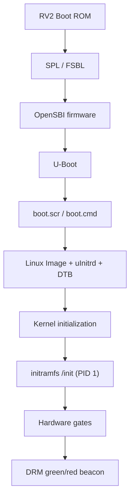

# Native Minimal Linux (`m0`) on Orange Pi RV2

## Complete technical learning record: design, build, validation, native boot, failure analysis, and prepared diagnostics

**Project:** Native Minimal Kernel  
**Kernel name used in this work:** `m0`  
**Target board:** Orange Pi RV2, 8-core 64-bit RISC-V, 4 GiB RAM  
**Kernel source:** Orange Pi vendor Linux 6.6 tree  
**Evidence cut-off:** 12 August 2026  
**Chronological cut-off:** Immediately before report-gathering began  
**Purpose of this document:** To let me reconstruct, understand, explain, defend, and present every important technical decision made in the project so far.

---

## Reading map

| Part | Sections | Focus |
|---|---:|---|
| Foundations | 0–4 | Scope, boot chain, terminology, host setup, pinned source |
| Build | 5–10 | BusyBox, initramfs, Kconfig, compilation, closure, DTB |
| Generic validation | 11 | QEMU design, code, observations, and limits |
| Native qualification | 12–14 | Hardware gate, DRM beacon, release construction, U-Boot handoff |
| Incident and repair | 15–18 | Revision-2 failure, 30 MiB proof, revision-3 repair, black screen |
| Diagnostic revision | 19–23 | Pstore/ramoops, revision-4 builder, QEMU gate, UART plan |
| Review and preparation | 24–32 | Timeline, file catalog, lessons, interview answers, presentation, glossary, evidence |

For a first pass, read Sections 1, 11, 15–17, 19, 23, and 24. For implementation-level mastery, then read every code explanation in order.

---

## 0. How to read this document

This is not a verbatim chat transcript. It is a chronological engineering record reconstructed from the commands, outputs, configuration files, source bundles, hashes, and hardware observations produced during the chat. Repetitive conversation has been condensed, but technical decisions, corrections, code, and evidence boundaries have been retained.

The following labels are used:

| Label | Meaning |
|---|---|
| **Performed** | The command or procedure was reported as executed. |
| **Observed** | A concrete output or hardware behavior was reported. |
| **Established** | The evidence supports the conclusion directly. |
| **Inferred** | The conclusion is the best explanation, but is not directly observed. |
| **Prepared, not executed** | Code or a procedure exists, but no result from running it has been supplied. |

Destructive storage commands are included because they are part of the engineering history. They must not be copied and run without rechecking device identities and the current project state.

The central evidence rule throughout this project is:

> A successful build proves that a kernel artifact was produced. A QEMU boot proves generic RV64 bootability. Neither proves that the Orange Pi RV2 firmware, device tree, drivers, and physical peripherals will work. Native proof requires evidence from the real board.

---

## 1. Project context and intended result

I am building a custom minimal Linux kernel called `m0` for the Orange Pi RV2. The RV2 is an eight-core RISC-V board with 4 GiB of RAM. The long-term research objective is not merely to make a small kernel boot. I want a controlled native platform on which I can compare a minimal Linux configuration against a normal/vendor Linux baseline using measurements such as:

- system-call and OS-call latency;
- privilege-transition cost;
- interrupt latency;
- memory footprint;
- IPC and processor-counter behavior;
- call-path depth and the amount of operating-system work performed;
- the cost of optional kernel subsystems.

The immediate milestone is narrower:

> Boot a cryptographically pinned `m0` Image on the physical Orange Pi RV2, start a known external initramfs, prove that all eight harts and the expected memory are available, detect fatal kernel diagnostics, and produce an unambiguous native pass/fail indication.

The first qualification configuration deliberately contains additional debugging. It is therefore not the final performance-measurement kernel. Debugging facilities such as lockdep, VM checks, SLUB checks, verbose printk, `initcall_debug`, and later `pstore/ramoops` distort latency and memory results. They are useful during bring-up and must be removed or measured separately before performance comparisons.

### 1.1 Why there are two profiles

The original workflow used two profiles:

1. **`baseline`** — the vendor `x1_defconfig` plus the common qualification/debug fragment.
2. **`m0`** — the same vendor seed and qualification fragment, plus a pruning fragment that removes subsystems outside the current boot contract.

This is a control-experiment design. If both profiles fail in the same generic environment, the shared toolchain, source, initramfs, or qualification configuration is suspect. If the baseline passes while `m0` fails, the pruning delta becomes the primary suspect.

Starting from the vendor configuration rather than `tinyconfig` was essential. The RV2 depends on vendor-specific clock, reset, power-domain, UART, DMA, pin-controller, interrupt-controller, and SoC support. Reconstructing those dependencies from `tinyconfig` would make silent Kconfig dependency failures much more likely.

### 1.2 Earlier hosted-kernel idea and the shift to native boot

Before this native workflow stabilized, an earlier design explored running a stripped RISC-V guest kernel as a userspace process on a normal RISC-V Linux host. In that design:

- ordinary unprivileged RISC-V instructions would execute natively;
- privileged/illegal instructions would trap and be decoded;
- guest CSR state such as `sstatus` would be maintained in shadow data;
- GDB `si`/`ni` would allow instruction-by-instruction study;
- host services could mediate devices rather than using KVM;
- a supplied DTB and metering layer would describe/measure the guest environment.

That is a hosted-kernel or user-mode virtualization architecture. It is technically different from the work in the rest of this document, which boots a real Linux Image through the RV2 firmware chain and lets Linux own the physical hardware.

The project direction shifted toward native execution because the final goal requires reading real hardware behavior and measuring actual OS/platform costs. No hosted shadow-CSR implementation is claimed as completed in the evidence covered here. The earlier idea remains a possible later instrumentation technique, not part of the current `m0` artifact chain.

### 1.3 The complete boot chain

The physical boot path has more stages than “load a kernel”:



Each stage answers a different question:

| Stage | Responsibility |
|---|---|
| Boot ROM | Executes immutable SoC startup logic and finds an early boot source. |
| SPL/FSBL | Performs minimal hardware/DRAM initialization and loads the next stage. |
| OpenSBI | Provides the RISC-V Supervisor Binary Interface used by the Linux kernel. |
| U-Boot | Discovers filesystems/scripts, loads the kernel, initramfs, and DTB, then transfers control. |
| DTB | Describes the actual hardware: CPUs, memory banks, UART, interrupts, clocks, resets, display, and reserved memory. |
| Linux `Image` | The raw bootable RISC-V kernel image. |
| `uInitrd` | A U-Boot legacy wrapper around the compressed initramfs. |
| `/init` | First userspace program, PID 1, supplied by the initramfs. |
| DRM beacon | Direct KMS program that makes a full-screen green or red result visible without a normal desktop. |

This distinction later became decisive: the first native USB failed in the removable-media boot region before Linux was attempted. It was therefore invalid evidence about the `m0` kernel itself.

---

## 2. Important artifact terminology

### 2.1 `vmlinux` versus `Image`

- `vmlinux` is the linked ELF kernel. It contains ELF metadata and is useful for inspection, symbols, disassembly, and debugging.
- `arch/riscv/boot/Image` is the flat bootable kernel image passed to QEMU or U-Boot.

Producing `vmlinux` does not by itself mean that the board boot path is correctly packaged. The board receives `Image`, not the development ELF.

### 2.2 Root filesystem versus initramfs

An initramfs is an archive unpacked by the kernel into an in-memory root filesystem during boot. It allows the experiment to avoid dependence on a full Ubuntu root filesystem, matching kernel modules, systemd, or storage drivers.

The project uses a statically linked BusyBox because a dynamically linked `/init` would require a dynamic loader and shared libraries inside the archive. Static linking makes the userspace dependency boundary explicit:

```text
kernel + initramfs + static BusyBox + /init
```

### 2.3 DTB and why QEMU cannot reuse the board DTB

The Device Tree Blob is a hardware contract. QEMU `virt` and the RV2 are not the same machine:

- QEMU `virt` provides generic emulated harts, a generated memory map, PLIC/CLINT, and virtual devices.
- The RV2 DTB describes the Ky/SpacemiT X1 SoC, two physical RAM banks, PXA-style UART, vendor clocks/resets, and real peripherals.

QEMU should normally use its own generated DTB. The board must use the proven RV2 DTB. Booting QEMU with the physical board DTB would ask generic emulated hardware to satisfy addresses and devices it does not implement.

### 2.4 `boot.cmd` versus `boot.scr`

`boot.cmd` is human-readable U-Boot command source. `boot.scr` is the binary legacy script image produced by `mkimage`. U-Boot's distro-boot path searches for the compiled script, not an arbitrary shell file.

### 2.5 Hashes as evidence identities

SHA-256 was used to answer “is this still exactly the same artifact?” A successful hash check does not prove functional correctness, but it prevents accidental substitution from contaminating an experiment.

The key pinned identities were:

| Artifact | SHA-256 |
|---|---|
| Original `m0` Image | `4f145f27ceeb037a164f7230ddac6ddef001d16e20d1ddafa77bd9151a8b3239` |
| Hardware-gate initramfs | `541234bd5426bd0de18b0b8ee6d9bd981583de0bdd654b3522f5ad7f66f2cf1e` |
| Proven vendor RV2 DTB | `05eeb6e9b249358b1f649a8405e240e37ffabb1da758da0a11be823bfa21d617` |
| Known-good USB first 8 MiB | `aa9f18a570df636ac3e28d7afcd89625e1d32fcda8d6edbd85252fb0713c02c6` |

---

## 3. Host environment and workspace

The recorded host environment was Ubuntu 24.04. The RISC-V cross-compiler was available as `riscv64-linux-gnu-gcc` (reported version 15.2.0 during this project). QEMU was initially absent and was installed before the later smoke tests. The host network also used Sophos TLS interception, which affected downloads and Python package installation; these environment problems were separate from kernel correctness.

### 3.1 Workspace variables

The stabilized workspace used:

```bash
export RV2_WORK="$HOME/MinimalKernelBuilding/rv2"
export RV2_PIN="ae9e974d3e19f460b6397bfe8f0f1417a073ce05"
export KERNEL_SRC="$RV2_WORK/src/linux-orangepi"
export ARCH=riscv
export CROSS_COMPILE=riscv64-linux-gnu-

mkdir -p "$RV2_WORK"/{src,configs,out,rootfs,artifacts,logs,scripts,releases}
```

Explanation:

- `RV2_WORK` is the project root and keeps source, generated output, evidence, and logs separate.
- `RV2_PIN` identifies the exact vendor commit.
- `ARCH=riscv` tells Kbuild which architecture tree to use.
- `CROSS_COMPILE=riscv64-linux-gnu-` is a prefix, not a complete executable name. Kbuild appends `gcc`, `ld`, `objcopy`, and other tool names.
- Out-of-tree build output under `out/` avoids filling or altering the source tree with generated files.

### 3.2 Host packages

The planned Ubuntu package installation was:

```bash
sudo apt update
sudo apt install -y \
    git curl build-essential bc bison flex \
    libssl-dev libelf-dev libncurses-dev dwarves \
    cpio rsync file device-tree-compiler sparse \
    qemu-system-riscv \
    gcc-riscv64-linux-gnu binutils-riscv64-linux-gnu \
    libc6-dev-riscv64-cross
```

Later native packaging also required:

```bash
sudo apt install --no-install-recommends u-boot-tools
```

`u-boot-tools` supplies:

- `mkimage`, used to make `uInitrd` and `boot.scr`;
- `dumpimage`, used to inspect and validate the resulting legacy images.

Device-tree schema tooling was considered through `dtschema`/`dt-schema`. Ubuntu's PEP 668 policy can reject direct system `pip` writes, so an Ubuntu package or an isolated Python environment is preferable. This tool checks DT bindings; it is not needed merely to compile a DTB with `dtc`.

### 3.3 Tool verification

```bash
command -v riscv64-linux-gnu-gcc
command -v qemu-system-riscv64
command -v fdtget
riscv64-linux-gnu-gcc --version
qemu-system-riscv64 --version
```

`command -v` is a cheap, deterministic prerequisite gate. Discovering a missing tool before a long build produces a much cleaner failure boundary.

### 3.4 Shell-safety idioms used repeatedly

Many scripts begin with:

```bash
set -euo pipefail
```

The flags mean:

- `-e`: stop when an unhandled command fails;
- `-u`: treat an unset variable as an error;
- `pipefail`: a pipeline fails if any component fails, not only the final command.

Required environment variables were checked with:

```bash
: "${RV2_WORK:?RV2_WORK is not set}"
```

The `:` command does nothing, but parameter expansion raises an error if the variable is missing. This prevents an unset path from collapsing into a dangerous or unintended location.

Temporary paths were paired with traps:

```bash
TMP_DIR="$(mktemp -d)"
trap 'rm -rf -- "$TMP_DIR"' EXIT HUP INT TERM
```

The key point is that `mktemp -d` creates a concrete, narrow target. Cleanup does not use a broad or unresolved path.

---

## 4. Pinning and inspecting the vendor kernel source

The chosen Orange Pi vendor commit was:

```text
ae9e974d3e19f460b6397bfe8f0f1417a073ce05
```

The commit description was `Support Orange Pi RV2`, from the `orange-pi-6.6-ky` branch.

The source procedure was:

```bash
git clone \
    --filter=blob:none \
    --single-branch \
    --branch orange-pi-6.6-ky \
    https://github.com/orangepi-xunlong/linux-orangepi.git \
    "$KERNEL_SRC"

git -C "$KERNEL_SRC" switch --detach "$RV2_PIN"

test "$(git -C "$KERNEL_SRC" rev-parse HEAD)" = "$RV2_PIN"
git -C "$KERNEL_SRC" show -s --format='%H %s'
grep -E '^(VERSION|PATCHLEVEL|SUBLEVEL) =' "$KERNEL_SRC/Makefile"
```

Line-by-line reasoning:

- `--filter=blob:none` reduces the initial transfer while Git fetches file contents as needed.
- `--single-branch` avoids unrelated branch history.
- `switch --detach` makes the working tree point directly at the commit rather than at a moving branch.
- `test … = "$RV2_PIN"` converts source identity into a hard gate.
- The Makefile query records the kernel release family independently of the Git commit.

Why a commit hash matters: a branch name is mutable. If the branch later changes, two builds made from “the same branch” can contain different source. A commit ID makes the source input repeatable.

The critical vendor inputs were:

```text
arch/riscv/configs/x1_defconfig
arch/riscv/boot/dts/ky/x1_orangepi-rv2.dts
```

`x1_defconfig` is the vendor's configuration seed. The DTS is the source representation of the board hardware description.

---

## 5. Building a static BusyBox userspace

### 5.1 Pinned BusyBox identity

The recorded userspace used:

```text
BusyBox version: 1.38.0
Source mirror:   vda-linux/busybox_mirror
Pinned commit:   fc71374dfccd46448c62947269a35f1420d7ee28
Architecture:    RISC-V 64
Linking:         static
```

### 5.2 Build commands

```bash
set -e

cd "$RV2_WORK/src"
git clone https://github.com/vda-linux/busybox_mirror.git busybox
cd busybox

git checkout --detach fc71374dfccd46448c62947269a35f1420d7ee28
test "$(git rev-parse HEAD)" = \
    "fc71374dfccd46448c62947269a35f1420d7ee28"

make distclean

make ARCH=riscv \
     CROSS_COMPILE="$CROSS_COMPILE" \
     defconfig

sed -i 's/^# CONFIG_STATIC is not set$/CONFIG_STATIC=y/' .config
sed -i 's/^CONFIG_TC=y$/# CONFIG_TC is not set/' .config

mkdir -p "$RV2_WORK/configs"
cp .config "$RV2_WORK/configs/busybox-1.38.0-riscv64.config"
sha256sum "$RV2_WORK/configs/busybox-1.38.0-riscv64.config"
git rev-parse HEAD > "$RV2_WORK/configs/busybox-1.38.0.commit"

cp "$RV2_WORK/configs/busybox-1.38.0-riscv64.config" .config
grep -qx 'CONFIG_STATIC=y' .config

make ARCH=riscv \
     CROSS_COMPILE="$CROSS_COMPILE" \
     -j"$(nproc)"

rm -rf "$RV2_WORK/rootfs"

make ARCH=riscv \
     CROSS_COMPILE="$CROSS_COMPILE" \
     CONFIG_PREFIX="$RV2_WORK/rootfs" \
     install

file "$RV2_WORK/rootfs/bin/busybox"
ls -l "$RV2_WORK/rootfs/bin/sh"
```

Important details:

- `make distclean` prevents an old configuration or object file from leaking into this build.
- `defconfig` supplies a known BusyBox starting point.
- `CONFIG_STATIC=y` removes the runtime dependency on a dynamic loader and libraries.
- `CONFIG_TC` was disabled because the traffic-control applet caused a build problem or was unnecessary for the current minimal userspace contract.
- Saving the BusyBox `.config` and commit makes the userspace build reproducible.
- `CONFIG_PREFIX=… install` creates BusyBox plus its applet symlinks inside the future root filesystem.

### 5.3 Static and architecture verification

```bash
riscv64-linux-gnu-readelf -h \
    "$RV2_WORK/rootfs/bin/busybox" |
    grep -q 'Machine:.*RISC-V'

if riscv64-linux-gnu-readelf -l \
    "$RV2_WORK/rootfs/bin/busybox" |
    grep -q 'INTERP'; then
    echo "ERROR: BusyBox is dynamically linked"
    exit 1
fi

for app in sh mount awk grep find wc dd sleep taskset poweroff; do
    find "$RV2_WORK/rootfs" -name "$app" -print -quit |
        grep -q . || {
            echo "Missing BusyBox applet: $app"
            exit 1
        }
done
```

`readelf -h` checks the ELF machine type. `readelf -l` searches for an `INTERP` program header; its presence would name a dynamic loader and prove the executable is not self-contained. The applet loop checks the commands used by `/init`, preventing a late boot failure caused by an absent utility.

---

## 6. The original QEMU qualification `/init`

The following script was designed to be PID 1 in the generic QEMU initramfs:

```sh
#!/bin/sh

PATH=/sbin:/bin:/usr/sbin:/usr/bin
export PATH

fail()
{
    echo "QEMU_GATE_FAIL: $*"
    sync
    poweroff -f
    while :; do sleep 1; done
}

mount -t proc proc /proc || fail "cannot mount proc"
mount -t sysfs sysfs /sys || fail "cannot mount sysfs"

grep -q " /dev devtmpfs " /proc/mounts ||
    mount -t devtmpfs devtmpfs /dev ||
    fail "cannot mount devtmpfs"

exec </dev/console >/dev/console 2>&1

mount -t tmpfs -o size=512M tmpfs /tmp ||
    fail "cannot mount tmpfs"

echo "QEMU_GATE_START"

[ "$$" -eq 1 ] || fail "/init is not PID 1"
[ "$(uname -m)" = "riscv64" ] || fail "wrong architecture"

model="$(tr -d '\000' </sys/firmware/devicetree/base/model)"
case "$model" in
    *riscv-virtio*) ;;
    *) fail "unexpected QEMU model: $model" ;;
esac

cpu_count="$(grep -c '^processor' /proc/cpuinfo)"
[ "$cpu_count" -eq 8 ] || fail "expected 8 CPUs, found $cpu_count"
[ "$(cat /sys/devices/system/cpu/online)" = "0-7" ] ||
    fail "not all CPUs online"

cpu=0
while [ "$cpu" -lt 8 ]; do
    taskset -c "$cpu" \
        awk -v expected="$cpu" \
        '{ exit ($39 == expected ? 0 : 1) }' \
        /proc/self/stat ||
        fail "CPU-affinity execution failed on CPU $cpu"
    cpu=$((cpu + 1))
done

time_before="$(cut -d. -f1 /proc/uptime)"
sleep 2
time_after="$(cut -d. -f1 /proc/uptime)"
[ $((time_after - time_before)) -ge 1 ] ||
    fail "timer did not advance"

dmesg | grep -Eq \
    'mapped [0-9]+ interrupts with [0-9]+ handlers' ||
    fail "PLIC initialization not found"

[ -c /dev/hvc0 ] || fail "hvc0 missing"
[ -d /sys/bus/virtio/drivers/virtio_console ] ||
    fail "VirtIO console driver not bound"

mem_kb="$(awk '/^MemTotal:/ {print $2}' /proc/meminfo)"
[ "$mem_kb" -ge 3800000 ] ||
    fail "less than expected 4-GiB memory: ${mem_kb} KiB"

(sh -c 'exit 0') &
child="$!"
wait "$child" || fail "fork/exec/wait test failed"

dd if=/dev/zero of=/tmp/memory.test \
    bs=1M count=256 2>/dev/null ||
    fail "memory allocation/write test failed"
rm -f /tmp/memory.test

dmesg >/tmp/dmesg
if grep -E \
    'BUG:|WARNING:|Oops:|Kernel panic|Unable to handle kernel|soft lockup|hard LOCKUP|rcu:.*stall|possible circular locking dependency' \
    /tmp/dmesg >/tmp/fatal; then
    cat /tmp/fatal
    fail "fatal kernel diagnostic found"
fi

echo "QEMU_GATE_PASS: model=$model cpus=$cpu_count mem_kb=$mem_kb"
sync
poweroff -f
fail "poweroff returned unexpectedly"
```

### 6.1 Explanation of the complex checks

#### PID 1 check

```sh
[ "$$" -eq 1 ]
```

`$$` is the current shell's process ID. If `/init` is not PID 1, the kernel did not use the intended initramfs entry point.

#### CPU-affinity loop

```sh
taskset -c "$cpu" \
    awk -v expected="$cpu" \
    '{ exit ($39 == expected ? 0 : 1) }' \
    /proc/self/stat
```

`taskset -c N` constrains the child process to CPU `N`. Field 39 of `/proc/self/stat` reports the processor on which the process last executed. The loop therefore checks more than enumeration: userspace scheduling and affinity must work on every advertised hart.

#### Timer check

The code compares integer seconds from `/proc/uptime` before and after `sleep 2`. This detects a gross failure in timer interrupts or timekeeping. It is not a latency benchmark.

#### PLIC check

The Platform-Level Interrupt Controller routes external interrupts. Searching `dmesg` for a PLIC initialization marker is a coarse generic-QEMU gate. It does not prove the physical RV2 interrupt-controller wiring.

#### Fork/exec/wait check

```sh
(sh -c 'exit 0') &
child="$!"
wait "$child"
```

This exercises process creation, execution of another program, scheduling, and child reaping. These paths depend on core kernel functionality beyond printing a boot banner.

#### Fatal-diagnostic scan

Merely reaching userspace is not treated as success if the boot log already contains an Oops, panic, lockup, RCU stall, or lockdep warning.

### 6.2 Reproducible initramfs packaging

```bash
find "$RV2_WORK/rootfs" \
    -exec touch -h -d '@0' {} +

(
    cd "$RV2_WORK/rootfs"
    find . -print0 |
        LC_ALL=C sort -z |
        cpio --null -o --format=newc --owner=0:0 2>/dev/null
) |
    gzip -9n > "$RV2_WORK/artifacts/rootfs.cpio.gz"

gzip -t "$RV2_WORK/artifacts/rootfs.cpio.gz"
```

Why each part exists:

- timestamps are set to Unix epoch so build time does not alter the archive;
- `-print0`, `sort -z`, and `--null` safely handle unusual filenames;
- `LC_ALL=C` gives a stable bytewise sort order;
- `newc` is a kernel-supported cpio format;
- `--owner=0:0` makes files root-owned in the archive;
- `gzip -n` omits original filename and timestamp metadata;
- `gzip -t` validates the compressed stream.

Reproducibility matters because two builds from identical inputs should have the same hash. If the bytes change for unrelated timestamp reasons, artifact identity becomes harder to reason about.

---

## 7. Kernel configuration strategy

### 7.1 Qualification fragment

The common qualification fragment requested core boot facilities, QEMU console support, the RISC-V vector extension, and strict debugging:

```config
# CONFIG_TOUCHSCREEN_FTS is not set

CONFIG_PRINTK=y
CONFIG_TTY=y
CONFIG_BLK_DEV_INITRD=y
CONFIG_RD_GZIP=y
CONFIG_BINFMT_ELF=y
CONFIG_BINFMT_SCRIPT=y
CONFIG_DEVTMPFS=y
CONFIG_DEVTMPFS_MOUNT=y
CONFIG_PROC_FS=y
CONFIG_SYSFS=y
CONFIG_TMPFS=y
CONFIG_IKCONFIG=y
CONFIG_IKCONFIG_PROC=y

CONFIG_SERIAL_EARLYCON_RISCV_SBI=y
CONFIG_VIRTIO_MENU=y
CONFIG_VIRTIO_MMIO=y
CONFIG_VIRTIO_CONSOLE=y

CONFIG_RISCV_ISA_V=y
CONFIG_RISCV_ISA_V_DEFAULT_ENABLE=y

CONFIG_DEBUG_KERNEL=y
CONFIG_DEBUG_LIST=y
CONFIG_DEBUG_VM=y
CONFIG_SCHED_STACK_END_CHECK=y
CONFIG_PANIC_ON_OOPS=y
CONFIG_PANIC_TIMEOUT=-1
CONFIG_DETECT_HUNG_TASK=y
CONFIG_DEFAULT_HUNG_TASK_TIMEOUT=30
CONFIG_BOOTPARAM_HUNG_TASK_PANIC=y
CONFIG_WQ_WATCHDOG=y
CONFIG_PROVE_LOCKING=y
CONFIG_DEBUG_ATOMIC_SLEEP=y
CONFIG_DEBUG_WX=y
CONFIG_MAGIC_SYSRQ=y
CONFIG_SLUB_DEBUG=y
```

Grouped explanation:

| Group | Symbols | Reason |
|---|---|---|
| Console | `PRINTK`, `TTY`, SBI early console | Make early and normal kernel diagnostics visible. |
| Initramfs | `BLK_DEV_INITRD`, `RD_GZIP`, `BINFMT_*` | Accept the compressed external archive and execute `/init` scripts/ELFs. |
| Minimal pseudo-filesystems | `DEVTMPFS`, `PROC_FS`, `SYSFS`, `TMPFS` | Supply device nodes and the runtime state queried by qualification scripts. |
| QEMU console | `VIRTIO_MMIO`, `VIRTIO_CONSOLE` | Provide `hvc0` without forcing a conflicting 8250 serial configuration. |
| RISC-V vector | `RISCV_ISA_V*` | Match the desired RV64 vector-capable experiment profile. |
| Debugging | `DEBUG_*`, lockdep, SLUB, hung-task checks | Turn silent corruption or warnings into visible failures during qualification. |

`CONFIG_PANIC_TIMEOUT=-1` later required special attention. The built config used a negative value, and Linux interprets that as immediate reboot. Revision 3 overrode panic behavior at the command line with `panic=0`; revision 4 also changed the configuration itself to zero.

### 7.2 Final recorded `m0.fragment`

The working guide evolved during troubleshooting. Its later recorded pruning/hardware fragment was:

```config
# CONFIG_POWERVR_ROGUE is not set
# CONFIG_TYPEC is not set
# CONFIG_TYPEC_HUSB239 is not set
# CONFIG_CHARGER_SGM415XX is not set

# CONFIG_COMPILE_TEST is not set
# CONFIG_MODULES is not set
# CONFIG_BLOCK is not set
# CONFIG_NET is not set
# CONFIG_PCI is not set
# CONFIG_MTD is not set
# CONFIG_INPUT is not set
# CONFIG_MEDIA_SUPPORT is not set
# CONFIG_DRM is not set
# CONFIG_FB is not set
# CONFIG_SOUND is not set
# CONFIG_USB is not set
# CONFIG_MMC is not set
# CONFIG_I2C is not set
# CONFIG_SPI is not set
# CONFIG_REGULATOR is not set
# CONFIG_THERMAL is not set
# CONFIG_WATCHDOG is not set
# CONFIG_RTC_CLASS is not set
# CONFIG_NEW_LEDS is not set
# CONFIG_REMOTEPROC is not set
# CONFIG_RPMSG_VIRTIO is not set
# CONFIG_IIO is not set
# CONFIG_PWM is not set
# CONFIG_CPU_FREQ is not set
# CONFIG_NAMESPACES is not set
# CONFIG_CGROUPS is not set
# CONFIG_SECURITY is not set
# CONFIG_PROFILING is not set
# CONFIG_BPF_JIT is not set
# CONFIG_BPF_JIT_ALWAYS_ON is not set

CONFIG_SOC_KY=y
CONFIG_SOC_KY_X1=y
CONFIG_SMP=y
CONFIG_NR_CPUS=8
CONFIG_RISCV_SBI=y

# CONFIG_SERIAL_8250 is not set
CONFIG_SERIAL_PXA=y
# CONFIG_SERIAL_PXA_NON8250 is not set
CONFIG_SERIAL_PXA_KY_X1=y
CONFIG_SERIAL_PXA_CONSOLE=y

CONFIG_KY_X1_CCU=y
CONFIG_RESET_CONTROLLER=y
CONFIG_RESET_X1_KY=y
CONFIG_PM=y
CONFIG_KY_PM_DOMAINS=y
CONFIG_PINCTRL=y
CONFIG_PINCTRL_SINGLE=y
CONFIG_GPIOLIB=y
CONFIG_GPIO_X1=y
CONFIG_DMADEVICES=y
CONFIG_MMP_PDMA_DRIVER=y
CONFIG_MMP_PDMA_KY_X1=y
CONFIG_KY_X1_DMA_RANGE=y
CONFIG_CMA=y
CONFIG_DMA_CMA=y

CONFIG_CPU_PM=y
CONFIG_CPU_IDLE=y
CONFIG_SUSPEND=y
```

### 7.3 What “minimal” meant at this stage

The fragment removed broad facilities that were outside the initial in-memory qualification contract: networking, ordinary block storage, modules, PCI, sound, media, USB, MMC, namespaces, cgroups, and security frameworks.

However, minimal did not mean “disable everything.” The kernel retained:

- eight-hart SMP;
- SBI support;
- interrupt and timer infrastructure;
- the RV2 SoC and clock/reset/power dependencies;
- the hardware UART path;
- enough memory-management and DMA/CMA support for the chosen board/display work;
- initramfs and pseudo-filesystem support;
- strict debug support.

This is best described as **contract-driven minimality**: retain everything necessary for a specific boot and evidence contract, then measure and prune further.

### 7.4 The important PXA/8250 Kconfig dependency

A repository inspection found that the Ky PXA UART driver has a dependency involving:

```text
!SERIAL_8250 || COMPILE_TEST
```

With `COMPILE_TEST` disabled, enabling the generic 8250 driver could make Kconfig silently drop the physical Ky PXA UART driver. The solution was:

- use a VirtIO `hvc0` console in QEMU;
- keep `SERIAL_8250` disabled;
- retain the PXA `ttyS0` console for physical hardware.

This is a strong interview example of why a fragment is only a request. Kconfig resolves dependencies and may reject a requested `=y` without producing the intended final state.

### 7.5 Configuration evolution and the authoritative state

An earlier draft disabled `CPU_IDLE` and `SUSPEND`; the later guide enabled `CPU_PM`, `CPU_IDLE`, and `SUSPEND` and added explicit vendor-problem symbols such as PowerVR, Type-C, and charger options to the disabled set.

The correct evidence hierarchy is:

1. the fragment records design intent;
2. `merge_config.sh` reports conflicts and requested-value problems;
3. `olddefconfig` resolves dependencies;
4. `$M0_OUT/.config` records the exact configuration actually built;
5. a closure gate checks that critical final values match the contract.

Therefore I should never claim a configuration value merely because it appears in a fragment. I should quote the final `.config` or a saved hash-backed copy.

---

## 8. Building the control and `m0` profiles

### 8.1 Reproducible Kbuild metadata

The build attempted to remove avoidable identity changes:

```bash
export SOURCE_DATE_EPOCH=0
export KBUILD_BUILD_TIMESTAMP="1970-01-01 00:00:00 UTC"
export KBUILD_BUILD_USER=rv2
export KBUILD_BUILD_HOST=qualification
```

Kernel versions can contain build timestamps, user names, and host names. Fixing them helps distinguish a genuine code/configuration change from metadata noise. Complete bit-for-bit kernel reproducibility can involve further toolchain details, but these settings remove common sources of variance.

### 8.2 Repeatable build function

The later recorded function was:

```bash
build_profile()
{
    profile="$1"
    shift
    output="$RV2_WORK/out/$profile"

    mkdir -p "$output"

    "$KERNEL_SRC/scripts/kconfig/merge_config.sh" \
        -m -O "$output" \
        "$KERNEL_SRC/arch/riscv/configs/x1_defconfig" \
        "$@" || return 1

    KCONFIG_WARN_UNKNOWN_SYMBOLS=1 KCONFIG_WERROR=1 \
        make -C "$KERNEL_SRC" O="$output" olddefconfig \
        || return 1

    make -C "$KERNEL_SRC" O="$output" \
        -j"$(nproc)" Image \
        || return 1
}
```

Detailed explanation:

- `profile="$1"; shift` consumes the profile name and leaves the remaining arguments as fragment paths.
- `O="$output"` tells Kbuild to keep generated files in a profile-specific out-of-tree directory.
- `merge_config.sh -m` merges the vendor seed and fragments but does not itself complete all dependency resolution.
- `-O "$output"` places the merged `.config` in the correct output directory.
- `"$@"` allows the function to receive one or more fragments without hard-coding them.
- `olddefconfig` resolves dependencies and supplies defaults for any new symbols.
- `KCONFIG_WARN_UNKNOWN_SYMBOLS=1` exposes misspelled or unavailable symbols.
- `KCONFIG_WERROR=1` asks Kconfig to treat relevant warnings as errors.
- `-j"$(nproc)"` runs parallel compilation using the host CPU count.
- `|| return 1` explicitly propagates a failure out of the function. This mattered because early versions could continue to later steps after a failed merge/build.

Before building, duplicate symbol requests were checked:

```bash
grep -E '^CONFIG_|^# CONFIG_.* is not set' \
    "$RV2_WORK/configs/m0.fragment" |
    sed -E 's/^# //; s/(=| is not set).*//' |
    sort |
    uniq -d
```

This normalizes both `CONFIG_X=y` and `# CONFIG_X is not set` to `CONFIG_X`, sorts them, and prints duplicates. A duplicate may mean that the same fragment contradicts itself or that an edit left an obsolete line behind.

The actual profile build sequence was:

```bash
rm -rf "$RV2_WORK/out/baseline"
build_profile baseline \
    "$RV2_WORK/configs/qualification.fragment"

rm -rf "$RV2_WORK/out/m0"
build_profile m0 \
    "$RV2_WORK/configs/m0.fragment" \
    "$RV2_WORK/configs/qualification.fragment"

make -C "$KERNEL_SRC" O="$RV2_WORK/out/m0" \
    -j"$(nproc)" dtbs
```

The removal of old output ensures a clean profile build, but it is destructive to generated build state. Once `$RV2_WORK/out/m0` became a pinned evidence baseline, later diagnostic work deliberately stopped deleting or modifying it and used a new output directory.

### 8.3 Why `Image` and `dtbs` were separate targets

`Image` builds the flat kernel image. `dtbs` compiles device-tree sources. A kernel can compile while a board DTB is absent or invalid; therefore both targets must be built and validated before a board candidate is frozen.

---

## 9. Configuration closure: proving what Kconfig actually produced

The closure gate inspected the resolved `.config`:

```bash
CFG="$RV2_WORK/out/m0/.config"
config_failed=0

required_y=(
    SOC_KY SOC_KY_X1 SMP RISCV_SBI
    RISCV_INTC SIFIVE_PLIC RISCV_TIMER
    RISCV_ISA_V RISCV_ISA_V_DEFAULT_ENABLE
    PRINTK TTY
    BLK_DEV_INITRD RD_GZIP
    BINFMT_ELF BINFMT_SCRIPT
    DEVTMPFS DEVTMPFS_MOUNT PROC_FS SYSFS TMPFS
    SERIAL_EARLYCON_RISCV_SBI
    SERIAL_PXA SERIAL_PXA_KY_X1 SERIAL_PXA_CONSOLE
    VIRTIO_MENU VIRTIO_MMIO VIRTIO_CONSOLE HVC_DRIVER
    KY_X1_CCU RESET_CONTROLLER RESET_X1_KY
    PM KY_PM_DOMAINS
    PINCTRL PINCTRL_SINGLE
    DMADEVICES MMP_PDMA_DRIVER MMP_PDMA_KY_X1
    KY_X1_DMA_RANGE CMA DMA_CMA
    DEBUG_KERNEL DEBUG_LIST DEBUG_VM
    SCHED_STACK_END_CHECK PANIC_ON_OOPS
    DETECT_HUNG_TASK BOOTPARAM_HUNG_TASK_PANIC
    WQ_WATCHDOG PROVE_LOCKING DEBUG_ATOMIC_SLEEP
    DEBUG_WX MAGIC_SYSRQ SLUB_DEBUG
    CPU_PM CPU_IDLE PM_SLEEP SUSPEND
)

for symbol in "${required_y[@]}"; do
    grep -qx "CONFIG_${symbol}=y" "$CFG" || {
        echo "CONFIG GATE FAIL: CONFIG_${symbol} is not built-in"
        config_failed=1
    }
done

required_n=(
    COMPILE_TEST
    MODULES
    BLOCK
    NET
    PCI
    MTD
    SERIAL_8250
    POWERVR_ROGUE
    TYPEC
    TYPEC_HUSB239
    REGULATOR
    CHARGER_SGM415XX
)

for symbol in "${required_n[@]}"; do
    if grep -Eq "^CONFIG_${symbol}=(y|m)$" "$CFG"; then
        echo "CONFIG GATE FAIL: CONFIG_${symbol} is enabled"
        config_failed=1
    fi
done

grep -qx 'CONFIG_NR_CPUS=8' "$CFG" || {
    echo "CONFIG GATE FAIL: CONFIG_NR_CPUS is not 8"
    config_failed=1
}

if grep -q '=m$' "$CFG"; then
    echo "CONFIG GATE FAIL: modules remain"
    config_failed=1
fi

if [ "$config_failed" -ne 0 ]; then
    echo
    echo "CONFIG GATE FAILED"
else
    echo
    echo "CONFIG GATE PASSED"
    echo "built-ins: $(grep -c '=y$' "$CFG")"
    stat -c 'Image bytes: %s' \
        "$RV2_WORK/out/m0/arch/riscv/boot/Image"
fi
```

### 9.1 Built-in versus module

`CONFIG_X=y` means the code is linked into the kernel. `CONFIG_X=m` means it is built as a loadable module. Because the initramfs did not carry a module tree and `CONFIG_MODULES` was disabled, boot-critical drivers had to be built in.

This is why the gate tests the exact line:

```text
CONFIG_SERIAL_PXA_KY_X1=y
```

Checking only that the symbol is “present” would be insufficient.

### 9.2 Why the negative-symbol test checks both `y` and `m`

Depending on dependencies and Kconfig rendering, a disabled symbol may be absent or written as:

```text
# CONFIG_FOO is not set
```

The later gate asks the more important semantic question: “is it enabled as either built-in or module?” This is more robust for vendor trees than requiring every disabled symbol to have a specific printed line.

### 9.3 What this gate prevented

It caught or guarded against:

- a misspelled fragment symbol;
- a requested driver rejected by dependencies;
- a physical UART removed by the 8250/PXA conflict;
- a boot-critical driver built as a module;
- an unexpected change in `NR_CPUS`;
- a vendor subsystem left enabled despite the pruning intent.

---

## 10. Auditing the RV2 device tree

### 10.1 Exact DTB checks

The compiled RV2 DTB was checked with:

```bash
DTB="$RV2_WORK/out/m0/arch/riscv/boot/dts/ky/x1_orangepi-rv2.dtb"

test -s "$DTB"

test "$(fdtget -t s "$DTB" / model)" \
    = "ky x1 orangepi-rv2 board"

test "$(fdtget -t s "$DTB" / compatible)" \
    = "ky,orangepi-rv2 ky,x1"

test "$(fdtget -t x "$DTB" /memory@0 reg)" \
    = "0 0 0 80000000"

test "$(fdtget -t x "$DTB" /memory@100000000 reg)" \
    = "1 0 0 80000000"

test "$(fdtget -t s "$DTB" /chosen stdout-path)" \
    = "serial0:115200n8"

test "$(fdtget -t s "$DTB" /soc/serial@d4017000 compatible)" \
    = "ky,pxa-uart"

test "$(fdtget -t s "$DTB" /soc/clock-controller@d4050000 compatible)" \
    = "ky,x1-clock"

test "$(fdtget -t s "$DTB" /soc/reset-controller@d4050000 compatible)" \
    = "ky,x1-reset"

test "$(fdtget -t s "$DTB" /soc/interrupt-controller@e0000000 compatible)" \
    = "riscv,plic0"

test "$(fdtget -t s "$DTB" /soc/clint@e4000000 compatible)" \
    = "riscv,clint0"

test "$(fdtget -t s "$DTB" /cpus/cpu@0 riscv,isa)" \
    = "rv64imafdcv"

cpu_nodes="$(
    fdtget -l "$DTB" /cpus |
        grep -c '^cpu@[0-9]'
)"
test "$cpu_nodes" -eq 8

echo "RV2 DTB GATE PASS"
```

### 10.2 Decoding the two-bank memory map

Device-tree `reg` values use cells. With two address cells and two size cells:

```text
0 0 0 80000000
```

means:

```text
address = 0x000000000
size    = 0x080000000 = 2 GiB
```

and:

```text
1 0 0 80000000
```

means:

```text
address = 0x100000000
size    = 0x080000000 = 2 GiB
```

The total is 4 GiB in two banks:

```text
bank 0: 0x000000000 .. 0x07fffffff
bank 1: 0x100000000 .. 0x17fffffff
```

This exact map later justified the revision-4 ramoops reservation at the final 1 MiB of the second bank.

### 10.3 Device-tree/configuration closure

The DTB says which drivers the kernel must contain:

| DT compatible | Required built-in support |
|---|---|
| `riscv,plic0` | `SIFIVE_PLIC` |
| `ky,x1-clock` | `KY_X1_CCU` |
| `ky,x1-reset` | `RESET_X1_KY` |
| `ky,power-controller` | `KY_PM_DOMAINS` |
| `pinconf-single-aib` | `PINCTRL_SINGLE` |
| `ky,pdma-1.0` | `MMP_PDMA_KY_X1` |
| `ky-dram-bus` | `KY_X1_DMA_RANGE` |
| `ky,pxa-uart` | `SERIAL_PXA_KY_X1` |

The device tree and `.config` are two sides of a contract. A correct DTB with a missing driver does not work, and a built-in driver with no matching DT node may never probe.

### 10.4 Schema checks

The proposed validation was:

```bash
make -C "$KERNEL_SRC" O="$RV2_WORK/out/m0" \
    W=1 dt_binding_check dtbs_check \
    2>&1 | tee "$RV2_WORK/logs/dt-schema.log"
```

Vendor trees may contain pre-existing schema warnings. The sound method is differential:

1. record the vendor baseline warnings;
2. treat new warnings caused by local DTS changes as regressions;
3. block hardware testing for errors involving critical CPU, memory, interrupt, clock, reset, UART, or reserved-memory nodes.

---

## 11. Strict QEMU qualification

### 11.1 Why QEMU was used

QEMU was used as a fast failure gate before touching hardware. It can establish that:

- the flat RISC-V Image is executable;
- OpenSBI can transfer control to it;
- the generic MMU, scheduler, timer, and userspace path operate;
- the external initramfs is readable and `/init` can run;
- eight generic harts and 4 GiB can be exercised;
- selected fatal diagnostics are absent.

It cannot establish:

- RV2 ROM/SPL/U-Boot behavior;
- the physical PXA UART or HDMI path;
- vendor clock/reset/PMIC operation;
- physical PLIC/CLINT addresses;
- board USB boot layout;
- native PMU, interrupt, cache, or latency fidelity.

### 11.2 Complete generic QEMU runner

```bash
#!/usr/bin/env bash
set -euo pipefail

kernel="${1:?kernel Image required}"
initramfs="${2:?initramfs required}"
label="${3:-qemu}"

smp="${RV2_QEMU_SMP:-8}"
memory="${RV2_QEMU_MEM:-4G}"
cpu="${RV2_QEMU_CPU:-rv64}"
log_dir="${RV2_LOG_DIR:-$PWD/logs}"

mkdir -p "$log_dir"

early_log="$log_dir/${label}-early.log"
runtime_log="$log_dir/${label}-runtime.log"
all_log="$log_dir/${label}-all.log"

: >"$early_log"
: >"$runtime_log"

set +e
timeout --foreground --signal=TERM --kill-after=5s 240s \
    qemu-system-riscv64 \
        -machine virt \
        -accel tcg,thread=multi \
        -cpu "$cpu" \
        -smp "$smp" \
        -m "$memory" \
        -bios default \
        -kernel "$kernel" \
        -initrd "$initramfs" \
        -append "earlycon=sbi console=hvc0 rdinit=/init loglevel=8 ignore_loglevel initcall_debug panic_on_warn=1 oops=panic panic=-1 hung_task_panic=1 workqueue.watchdog_thresh=30 slub_debug=FZPU" \
        -nodefaults \
        -no-user-config \
        -display none \
        -monitor none \
        -nic none \
        -serial "file:$early_log" \
        -chardev stdio,id=hvc,signal=off \
        -device virtio-serial-device \
        -device virtconsole,chardev=hvc \
        -no-reboot \
    2>&1 | tee "$runtime_log"

qemu_status="${PIPESTATUS[0]}"
set -e

cat "$early_log" "$runtime_log" >"$all_log"

fatal='QEMU_GATE_FAIL|Kernel panic|BUG:|WARNING:|Oops:|Unable to handle kernel|soft lockup|hard LOCKUP|rcu:.*stall|possible circular locking dependency'

if [ "$qemu_status" -ne 0 ]; then
    echo "QEMU GATE FAIL: QEMU status $qemu_status"
    tail -n 100 "$all_log"
    exit 1
fi

if grep -Eq "$fatal" "$all_log"; then
    echo "QEMU GATE FAIL: fatal diagnostic found"
    grep -En "$fatal" "$all_log"
    exit 1
fi

grep -q '^QEMU_GATE_PASS:' "$runtime_log" || {
    echo "QEMU GATE FAIL: success marker absent"
    tail -n 100 "$all_log"
    exit 1
}

echo "QEMU GATE PASS: $label"
```

### 11.3 Explanation of the complex QEMU arguments

| Argument | Meaning |
|---|---|
| `-machine virt` | Use QEMU's generic RISC-V virtual board. |
| `-accel tcg,thread=multi` | Use software translation and allow virtual CPUs to run in multiple host threads. |
| `-smp 8` | Present eight virtual harts. |
| `-m 4G` | Present 4 GiB of guest RAM. |
| `-bios default` | Use QEMU's bundled/default RISC-V firmware, normally including OpenSBI. |
| `-kernel` | Load the flat Linux Image directly. |
| `-initrd` | Supply the external compressed initramfs. |
| `earlycon=sbi` | Print very early kernel messages through SBI. |
| `console=hvc0` | Use the VirtIO console after normal console initialization. |
| `rdinit=/init` | Execute `/init` from the initramfs as PID 1. |
| `panic_on_warn=1` | Convert kernel warnings into panics during qualification. |
| `oops=panic` | Convert an Oops into a panic. |
| `-nodefaults`, `-nic none` | Avoid unrelated default devices and networking. |
| `-serial file:…` | Save the early emulated serial stream. |
| VirtIO chardev/device lines | Provide `hvc0` on standard output. |
| `-no-reboot` | Prevent QEMU from hiding a panic by rebooting. |

`set +e` around QEMU is intentional. The script needs to capture QEMU's exit status and inspect the logs rather than being terminated immediately by `set -e`. `${PIPESTATUS[0]}` selects the QEMU status, not the status of `tee`.

### 11.4 CPU-extension variant

A later invocation made the intended ISA extensions explicit:

```text
rv64,v=true,zba=true,zbb=true,zbc=true,zbs=true,zicond=true
```

These enable the RISC-V vector extension and selected bit-manipulation/conditional-operation extensions in the emulated CPU. This is still not a cycle-accurate model of the RV2 microarchitecture.

### 11.5 Positive and negative tests

The control and `m0` runs were:

```bash
export RV2_LOG_DIR="$RV2_WORK/logs"

"$RV2_WORK/scripts/run-qemu-gate.sh" \
    "$RV2_WORK/out/baseline/arch/riscv/boot/Image" \
    "$RV2_WORK/artifacts/rootfs.cpio.gz" \
    baseline

"$RV2_WORK/scripts/run-qemu-gate.sh" \
    "$RV2_WORK/out/m0/arch/riscv/boot/Image" \
    "$RV2_WORK/artifacts/rootfs.cpio.gz" \
    m0
```

The gate itself was to be tested by deliberately supplying the wrong topology:

```bash
if RV2_QEMU_SMP=4 \
    "$RV2_WORK/scripts/run-qemu-gate.sh" \
    "$RV2_WORK/out/m0/arch/riscv/boot/Image" \
    "$RV2_WORK/artifacts/rootfs.cpio.gz" \
    negative-4cpu; then
    echo "ERROR: gate passed with only four CPUs"
    exit 1
else
    echo "NEGATIVE CONTROL PASS: four-CPU boot was rejected"
fi
```

and insufficient memory:

```bash
if RV2_QEMU_MEM=1G \
    "$RV2_WORK/scripts/run-qemu-gate.sh" \
    "$RV2_WORK/out/m0/arch/riscv/boot/Image" \
    "$RV2_WORK/artifacts/rootfs.cpio.gz" \
    negative-1g; then
    echo "ERROR: gate passed with only 1 GiB"
    exit 1
else
    echo "NEGATIVE CONTROL PASS: 1-GiB boot was rejected"
fi
```

A negative control proves that the test can fail when its assumption is violated. Without it, a success marker might be printed despite a broken check.

### 11.6 What was actually observed in QEMU

**Performed/observed:** The exact `m0` Image was exercised on QEMU `virt`. OpenSBI v1.8 appeared, the kernel progressed through many initialization paths, and later runs used the explicit vector/bit-manipulation CPU string. Recorded nonfatal observations included `cacheinfo_sysfs_init` returning `-2` and `db_root` being unable to open `/etc/target`.

The QEMU evidence demonstrated generic RV64 execution and substantial kernel progress. It did not constitute a complete physical-board qualification. Some recorded runs reached the harness timeout (`124`) rather than a clean, final native proof marker. Therefore the most defensible statement is:

> The compiled Image was smoke-tested successfully enough to rule out an immediately malformed or completely non-bootable generic RISC-V kernel, but QEMU did not prove RV2 hardware compatibility.

### 11.7 Freezing the board candidate

The intended freeze procedure was:

```bash
make -C "$KERNEL_SRC" O="$RV2_WORK/out/m0" savedefconfig

install -m 0644 \
    "$RV2_WORK/out/m0/arch/riscv/boot/Image" \
    "$RV2_WORK/artifacts/Image"

install -m 0644 \
    "$RV2_WORK/out/m0/arch/riscv/boot/dts/ky/x1_orangepi-rv2.dtb" \
    "$RV2_WORK/artifacts/x1_orangepi-rv2.dtb"

install -m 0644 \
    "$RV2_WORK/out/m0/.config" \
    "$RV2_WORK/artifacts/rv2-m0.config"

install -m 0644 \
    "$RV2_WORK/out/m0/defconfig" \
    "$RV2_WORK/artifacts/rv2-m0.defconfig"

git -C "$KERNEL_SRC" rev-parse HEAD \
    >"$RV2_WORK/artifacts/SOURCE_COMMIT"

(
    cd "$RV2_WORK/artifacts"
    sha256sum \
        Image \
        x1_orangepi-rv2.dtb \
        rootfs.cpio.gz \
        rv2-m0.config \
        >SHA256SUMS
)
```

`savedefconfig` produces a minimized configuration description relative to Kconfig defaults. The full `.config` remains the exact resolved build evidence; `defconfig` is a more compact reconstruction input.

The final recorded original Image identity was:

```text
4f145f27ceeb037a164f7230ddac6ddef001d16e20d1ddafa77bd9151a8b3239
```

---

## 12. Transition from compilation to native-board qualification

### 12.1 Exact post-build baseline

After the original `m0` compilation succeeded, the evidence baseline was:

| Evidence | Path or identity | Exact value or role |
|---|---|---|
| Kernel source | `linux-orangepi` | Commit `ae9e974d3e19f460b6397bfe8f0f1417a073ce05` |
| Build output | `$RV2_WORK/out/m0` | Original out-of-tree build, later preserved unchanged |
| Kernel Image | `$M0_OUT/arch/riscv/boot/Image` | SHA-256 `4f145f27ceeb037a164f7230ddac6ddef001d16e20d1ddafa77bd9151a8b3239` |
| Hardware-gate initramfs | `$RV2_WORK/artifacts/rootfs-rv2-hw-gate.cpio.gz` | SHA-256 `541234bd5426bd0de18b0b8ee6d9bd981583de0bdd654b3522f5ad7f66f2cf1e` |
| Proven vendor DTB | `$RV2_WORK/artifacts/x1-orangepi-rv2-vendor.dtb` | SHA-256 `05eeb6e9b249358b1f649a8405e240e37ffabb1da758da0a11be823bfa21d617` |
| BusyBox | inside the initramfs | Static 64-bit RISC-V ELF |

The important evidence-preservation choice was to stop casually rebuilding or overwriting `$RV2_WORK/out/m0`. Later diagnostic kernel work used a new output directory.

### 12.2 Post-build audit

The audit checked the exact artifacts and required tools:

```bash
sha256sum "$IMAGE" "$ROOTFS"
gzip -t "$ROOTFS" && echo "gzip integrity: PASS"

for TOOL in \
    riscv64-linux-gnu-gcc \
    cpio \
    gzip \
    mkimage \
    dumpimage
do
    printf '%-28s ' "$TOOL"
    command -v "$TOOL" || echo "<missing>"
done

riscv64-linux-gnu-gcc -print-file-name=libc.a
```

The reported results included:

```text
Image:
4f145f27ceeb037a164f7230ddac6ddef001d16e20d1ddafa77bd9151a8b3239

hardware-gate initramfs:
541234bd5426bd0de18b0b8ee6d9bd981583de0bdd654b3522f5ad7f66f2cf1e

gzip integrity: PASS
static libc archive: present
mkimage: missing
dumpimage: missing
```

This is why `u-boot-tools` was added before release construction.

The initramfs was extracted into a temporary directory:

```bash
TMP_ROOT="$(mktemp -d)"
trap 'rm -rf -- "$TMP_ROOT"' EXIT HUP INT TERM

(
    cd "$TMP_ROOT"
    gzip -dc "$ROOTFS" |
        cpio -idmu --quiet
)

file "$TMP_ROOT/init" "$TMP_ROOT/bin/busybox"
sed -n '1,320p' "$TMP_ROOT/init"
```

The output proved that:

- `/init` was an executable POSIX shell script;
- `/bin/busybox` was a 64-bit RISC-V, statically linked, stripped ELF;
- the archive contained the applet symlinks needed by the gate.

The kernel source was also checked for exported DRM UAPI headers:

```text
include/uapi/drm/drm.h
include/uapi/drm/drm_mode.h
include/uapi/drm/drm_fourcc.h
```

Finding headers proves that the source tree can expose the userspace interface. It does **not** prove that the built kernel has `CONFIG_DRM=y` or that the Ky display driver is built and functioning.

### 12.3 Original native hardware-gate script

Before the visible beacon was added, the native `/init` checked:

```sh
echo "RV2_HW_GATE_START"

MODEL="$(tr -d '\000' < /sys/firmware/devicetree/base/model)"
COMPATIBLE="$(tr '\000' ' ' < /sys/firmware/devicetree/base/compatible)"
ARCH="$(uname -m)"
CPUS="$(grep -c '^processor' /proc/cpuinfo)"
ONLINE="$(cat /sys/devices/system/cpu/online)"
MEM_KB="$(awk '/^MemTotal:/ {print $2}' /proc/meminfo)"
ISA="$(awk -F: '/^isa[[:space:]]*:/ {print $2; exit}' /proc/cpuinfo)"

echo "model=$MODEL"
echo "compatible=$COMPATIBLE"
echo "architecture=$ARCH"
echo "cpus=$CPUS"
echo "online=$ONLINE"
echo "memory_kb=$MEM_KB"
echo "isa=$ISA"

if [ "$ARCH" != "riscv64" ]; then
    echo "RV2_HW_GATE_FAIL: architecture is $ARCH"
    exec sh
fi

if ! echo "$COMPATIBLE" | grep -q 'ky,orangepi-rv2'; then
    echo "RV2_HW_GATE_FAIL: wrong board"
    exec sh
fi

if [ "$CPUS" -ne 8 ]; then
    echo "RV2_HW_GATE_FAIL: expected 8 CPUs"
    exec sh
fi

if [ "$ONLINE" != "0-7" ]; then
    echo "RV2_HW_GATE_FAIL: not all CPUs are online"
    exec sh
fi

if [ "$MEM_KB" -lt 3500000 ] || [ "$MEM_KB" -gt 4300000 ]; then
    echo "RV2_HW_GATE_FAIL: unexpected RAM size"
    exec sh
fi

FATAL="$(dmesg | grep -E 'WARNING: CPU:|Kernel panic|Oops:|BUG:|illegal instruction|Unhandled fault')"

if [ -n "$FATAL" ]; then
    echo "$FATAL"
    echo "RV2_HW_GATE_FAIL: fatal kernel diagnostic"
    exec sh
fi

echo "RV2_HW_GATE_PASS: model=$MODEL cpus=$CPUS mem_kb=$MEM_KB online=$ONLINE"
echo "Hardware qualification shell is ready."
exec sh
```

This is a useful UART gate, but it is not an HDMI-only proof. If no serial adapter is attached, a shell prompt on `ttyS0` is invisible. That motivated the DRM/KMS beacon.

### 12.4 Native screen protocol

The display qualification protocol was:

| Screen | Intended meaning |
|---|---|
| Full-screen green with white border | `/init` ran, all selected board gates passed, and DRM/KMS scanned out the test buffer. |
| Full-screen red with white border | `/init` and DRM/KMS ran, but one selected board gate failed. |
| Black/blank/frozen earlier image | **Indeterminate**. The stop may be before Linux, before `/init`, or inside display bring-up. |

The physical red power LED and green status LED are not part of this software protocol.

### 12.5 Beacon-aware native `/init`

Revision 3 used:

```sh
#!/bin/sh

export PATH=/sbin:/bin:/usr/sbin:/usr/bin

mkdir -p /dev /proc /sys /tmp
chmod 1777 /tmp

mount -t devtmpfs devtmpfs /dev 2>/dev/null || true
exec </dev/console >/dev/console 2>&1
mount -t proc proc /proc 2>/dev/null || true
mount -t sysfs sysfs /sys 2>/dev/null || true
mount -t tmpfs tmpfs /tmp 2>/dev/null || true

hold_without_beacon() {
    echo "DRM beacon could not be displayed; result is INDETERMINATE."
    while :; do
        sleep 3600
    done
}

show_result() {
    COLOR="$1"
    shift
    echo "$*"
    sync
    /bin/m0-drm-beacon "$COLOR"
    hold_without_beacon
}

fail_gate() {
    show_result red "RV2_HW_GATE_FAIL: $*"
}

echo "RV2_HW_GATE_START"

MODEL="$(tr -d '\000' < /sys/firmware/devicetree/base/model 2>/dev/null)"
COMPATIBLE="$(tr '\000' ' ' < /sys/firmware/devicetree/base/compatible 2>/dev/null)"
ARCH="$(uname -m)"
CPUS="$(grep -c '^processor' /proc/cpuinfo)"
ONLINE="$(cat /sys/devices/system/cpu/online 2>/dev/null)"
MEM_KB="$(awk '/^MemTotal:/ {print $2}' /proc/meminfo)"
ISA="$(awk -F: '/^isa[[:space:]]*:/ {print $2; exit}' /proc/cpuinfo)"

echo "model=$MODEL"
echo "compatible=$COMPATIBLE"
echo "architecture=$ARCH"
echo "cpus=$CPUS"
echo "online=$ONLINE"
echo "memory_kb=$MEM_KB"
echo "isa=$ISA"

[ "$ARCH" = "riscv64" ] || fail_gate "architecture is $ARCH"
echo "$COMPATIBLE" | grep -q 'ky,orangepi-rv2' || fail_gate "wrong board"
[ "$CPUS" -eq 8 ] || fail_gate "expected 8 CPUs, observed $CPUS"
[ "$ONLINE" = "0-7" ] || fail_gate "not all CPUs are online: $ONLINE"

if [ "$MEM_KB" -lt 3500000 ] || [ "$MEM_KB" -gt 4300000 ]; then
    fail_gate "unexpected RAM size: ${MEM_KB} KiB"
fi

if dmesg | grep -E 'WARNING: CPU:|Kernel panic|Oops:|BUG:|illegal instruction|Unhandled fault' > /tmp/fatal.log; then
    cat /tmp/fatal.log
    fail_gate "fatal kernel diagnostic"
fi

show_result green \
    "RV2_HW_GATE_PASS: model=$MODEL cpus=$CPUS mem_kb=$MEM_KB online=$ONLINE"
```

Important control-flow property: `m0-drm-beacon` pauses forever after a successful modeset. Therefore `hold_without_beacon` is reached only if the beacon program returns, which indicates a display-path failure. The script then holds the board rather than rebooting or incorrectly treating black as success.

### 12.6 Critical unresolved configuration consistency check

The recorded `m0.fragment` contains:

```config
# CONFIG_DRM is not set
# CONFIG_FB is not set
```

The native beacon requires at least the core DRM/KMS subsystem and the relevant Ky display/HDMI drivers to be built into the exact Image. The revision-3 release builder verified the Image hash and compiled the userspace beacon, but it did not verify the final kernel `.config` for DRM symbols.

Therefore, before claiming that the green/red screen was a valid reachable endpoint, the exact baseline must be queried, for example:

```bash
CFG="$RV2_WORK/out/m0/.config"

grep -E \
    '^CONFIG_DRM=|^# CONFIG_DRM is not set|^CONFIG_DRM_KY|^CONFIG_DRM_.*KY|^CONFIG_DRM_DW_HDMI|^CONFIG_DRM_DISPLAY_HDMI' \
    "$CFG"
```

The exact Ky symbol names must be taken from the vendor tree rather than guessed. The evidence currently available does not contain the result of this query.

Consequences:

- if the final `.config` has DRM disabled, `/dev/dri/card*` cannot appear and the beacon cannot display;
- Linux and `/init` could still be running behind the black screen;
- UART would show `RV2_HW_GATE_PASS` followed by a beacon error;
- revision 4, which merges only pstore settings into the same baseline, would inherit the absence of DRM unless its configuration is explicitly corrected.

This does not explain whether the kernel is currently reached; it identifies an unverified dependency in the visual qualification design.

---

## 13. The static DRM/KMS beacon

### 13.1 Why a direct DRM client was used

A normal graphics stack would introduce libraries, device management, a compositor, fonts, and many more kernel/userspace dependencies. The beacon instead uses Linux's DRM userspace API directly through `ioctl`.

Its source is identical in revisions 2, 3, and 4:

```text
SHA-256:
1362ba68e39a3d393137aa51162ddc7ef7c9af8c52e4d86dfb83912e93044b58
```

The operational sequence is:

1. poll `/dev/dri/card0` through `/dev/dri/card15`;
2. request DRM master;
3. enumerate resources;
4. select a connected connector;
5. select its preferred mode and a compatible CRTC;
6. allocate a 32-bit dumb scanout buffer;
7. register an `XRGB8888` framebuffer;
8. map and paint it;
9. call `DRM_IOCTL_MODE_SETCRTC`;
10. hold forever so the result remains visible.

### 13.2 Retrying interrupted ioctls

```c
static int retry_ioctl(int fd, unsigned long request, void *arg)
{
    int rc;

    do {
        rc = ioctl(fd, request, arg);
    } while (rc < 0 && errno == EINTR);

    return rc;
}
```

A system call can be interrupted by a signal and return `EINTR`. Retrying prevents a transient signal from being misclassified as a permanent DRM failure.

### 13.3 Two-call resource enumeration

DRM resource ioctls commonly require:

1. a first call to obtain counts;
2. allocation of arrays;
3. a second call with pointers to those arrays.

The code also checks whether resource counts grew between calls. If they did, it returns `EAGAIN` rather than writing beyond an allocation.

The allocation helper protects against integer overflow:

```c
if ((size_t)count > SIZE_MAX / size) {
    errno = ENOMEM;
    return NULL;
}

return calloc(count, size);
```

Without this test, `count * size` could wrap and allocate too few bytes.

### 13.4 Connector, encoder, and CRTC selection

The program rejects connectors that are not physically connected or expose no mode:

```c
if (conn.connection != M0_DRM_MODE_CONNECTED || conn.count_modes == 0) {
    errno = ENODEV;
    goto out;
}
```

It defaults to the first mode and then prefers a mode tagged `DRM_MODE_TYPE_PREFERRED`. It tries the connector's current encoder first and then alternative encoders. `possible_crtcs` is a bitmask; the first set bit selects a compatible CRTC.

### 13.5 Waiting for the display device

```c
for (attempt = 0; attempt < 120; ++attempt) {
    for (card = 0; card < 16; ++card) {
        snprintf(path, path_size, "/dev/dri/card%u", card);
        fd = open(path, O_RDWR | O_CLOEXEC);
        if (fd < 0)
            continue;

        if (retry_ioctl(fd, DRM_IOCTL_SET_MASTER, NULL) < 0 &&
            errno == EBUSY) {
            close(fd);
            continue;
        }

        if (find_display(fd, connector_id, crtc_id, mode) == 0)
            return fd;

        close(fd);
    }

    usleep(250000);
}
```

There are 120 attempts separated by 250 ms, so the display path has roughly 30 seconds to create a usable DRM device. `O_CLOEXEC` prevents the file descriptor from leaking across a later `exec`.

### 13.6 Framebuffer creation and fallback

The preferred path uses:

```c
fb2.pixel_format = DRM_FORMAT_XRGB8888;
fb2.handles[0] = handle;
fb2.pitches[0] = pitch;
DRM_IOCTL_MODE_ADDFB2
```

If `ADDFB2` fails, the code falls back to legacy `ADDFB` with 32 bits per pixel and 24-bit color depth. This improves compatibility with older/vendor DRM implementations.

### 13.7 Painting and modesetting

The color selection is:

```c
color = strcmp(argv[1], "green") == 0
      ? 0x0000ff00U
      : 0x00ff0000U;
```

For `XRGB8888`, the visible RGB bytes produce green or red; the unused X byte is zero.

The paint loop uses the kernel-returned `pitch`, not `width * 4`, because scanout rows may include alignment padding:

```c
uint32_t *row =
    (uint32_t *)((unsigned char *)mapping + (size_t)y * pitch);
```

Pixels inside a border are green/red; border pixels are white. A memory barrier and `msync` are issued before modesetting.

The final CRTC programming is:

```c
crtc.set_connectors_ptr = (uintptr_t)&connector_id;
crtc.count_connectors = 1;
crtc.crtc_id = crtc_id;
crtc.fb_id = fb_id;
crtc.mode_valid = 1;
crtc.mode = mode;

if (retry_ioctl(fd, DRM_IOCTL_MODE_SETCRTC, &crtc) < 0) {
    perror("m0-drm-beacon: SETCRTC");
    ...
}
```

On success it reports:

```text
M0_DRM_BEACON_GREEN: card=... connector=... crtc=... mode=... pitch=...
```

and calls `pause()` forever.

### 13.8 Exported UAPI headers

The beacon builder did not include raw kernel-source headers directly. It ran:

```bash
make -s -C "$SRC" \
    O="$M0_OUT" \
    ARCH=riscv \
    CROSS_COMPILE=riscv64-linux-gnu- \
    INSTALL_HDR_PATH="$UAPI_ROOT" \
    headers_install
```

`headers_install` sanitizes kernel UAPI headers for userspace, removing kernel-internal annotations and arranging includes correctly. The beacon was then cross-compiled:

```bash
riscv64-linux-gnu-gcc \
    -static -O2 -std=c11 -D_GNU_SOURCE \
    -Wall -Wextra \
    -I"$UAPI_ROOT/include" \
    "$SCRIPT_DIR/m0-drm-beacon.c" \
    -o "$STAGE/qualification/m0-drm-beacon"
```

Static linking again removes dependency on a shared `libc` at boot. The program deliberately does not depend on `libdrm`.

---

## 14. Creating the native-beacon release

### 14.1 Why a release directory was introduced

The native test needed more than the kernel build output. A release directory assembled:

- the exact pinned Image;
- an external initramfs containing the hardware gate and beacon;
- a U-Boot-wrapped `uInitrd`;
- the proven RV2 DTB;
- a human-readable `boot.cmd`;
- a compiled `boot.scr`;
- provenance and complete manifests.

The release builder did **not** initially recompile the kernel. That preserved the already tested Image hash while changing only the external userspace and boot packaging.

### 14.2 Capturing the proven vendor DTB

The first native-beacon bundle included `capture-vendor-dtb.sh`. Its job was to extract the board DTB from a known-good Orange Pi Ubuntu medium instead of trusting an unverified local rebuild.

Its safety model was:

1. require a stable whole-disk path under `/dev/disk/by-id/usb-*`;
2. reject partition paths;
3. ensure it is a removable USB disk and not the running root disk;
4. mount the `opi_root` filesystem read-only with `noload`;
5. search the boot tree for `x1-orangepi-rv2.dtb`;
6. accept only the file with the pinned SHA-256;
7. copy it to the artifacts directory without modifying the source.

The important mount mode was conceptually:

```bash
sudo mount -o ro,noload "$PARTITION" "$MOUNT_DIR"
```

For ext4, `ro` prevents normal writes and `noload` prevents journal replay. This makes the source-side evidence boundary cleaner.

The accepted DTB identity was:

```text
05eeb6e9b249358b1f649a8405e240e37ffabb1da758da0a11be823bfa21d617
```

and the captured path was:

```text
$RV2_WORK/artifacts/x1-orangepi-rv2-vendor.dtb
```

### 14.3 Input hash gate in the revision-3 builder

The release builder hard-coded the known identities:

```bash
EXPECTED_IMAGE_SHA="4f145f27ceeb037a164f7230ddac6ddef001d16e20d1ddafa77bd9151a8b3239"
EXPECTED_BASE_INITRAMFS_SHA="541234bd5426bd0de18b0b8ee6d9bd981583de0bdd654b3522f5ad7f66f2cf1e"
EXPECTED_DTB_SHA="05eeb6e9b249358b1f649a8405e240e37ffabb1da758da0a11be823bfa21d617"
EXPECTED_BOOT_CMD_SHA="70203b204383d2ac8da7ab04155ab06b0e479f69bdfad71febce7c9f73815940"
```

The reusable check was:

```bash
require_sha() {
    local FILE="$1"
    local EXPECTED="$2"
    local ACTUAL

    if [ ! -r "$FILE" ]; then
        echo "ERROR: required input is missing: $FILE" >&2
        exit 1
    fi

    ACTUAL="$(sha256sum "$FILE" | awk '{print $1}')"
    if [ "$ACTUAL" != "$EXPECTED" ]; then
        echo "ERROR: unexpected SHA-256 for $FILE" >&2
        echo "expected=$EXPECTED" >&2
        echo "actual=$ACTUAL" >&2
        exit 1
    fi
}
```

This turns “I think I used the same file” into a machine-enforced precondition.

### 14.4 Staged, atomic release publication

The builder refused to replace an existing release:

```bash
if [ -e "$OUT" ]; then
    echo "ERROR: release already exists: $OUT" >&2
    exit 1
fi
```

It built into a temporary directory under `releases/`, validated everything, then published with:

```bash
mv -- "$STAGE" "$OUT"
STAGE=""
```

Because source and destination are on the same filesystem, the rename is effectively atomic: consumers do not see a half-built release directory.

### 14.5 Repacking the qualification initramfs

The builder:

```bash
(
    cd "$ROOTFS_DIR"
    gzip -dc "$BASE_INITRAMFS" |
        cpio -idmu --quiet --no-absolute-filenames
)

install -m 0755 \
    "$STAGE/qualification/m0-drm-beacon" \
    "$ROOTFS_DIR/bin/m0-drm-beacon"

install -m 0755 \
    "$SCRIPT_DIR/init" \
    "$ROOTFS_DIR/init"

(
    cd "$ROOTFS_DIR"
    find . -print0 |
        LC_ALL=C sort -z |
        cpio --null -o --format=newc \
            --owner=0:0 --reproducible --quiet
) |
    gzip -n -9 \
    > "$STAGE/qualification/initramfs.cpio.gz"

gzip -t "$STAGE/qualification/initramfs.cpio.gz"
```

`--no-absolute-filenames` prevents a malicious or accidental archive entry from extracting outside the temporary root. `install -m` both copies the files and assigns explicit modes.

### 14.6 Creating `uInitrd` and `boot.scr`

The raw compressed initramfs was wrapped for U-Boot:

```bash
mkimage \
    -A riscv -O linux -T ramdisk -C gzip \
    -n 'RV2 m0 native DRM gate' \
    -d "$STAGE/qualification/initramfs.cpio.gz" \
    "$STAGE/boot/uInitrd"
```

The fields mean:

- `-A riscv`: RISC-V architecture metadata;
- `-O linux`: operating system is Linux;
- `-T ramdisk`: legacy image type is a ramdisk;
- `-C gzip`: payload is gzip-compressed;
- `-n`: human-readable description;
- `-d`: source payload.

The script was compiled with:

```bash
mkimage \
    -A arm -O linux -T script -C none \
    -n 'RV2 m0 native qualification' \
    -d "$STAGE/boot/boot.cmd" \
    "$STAGE/boot/boot.scr"
```

The architecture tag is `arm` because the known-good vendor script used that legacy tag; after recognizing a script image, U-Boot does not execute it as ARM machine code. The payload is interpreted U-Boot commands.

Both were inspected with:

```bash
dumpimage -l "$STAGE/boot/uInitrd"
dumpimage -l "$STAGE/boot/boot.scr"
```

### 14.7 Complete revision-3 `boot.cmd`

```sh
echo "RV2 m0 native qualification script"
echo "Boot source: ${devtype} ${devnum}, discovered prefix: ${prefix}"

setenv m0_devpart "${devnum}"
if test "${distro_bootpart}" != ""; then
    setenv m0_devpart "${devnum}:${distro_bootpart}"
fi

if test -e ${devtype} ${m0_devpart} ${prefix}Image; then
    setenv m0_prefix "${prefix}"
else
    setenv m0_prefix "/boot/"
fi

setenv m0_load_ok "1"
setenv bootargs "earlycon=sbi console=ttyS0,115200 loglevel=7 ignore_loglevel rdinit=/init panic=0 clk_ignore_unused swiotlb=65536"

if load ${devtype} ${m0_devpart} ${ramdisk_addr_r} ${m0_prefix}uInitrd; then
    echo "Loaded m0 uInitrd"
else
    echo "ERROR: unable to load ${m0_prefix}uInitrd"
    setenv m0_load_ok "0"
fi

if load ${devtype} ${m0_devpart} ${kernel_addr_r} ${m0_prefix}Image; then
    echo "Loaded exact m0 Image"
else
    echo "ERROR: unable to load ${m0_prefix}Image"
    setenv m0_load_ok "0"
fi

if load ${devtype} ${m0_devpart} ${fdt_addr_r} ${m0_prefix}dtb/ky/x1_orangepi-rv2.dtb; then
    echo "Loaded proven RV2 DTB"
else
    echo "ERROR: unable to load RV2 DTB"
    setenv m0_load_ok "0"
fi

if test "${m0_load_ok}" = "1"; then
    fdt addr ${fdt_addr_r}
    fdt rm /soc/lcd_backlight phandle
    fdt resize 65536
    booti ${kernel_addr_r} ${ramdisk_addr_r} ${fdt_addr_r}
fi

echo "RV2 m0 qualification boot aborted because an artifact did not load"
```

### 14.8 Line-by-line boot-script reasoning

#### Discovery marker

```sh
echo "RV2 m0 native qualification script"
```

This is the first high-value UART marker. If absent, U-Boot did not discover or execute this script.

#### Device/partition selection

U-Boot's distro-boot logic supplies variables such as `devtype`, `devnum`, `distro_bootpart`, and `prefix`. The script turns them into a load target such as:

```text
usb 0:1
```

#### Prefix fallback

The script checks the discovered prefix for `Image`. If it is absent, it tries `/boot/`. This accommodates vendor layouts in which the script is found at the filesystem root while payloads live under `/boot`.

#### Aggregate load status

`m0_load_ok` starts at `1` and is changed to `0` by any failed load. The kernel handoff occurs only after all three artifacts have loaded.

#### Command line

```text
earlycon=sbi
```

requests very-early kernel output through OpenSBI.

```text
console=ttyS0,115200
```

selects the physical UART as the main console.

```text
rdinit=/init
```

selects the external initramfs entry point.

```text
panic=0
```

overrides the baseline `CONFIG_PANIC_TIMEOUT=-1` and tells Linux to remain stopped after a panic.

```text
clk_ignore_unused
```

prevents the common clock framework from disabling clocks it believes unused during early bring-up. This is diagnostic and can hide clock-description problems, so it should not automatically remain in the final measurement kernel.

```text
swiotlb=65536
```

sets the Software I/O TLB size in slabs, providing a bounce-buffer pool for devices with DMA-addressing constraints.

#### U-Boot standard load addresses

`kernel_addr_r`, `ramdisk_addr_r`, and `fdt_addr_r` come from the vendor U-Boot environment. Reusing its standard addresses avoids inventing a potentially overlapping physical layout.

#### In-memory DTB edit

```sh
fdt rm /soc/lcd_backlight phandle
```

removes the `phandle` property from the loaded DTB copy. It does not edit the file on USB. This was carried as a vendor-specific workaround. Its exact necessity should be verified against the known-good boot script before it becomes part of a final design.

`fdt resize 65536` gives the live FDT extra writable capacity before later boot-time modifications.

#### `booti`

```sh
booti ${kernel_addr_r} ${ramdisk_addr_r} ${fdt_addr_r}
```

hands a flat Linux Image, ramdisk image, and FDT to the RISC-V Linux boot path. A normal handoff prints `Starting kernel …` and ordinarily does not return.

### 14.9 Provenance and manifest

Revision 3 wrote:

```text
bundle_revision=3
kernel_source_commit=ae9e974d3e19f460b6397bfe8f0f1417a073ce05
kernel_image_sha256=4f145f27ceeb037a164f7230ddac6ddef001d16e20d1ddafa77bd9151a8b3239
base_initramfs_sha256=541234bd5426bd0de18b0b8ee6d9bd981583de0bdd654b3522f5ad7f66f2cf1e
vendor_dtb_sha256=05eeb6e9b249358b1f649a8405e240e37ffabb1da758da0a11be823bfa21d617
boot_command_panic_timeout=0
required_vendor_boot_gap_bytes=31457280
required_vendor_boot_first_8MiB_sha256=aa9f18a570df636ac3e28d7afcd89625e1d32fcda8d6edbd85252fb0713c02c6
```

Then:

```bash
find . -type f ! -name MANIFEST.sha256 -print0 |
    LC_ALL=C sort -z |
    xargs -0 sha256sum > MANIFEST.sha256

sha256sum -c MANIFEST.sha256
```

This manifest covers the entire release, while the provenance file explains which inputs and policies produced it.

### 14.10 Generated release tree

```text
m0-rv2-native-beacon-v3/
├── MANIFEST.sha256
├── README.md
├── boot/
│   ├── Image
│   ├── boot.cmd
│   ├── boot.scr
│   ├── uInitrd
│   └── dtb/ky/x1_orangepi-rv2.dtb
└── qualification/
    ├── PROVENANCE.txt
    ├── init
    ├── initramfs.cpio.gz
    ├── m0-drm-beacon
    └── m0-drm-beacon.c
```

This separation is useful:

- `boot/` contains what U-Boot needs;
- `qualification/` contains audit/source material and the raw initramfs used by QEMU;
- the manifest makes post-copy verification possible.

---

## 15. Revision-2 USB construction and the first native failure

### 15.1 What the revision-2 writer did correctly

The first writer already contained several valuable safety controls:

- the target had to be a stable whole-disk `/dev/disk/by-id/usb-*` path;
- partition targets were rejected;
- the resolved target had to be a removable USB disk;
- mounted devices and the running root disk were rejected;
- the release manifest and pinned Image/DTB hashes were checked;
- the operator had to type an exact destructive confirmation phrase;
- copied payloads were hashed again from the mounted target;
- the filesystem was unmounted and device buffers were flushed.

This matters because the incident was not caused by a complete absence of safety engineering. It was caused by a board-specific layout assumption that the safety checks did not test.

### 15.2 The defective layout code

The writer used:

```bash
sudo wipefs --all "$DISK"

printf \
    'label: dos\nunit: sectors\n\nstart=2048, size=2097152, type=83, bootable\n' |
    sudo sfdisk --wipe always "$DISK"

sudo blockdev --rereadpt "$DISK" || true
udevadm settle

PART_ID="${TARGET_ID}-part1"
PART="$(readlink -f -- "$PART_ID")"

sudo mkfs.ext4 \
    -F -m 0 -L m0_test \
    -O '^64bit,^metadata_csum' \
    "$PART"
```

The calculations are:

```text
start sector = 2048
sector size  = 512 bytes
offset       = 2048 × 512
             = 1,048,576 bytes
             = 1 MiB
```

The partition size was:

```text
2,097,152 sectors × 512 bytes = 1 GiB
```

A 1 MiB partition alignment is normal on many PCs, but the RV2 removable medium stores raw firmware/bootloader material well beyond 1 MiB. The assumption was therefore invalid for this board.

### 15.3 Why the writer's read-back still passed

After formatting, the writer copied:

```bash
sudo cp -a "$RELEASE/boot/." "$MOUNT_DIR/boot/"
sudo cp -a "$RELEASE/qualification/." "$MOUNT_DIR/qualification/"
sudo cp -a "$RELEASE/boot/boot.scr" "$MOUNT_DIR/boot.scr"
```

It compared target and source hashes for `Image`, DTB, `uInitrd`, and both copies of `boot.scr`. Those checks proved that the requested filesystem and files were internally correct.

They did not answer the missing question:

> Does the RV2 require raw boot-chain bytes in the area that the new filesystem overwrote?

This is an important test-design lesson: a procedure can verify its own output perfectly while verifying the wrong specification.

### 15.4 First native observation

**Observed:** On the physical RV2, bootloader initialization repeatedly appeared, followed by an immediate reset. No green or red beacon appeared.

The user later explicitly reported:

```text
Saw "RV2 m0 native qualification script": no
Saw "Starting kernel ...": no
Last visible line: nothing
Approximate reset interval: immediate
```

Evidence interpretation:

- no custom-script banner means revision-2 U-Boot did not reach the external script;
- no `Starting kernel …` means the Linux handoff was not observed;
- therefore this boot did not test the `m0` kernel;
- the result was a **pre-Linux removable-media/boot-chain failure**.

### 15.5 Why the USB was not repeatedly booted

Once the behavior was classified as an immediate pre-Linux loop, repeated cold boots added little information and risked confusing the evidence trail. The faulty test USB was disconnected, and the known-good USB was audited read-only instead.

---

## 16. Read-only audit of the known-good Ubuntu USB

### 16.1 Safe source condition

Only the known-good Ubuntu SanDisk was connected. The faulty spare was disconnected. The stable identity was:

```text
/dev/disk/by-id/usb-USB_SanDisk_3.2Gen1_0401e67c2617a859555536e2ab3a708d7ec9baec1ac8c0833d82ea23fda679ad95a900000000000000000000532dd89bff9e6d18815581073c32fb0f-0:0
```

Stable IDs are preferable to `/dev/sdb`, because kernel-assigned letters can change when devices are reconnected.

### 16.2 The first audit stopped safely

The first audit attempted an `lsblk` column called `SECTORS`, but the host's `lsblk` did not support it:

```text
lsblk: unknown column:
SECTORS,SIZE,TYPE,FSTYPE,PTTYPE,LABEL,UUID,MOUNTPOINTS,MODEL,SERIAL
```

Because the script used `set -e`, it stopped at that read-only command. Nothing was written. The fix was to use portable `lsblk` fields and obtain sector geometry from `fdisk` and `sfdisk`.

This is a useful example of fail-closed behavior: a compatibility problem ended the audit before later commands rather than allowing partially trusted output to continue.

### 16.3 Portable inventory

```bash
lsblk -e 7 -p \
    -o NAME,TRAN,RM,HOTPLUG,SIZE,TYPE,FSTYPE,PTTYPE,LABEL,UUID,MOUNTPOINTS,MODEL,SERIAL \
    "$NORMAL_DISK"

sudo fdisk -l "$NORMAL_DISK"
sudo sfdisk --dump "$NORMAL_DISK"
sudo wipefs --no-act "$NORMAL_DISK"
```

`wipefs --no-act` reports signatures without changing them.

### 16.4 Raw boot-region audit

The first 8 MiB was hashed:

```bash
sudo dd \
    if="$NORMAL_DISK" \
    bs=1M count=8 iflag=fullblock status=none |
    sha256sum
```

`iflag=fullblock` asks `dd` to keep reading until each requested block is full, preventing a short read from silently reducing the byte count.

The same raw bytes were searched for boot-chain strings:

```bash
sudo dd \
    if="$NORMAL_DISK" \
    bs=1M count=8 iflag=fullblock status=none |
    strings -a -n 8 |
    grep -Ei \
        'U-Boot|OpenSBI|SpacemiT|bootinfo|watchdog|FIT image' |
    head -n 160 ||
    true
```

The final `|| true` prevents “no matching strings” from aborting the larger audit under `set -e`/`pipefail`. String scanning is supporting evidence; hashes and partition geometry are stronger evidence.

### 16.5 Decisive known-good geometry

The output was:

```text
Disk /dev/sdb: 57.3 GiB, 61524148224 bytes, 120164352 sectors
Disk model: SanDisk 3.2Gen1
Units: sectors of 1 * 512 = 512 bytes
Sector size (logical/physical): 512 bytes / 512 bytes
Disklabel type: dos
Disk identifier: 0xbbaac27f

Device     Start       End   Sectors  Size Id Type
/dev/sdb1  61440 118947839 118886400 56.7G 83 Linux
```

The raw pre-partition region is:

```text
61,440 sectors × 512 bytes
= 31,457,280 bytes
= 30 MiB
```

The first 8 MiB hash was:

```text
aa9f18a570df636ac3e28d7afcd89625e1d32fcda8d6edbd85252fb0713c02c6
```

### 16.6 Boot-chain strings

The raw area contained strings including:

```text
U-Boot SPL 2022.10ky (Mar 11 2025 - 22:24:18 +0800)
RISC-V OpenSBI
U-Boot 2022.10ky
OpenSBI fw_dynamic Firmware
u-boot.itb
mtdparts=d420c000.spi-0:...opensbi...uboot
```

This established that the bytes before partition 1 contain boot-chain components. The medium is not simply “an ext4 Ubuntu filesystem.”

### 16.7 Why watchdog strings were not proof of a watchdog reset

The raw binary also contained text such as:

```text
ERROR: Failed to set watchdog timer
No watchdog timer device set!
Resetting watchdog timer failed
Watchdog sub-system
```

`strings` extracts every printable sequence compiled into the binary, including messages for paths never executed. Therefore these strings prove that watchdog-related code/messages exist in U-Boot. They do not prove that a watchdog was armed during this boot.

The direct partition-overlap evidence was stronger and sufficient to explain revision 2.

### 16.8 Root cause calculation

```text
known-good partition start: 61,440 sectors = 30 MiB
revision-2 partition start:   2,048 sectors =  1 MiB
overwritten interval:                     1 MiB .. 30 MiB
```

Early bytes below 1 MiB could remain intact and start initial firmware, while later boot components between 1 and 30 MiB were replaced by ext4 metadata/data. This matches the observation:

```text
early bootloader activity -> later stage damaged -> immediate reset
```

### 16.9 Independent panic-timeout issue

Revision 2 also used:

```text
panic=-1
```

Linux panic semantics are:

| Value | Behavior |
|---:|---|
| positive | reboot after that many seconds |
| `0` | wait forever |
| negative | reboot immediately |

This could have hidden a later Linux panic in a reset loop. It did **not** cause the observed revision-2 loop, because the custom U-Boot script and kernel handoff were never observed. Nevertheless, it had to be fixed for the next diagnostic test.

---

## 17. Revision-3 repair: preserve and restore the 30 MiB boot chain

### 17.1 Why the repair was split into two physical phases

The source and target were never connected for a direct device-to-device `dd`.

1. Connect only the known-good SanDisk and capture its 30 MiB boot gap into a normal file.
2. Disconnect the SanDisk completely.
3. Connect only the audited spare and restore the captured file.

This prevents the most dangerous failure mode: reversing `if=` and `of=` or confusing source and target while both physical devices are present.

### 17.2 Revision-3 archive identity

```text
m0-native-beacon-bundle-v3.tar.gz
SHA-256:
7e086f7d96d40de08f5c5eae479f27caa3af220688f061456fdf219662bc5737
```

Revision 3 preserved the original Image and DTB identities, changed the USB layout, and changed `panic=-1` to `panic=0`.

### 17.3 Capture preconditions

The capture script pinned:

```bash
EXPECTED_SOURCE_ID="/dev/disk/by-id/usb-USB_SanDisk_3.2Gen1_0401e67c2617a859555536e2ab3a708d7ec9baec1ac8c0833d82ea23fda679ad95a900000000000000000000532dd89bff9e6d18815581073c32fb0f-0:0"
EXPECTED_SOURCE_BYTES="61524148224"
EXPECTED_PART_START="61440"
EXPECTED_PART_SIZE="118886400"
EXPECTED_FIRST_8M_SHA="aa9f18a570df636ac3e28d7afcd89625e1d32fcda8d6edbd85252fb0713c02c6"
BOOT_GAP_MIB="30"
BOOT_GAP_BYTES="31457280"
```

The source had to match all of these dimensions:

- stable identity;
- exact byte size;
- removable USB type;
- exactly one partition;
- exact start and size;
- exact first-8-MiB hash;
- not mounted;
- not the running system disk.

Using identity, size, geometry, and a content hash together is much stronger than trusting any one property.

### 17.4 Parsing partition geometry

```bash
PARTITION_DUMP="$(sudo sfdisk --dump "$SOURCE_DISK")"

PART_COUNT="$(
    printf '%s\n' "$PARTITION_DUMP" |
        awk '/^\/dev\/[^[:space:]]+[[:space:]]*:/ {n++}
             END {print n+0}'
)"

PART_LINE="$(
    printf '%s\n' "$PARTITION_DUMP" |
        awk '/^\/dev\/[^[:space:]]+[[:space:]]*:/ {print; exit}'
)"

PART_START="$(
    printf '%s\n' "$PART_LINE" |
        sed -nE 's/.*start=[[:space:]]*([0-9]+).*/\1/p'
)"

PART_SIZE="$(
    printf '%s\n' "$PART_LINE" |
        sed -nE 's/.*size=[[:space:]]*([0-9]+).*/\1/p'
)"
```

Explanation:

- `sfdisk --dump` provides a machine-readable partition-table description.
- the first `awk` counts partition records;
- the second `awk` selects the first record;
- the two `sed` expressions capture numeric `start=` and `size=` fields;
- the script rejects anything other than one exact known-good partition.

### 17.5 Read-only boot-gap capture

```bash
OUT="${M0_VENDOR_BOOT_GAP:-$RV2_WORK/artifacts/x1-orangepi-rv2-vendor-boot-gap-30MiB.bin}"

TMP="$(mktemp "$(dirname -- "$OUT")/.rv2-boot-gap.XXXXXX")"
trap 'rm -f -- "$TMP"' EXIT HUP INT TERM

sudo dd \
    if="$SOURCE_DISK" \
    bs=1M count=30 iflag=fullblock status=progress \
    > "$TMP"
```

Notice that `dd` has only `if=`. Its output is redirected into a normal temporary file. There is no block-device `of=` in the source phase.

The script then checked:

```bash
CAPTURE_BYTES="$(stat -c '%s' "$TMP")"
test "$CAPTURE_BYTES" = "31457280"

CAPTURE_FIRST_8M_SHA="$(
    dd if="$TMP" bs=1M count=8 iflag=fullblock status=none |
        sha256sum |
        awk '{print $1}'
)"

test "$CAPTURE_FIRST_8M_SHA" = \
    "aa9f18a570df636ac3e28d7afcd89625e1d32fcda8d6edbd85252fb0713c02c6"

CAPTURE_SHA="$(sha256sum "$TMP" | awk '{print $1}')"
mv -- "$TMP" "$OUT"
```

It refused to overwrite an existing capture, hash sidecar, or provenance file. That preserves evidence instead of silently replacing it.

Outputs:

```text
x1-orangepi-rv2-vendor-boot-gap-30MiB.bin
x1-orangepi-rv2-vendor-boot-gap-30MiB.bin.sha256
x1-orangepi-rv2-vendor-boot-gap-30MiB.bin.provenance.txt
```

The full 30 MiB hash was generated locally but was not copied into the chat evidence. It must not be invented.

### 17.6 Target identity and physical isolation

The audited spare was pinned as:

```text
/dev/disk/by-id/usb-SCSI_DISK-0:0
```

with exact size:

```text
61,881,285,632 bytes
```

The writer enumerated all USB disks:

```bash
mapfile -t USB_DISKS < <(
    lsblk -dnpo NAME,TRAN,TYPE |
        awk '$2 == "usb" && $3 == "disk" {print $1}'
)

if [ "${#USB_DISKS[@]}" -ne 1 ] ||
   [ "${USB_DISKS[0]:-}" != "$DISK" ]; then
    echo "ERROR: connect only the audited spare USB"
    exit 1
fi
```

This made “only the target is connected” a machine-checked condition rather than an operator assumption.

### 17.7 Validating the boot-gap file itself

Before any destructive write, revision 3 checked:

- file size is exactly 30 MiB;
- first 8 MiB match the known-good hash;
- full hash matches its sidecar, if present;
- MBR signature is `55aa`;
- partition type is `0x83`;
- start is `61440`;
- size is `118886400`.

The MBR uses little-endian 32-bit fields. The helper was:

```bash
read_u32_le() {
    local FILE="$1"
    local OFFSET="$2"
    local B0 B1 B2 B3

    read -r B0 B1 B2 B3 < <(
        od -An -v -tu1 -j "$OFFSET" -N 4 "$FILE"
    )

    printf '%u\n' \
        "$((B0 | (B1 << 8) | (B2 << 16) | (B3 << 24)))"
}
```

The expression reconstructs:

```text
value = byte0
      | byte1 << 8
      | byte2 << 16
      | byte3 << 24
```

The MBR fields were read from:

```bash
MBR_SIGNATURE="$(od -An -v -tx1 -j 510 -N 2 "$BOOT_GAP" | tr -d '[:space:]')"
MBR_PART_TYPE="$(od -An -v -tx1 -j 450 -N 1 "$BOOT_GAP" | tr -d '[:space:]')"
MBR_PART_START="$(read_u32_le "$BOOT_GAP" 454)"
MBR_PART_SIZE="$(read_u32_le "$BOOT_GAP" 458)"
```

These offsets correspond to the first MBR partition entry and the final two-byte MBR signature.

### 17.8 Corrected destructive write

Only after all checks and an exact typed confirmation did the script run:

```bash
sudo wipefs --all "$DISK"

sudo dd \
    if="$BOOT_GAP" \
    of="$DISK" \
    bs=1M count=30 \
    iflag=fullblock \
    conv=fsync,notrunc \
    status=progress

sudo blockdev --rereadpt "$DISK"
udevadm settle
```

`conv=fsync` flushes output data before `dd` exits. `notrunc` prevents truncation semantics on regular files and states the intended “overwrite this prefix only” behavior.

Crucially, the copied 30 MiB already contains the known-good MBR partition table. No new 1 MiB partition was created.

### 17.9 Formatting only the restored partition

The writer re-read the target partition table and required the original start/size. It then waited for:

```text
/dev/disk/by-id/usb-SCSI_DISK-0:0-part1
```

and formatted only that partition:

```bash
PART="$(readlink -f -- "${TARGET_ID}-part1")"

sudo mkfs.ext4 \
    -F -m 0 -L m0_test \
    -O '^64bit,^metadata_csum' \
    "$PART"
```

The filesystem begins at 30 MiB, so it does not overlap the restored firmware.

### 17.10 Payload and raw-region read-back

After copying release files, the writer verified their hashes and then read the first 30 MiB back from the target:

```bash
TARGET_BOOT_GAP_SHA="$(
    sudo dd \
        if="$DISK" \
        bs=1M count=30 iflag=fullblock status=none |
        sha256sum |
        awk '{print $1}'
)"

if [ "$TARGET_BOOT_GAP_SHA" != "$BOOT_GAP_SHA" ]; then
    echo "ERROR: target boot-gap read-back hash failed"
    exit 1
fi
```

Required success markers:

```text
Read-back verification: PASS
Vendor boot gap: PASS
Test USB creation: PASS
```

This closes the earlier specification gap: revision 3 verifies both the boot firmware region and the filesystem payload.

### 17.11 Revision-3 hardware result

**Observed:**

```text
bootloader initialization appeared
then HDMI became black
board remained powered
red power LED on
green hardware/status LED on
no immediate reset loop
no full-screen software green/red beacon
no UART log yet
```

This was real progress:

```text
revision 2: bootloader -> immediate reset loop
revision 3: bootloader -> persistent black screen, no reset loop
```

It supports the inference that the 30 MiB boot-chain repair worked. It does not identify the final successful stage.

### 17.12 Correct classification of the black screen

The result is **indeterminate**, not a pass and not a confirmed kernel failure.

Possible boundaries include:

1. U-Boot did not discover `boot.scr`;
2. the script ran but could not load one artifact;
3. `booti` failed before printing `Starting kernel …`;
4. Linux started but the early console was unavailable;
5. Linux panicked and stopped because `panic=0`;
6. `/init` ran but one of its mounts/checks failed;
7. all board gates passed but DRM was absent or failed;
8. DRM scanned out nothing because required kernel symbols/drivers were not present.

HDMI alone cannot distinguish these states. The main kernel console is `ttyS0`, and the visible beacon is a late userspace/DRM event.

---

## 18. Why Balena Etcher or a direct Ubuntu-kernel replacement was not the immediate fix

### 18.1 Balena Etcher

Balena Etcher copies an already complete disk image to a whole drive and validates the copy. It does not assemble:

- a 30 MiB vendor boot gap;
- an MBR and correctly placed partition;
- `Image`;
- `uInitrd`;
- DTB;
- `boot.scr`;
- qualification files.

Therefore none of these is individually an Etcher image:

```text
m0-native-beacon-bundle-v3.tar.gz
x1-orangepi-rv2-vendor-boot-gap-30MiB.bin
Image
uInitrd
release directory
```

Etcher could be used with:

- the official Orange Pi Ubuntu `.img`;
- a future complete custom `.img` containing both boot-chain and filesystem bytes.

The revision-3 writer already performed the component assembly and raw-region read-back. Reflashing the same logical content through another copying GUI would not diagnose a kernel/console/DRM failure.

### 18.2 Why simply overwriting Ubuntu's kernel is unsafe

A normal Ubuntu installation expects a matched system:

- vendor kernel and command line;
- corresponding initramfs;
- `/lib/modules/<kernel-release>`;
- storage and root-filesystem drivers;
- systemd requirements;
- cgroups, namespaces, networking, and device-management facilities;
- vendor clock, PMIC, reset, USB, display, and other drivers.

The `m0` contract deliberately removed many of these. Even if it reached Linux, it was not designed to mount and operate the complete Ubuntu system.

Directly replacing the vendor Image would also remove the easiest recovery path.

### 18.3 Safe form of the Ubuntu-carrier idea

A safer A/B design would:

1. clone or flash Ubuntu to the spare;
2. prove the untouched clone boots;
3. retain the vendor kernel, DTB, initramfs, and script;
4. add `m0` under separate names;
5. add a separate U-Boot menu/script entry for the `m0` Image, its own initramfs, and the pinned DTB;
6. keep the vendor entry as a recovery control.

This uses the known-good media layout and U-Boot environment as a carrier without asking `m0` to operate Ubuntu userspace.

---

## 19. Why revision 4 added `pstore/ramoops`

### 19.1 The observation problem

Revision 3 used `panic=0`. This is good for preserving the first failure state, but a stopped board with no UART looks like a black screen. The tested baseline also had:

```text
# CONFIG_PSTORE is not set
```

so it could not save a kernel panic/console record for later recovery.

Revision 4 was designed to add two complementary evidence channels:

1. **live UART**, starting before power-on;
2. **pstore/ramoops**, using reserved RAM for selected records across a warm reset.

### 19.2 What pstore is

`pstore` is a kernel framework for storing crash or diagnostic records in a persistent backend. `ramoops` is a backend that writes into a reserved physical RAM range.

It can hold:

- panic/oops kernel messages;
- a console tail;
- explicit userspace `pmsg` records.

It is “persistent” only relative to ordinary kernel memory. It depends on the platform preserving the reserved RAM across the kind of reset used.

### 19.3 What ramoops cannot replace

Ramoops cannot record:

- Boot ROM, SPL, OpenSBI, or U-Boot failures;
- a Linux failure before the ramoops driver registers;
- a hard hang that never emits a record;
- data after power has been physically removed;
- anything if firmware clears the reserved RAM during reset.

This is why UART remains primary. Pstore is a secondary recovery path and progress marker.

### 19.4 Revision-4 archive and status

```text
m0-pstore-diagnostic-bundle-v4.tar.gz
SHA-256:
f1b679632e4f7c4b52f951b08850c2e22d931a9b82ecd4f9c2a9c1494d27ddef
```

**Status at the evidence cut-off:** prepared and validated as a source bundle, but not yet reported as:

- compiled on the user's host;
- passed through its QEMU pstore gate;
- written to the spare;
- booted on the RV2;
- captured over UART.

No revision-4 diagnostic Image or patched-DTB hash should be claimed until those steps run.

### 19.5 Separate diagnostic build output

Revision 4 preserves:

```text
$RV2_WORK/out/m0
```

and uses:

```text
$RV2_WORK/out/m0-pstore-v4
```

This avoids modifying the evidence baseline. The release explicitly identifies itself as:

```text
artifact_kind=m0_pstore_uart_diagnostic_not_final_minimal_baseline
```

### 19.6 Complete pstore Kconfig fragment

```config
# Revision-4 diagnostic delta from the qualified m0 baseline.
# Keep every pstore component built in: a panic cannot load modules.
CONFIG_PSTORE=y
CONFIG_PSTORE_DEFAULT_KMSG_BYTES=131072
# CONFIG_PSTORE_COMPRESS is not set
CONFIG_PSTORE_CONSOLE=y
CONFIG_PSTORE_PMSG=y
# CONFIG_PSTORE_FTRACE is not set
CONFIG_PSTORE_RAM=y

# Timestamp the live UART and persisted console records.
CONFIG_PRINTK_TIME=y

# Required only for the optional, deliberate QEMU panic experiment.
CONFIG_MAGIC_SYSRQ=y
CONFIG_MAGIC_SYSRQ_DEFAULT_ENABLE=0x1

# A diagnostic panic must remain visible on UART.
CONFIG_PANIC_TIMEOUT=0

# Give this diagnostic artifact an unmistakable uname identity.
CONFIG_LOCALVERSION="-m0-pstore-v4"
# CONFIG_LOCALVERSION_AUTO is not set
```

Explanation:

| Symbol | Purpose |
|---|---|
| `CONFIG_PSTORE` | Core persistent-store framework |
| `CONFIG_PSTORE_DEFAULT_KMSG_BYTES=131072` | Default kernel-message allocation of 128 KiB |
| `CONFIG_PSTORE_CONSOLE` | Preserve a tail of console output |
| `CONFIG_PSTORE_PMSG` | Provide `/dev/pmsg0` for userspace progress markers |
| `CONFIG_PSTORE_RAM` | Build the ramoops backend |
| `CONFIG_PRINTK_TIME` | Timestamp printk records, useful when correlating UART and stored logs |
| `CONFIG_MAGIC_SYSRQ` | Permit a later controlled diagnostic action, not an automatic panic |
| `CONFIG_PANIC_TIMEOUT=0` | Hold the first panic for live observation |
| `CONFIG_LOCALVERSION` | Make `uname -r` identify the diagnostic build |

All pstore components must be built in. A panic path cannot rely on loading a module from a filesystem.

### 19.7 Complete ramoops overlay

```dts
// SPDX-License-Identifier: GPL-2.0-only
/dts-v1/;
/plugin/;

/*
 * The captured 4 GiB RV2 DT describes two 2 GiB banks.
 * Reserve the final 1 MiB of the second bank.
 * The build script rejects a different memory map before applying this.
 */
/ {
    fragment@0 {
        target-path = "/";

        __overlay__ {
            reserved-memory {
                #address-cells = <2>;
                #size-cells = <2>;
                ranges;

                ramoops@17ff00000 {
                    compatible = "ramoops";
                    reg = <0x1 0x7ff00000 0x0 0x00100000>;
                    record-size = <0x00020000>;
                    console-size = <0x00040000>;
                    pmsg-size = <0x00010000>;
                    ecc-size = <16>;
                    max-reason = <2>;
                };
            };
        };
    };
};
```

### 19.8 Decoding the reservation

The two address cells:

```text
<0x1 0x7ff00000>
```

form:

```text
0x000000017ff00000
```

The two size cells:

```text
<0x0 0x00100000>
```

form:

```text
0x00100000 = 1 MiB
```

Therefore:

```text
start = 0x17ff00000
end   = 0x17fffffff
size  = 1 MiB
```

The selected range is the last 1 MiB of the audited second RAM bank.

Ramoops subareas are:

| Property | Hex | Size |
|---|---:|---:|
| `record-size` | `0x20000` | 128 KiB per kmsg record |
| `console-size` | `0x40000` | 256 KiB console region |
| `pmsg-size` | `0x10000` | 64 KiB userspace message region |
| `ecc-size` | `16` | 16-byte ECC metadata unit as interpreted by the backend |

`max-reason=<2>` restricts stored dump reasons to the intended severe classes such as oops/panic rather than every possible kmsg dump reason.

### 19.9 Overlay safety gates

Before applying the overlay, the build script verifies:

```bash
LOW_BANK="$(fdtget -t x "$VENDOR_DTB" /memory@0 reg | normalize_words)"
HIGH_BANK="$(fdtget -t x "$VENDOR_DTB" /memory@100000000 reg | normalize_words)"

test "$LOW_BANK" = "0 0 0 80000000"
test "$HIGH_BANK" = "1 0 0 80000000"
```

It also rejects an input DTB that already contains:

```text
/reserved-memory/ramoops@17ff00000
```

After applying the overlay, it checks the exact `reg`, record, console, pmsg, and compatible values. This prevents a syntactically compiled but semantically wrong DTB from entering the release.

---

## 20. Revision-4 diagnostic builder

### 20.1 Environment

The prepared command sequence was:

```bash
tar -xzf m0-pstore-diagnostic-bundle-v4.tar.gz
cd m0-pstore-diagnostic-bundle-v4
sha256sum -c BUNDLE-MANIFEST.sha256

export RV2_WORK=/home/prabin/MinimalKernelBuilding/rv2
export M0_OUT="$RV2_WORK/out/m0"
export M0_DIAG_OUT="$RV2_WORK/out/m0-pstore-v4"
export KERNEL_SRC="$RV2_WORK/src/linux-orangepi"
export M0_PSTORE_RELEASE="$RV2_WORK/releases/m0-rv2-pstore-diagnostic-v4"
export M0_BOOT_GAP="$RV2_WORK/artifacts/x1-orangepi-rv2-vendor-boot-gap-30MiB.bin"
export M0_USB_ID='/dev/disk/by-id/usb-SCSI_DISK-0:0'

./build-m0-native-beacon.sh
```

`BUNDLE-MANIFEST.sha256` covers the source bundle before it consumes any local project artifact.

### 20.2 Source and baseline identity gates

The builder requires:

```bash
EXPECTED_COMMIT="ae9e974d3e19f460b6397bfe8f0f1417a073ce05"
EXPECTED_BASE_IMAGE_SHA="4f145f27ceeb037a164f7230ddac6ddef001d16e20d1ddafa77bd9151a8b3239"
EXPECTED_BASE_INITRAMFS_SHA="541234bd5426bd0de18b0b8ee6d9bd981583de0bdd654b3522f5ad7f66f2cf1e"
EXPECTED_VENDOR_DTB_SHA="05eeb6e9b249358b1f649a8405e240e37ffabb1da758da0a11be823bfa21d617"
```

It checks the source commit:

```bash
ACTUAL_COMMIT="$(git -C "$SRC" rev-parse HEAD)"

if [ "$ACTUAL_COMMIT" != "$EXPECTED_COMMIT" ]; then
    echo "ERROR: kernel source is not at the qualified commit"
    exit 1
fi
```

and rejects tracked modifications:

```bash
if [ -n "$(git -C "$SRC" status --porcelain --untracked-files=no)" ]; then
    echo "ERROR: tracked kernel-source files are modified"
    exit 1
fi
```

Untracked files do not alter Git-tracked source, so the check focuses on tracked changes. The build inputs are further pinned by the artifact hashes and fragment hashes.

The baseline config must explicitly contain:

```text
# CONFIG_PSTORE is not set
```

This proves that the diagnostic delta begins from the recorded pstore-disabled baseline.

### 20.3 Output-directory identity marker

If `$M0_DIAG_OUT` already exists, the script adopts it only when it contains a marker with the same:

- source commit;
- baseline-config hash;
- pstore-fragment hash.

Conceptually:

```text
$M0_DIAG_OUT/.m0-pstore-v4-inputs
```

contains:

```text
kernel_source_commit=...
baseline_config_sha256=...
fragment_sha256=...
```

This prevents incremental object files from an unknown configuration from being silently reused.

### 20.4 Merge and resolve the diagnostic configuration

```bash
"$SRC/scripts/kconfig/merge_config.sh" \
    -m -O "$DIAG_OUT" \
    "$BASE_CONFIG" \
    "$SCRIPT_DIR/pstore.fragment"

make -s -C "$SRC" \
    O="$DIAG_OUT" \
    ARCH=riscv \
    CROSS_COMPILE=riscv64-linux-gnu- \
    olddefconfig
```

The script then checks every required final line, including:

```text
CONFIG_PSTORE=y
CONFIG_PSTORE_DEFAULT_KMSG_BYTES=131072
# CONFIG_PSTORE_COMPRESS is not set
CONFIG_PSTORE_CONSOLE=y
CONFIG_PSTORE_PMSG=y
# CONFIG_PSTORE_FTRACE is not set
CONFIG_PSTORE_RAM=y
CONFIG_PRINTK_TIME=y
CONFIG_MAGIC_SYSRQ=y
CONFIG_PANIC_TIMEOUT=0
CONFIG_LOCALVERSION="-m0-pstore-v4"
# CONFIG_LOCALVERSION_AUTO is not set
```

Again, this verifies the resolved `.config`, not only the fragment.

### 20.5 Compile and identify the new Image

```bash
make -C "$SRC" \
    O="$DIAG_OUT" \
    ARCH=riscv \
    CROSS_COMPILE=riscv64-linux-gnu- \
    -j"$JOBS" \
    Image

test -s "$DIAG_OUT/arch/riscv/boot/Image"
test -s "$DIAG_OUT/vmlinux"

riscv64-linux-gnu-readelf -h "$DIAG_OUT/vmlinux" |
    grep -q 'Machine:.*RISC-V'
```

The diagnostic Image hash must differ from the original:

```bash
IMAGE_SHA="$(sha256sum "$IMAGE" | awk '{print $1}')"

if [ "$IMAGE_SHA" = "$EXPECTED_BASE_IMAGE_SHA" ]; then
    echo "ERROR: diagnostic Image unexpectedly equals baseline"
    exit 1
fi
```

If Kconfig and compilation really added built-in pstore code and a local-version change, an identical Image would be suspicious.

### 20.6 Applying and verifying the native overlay

```bash
dtc -@ -I dts -O dtb \
    -o "$STAGE/qualification/ramoops-overlay.dtbo" \
    "$SCRIPT_DIR/ramoops-overlay.dts"

fdtoverlay \
    -i "$VENDOR_DTB" \
    -o "$STAGE/boot/dtb/ky/x1_orangepi-rv2.dtb" \
    "$STAGE/qualification/ramoops-overlay.dtbo"
```

`-@` includes symbols/fixup metadata required for overlays. `fdtoverlay` applies the compiled overlay to a copy of the vendor DTB.

Post-application checks require:

```text
compatible  = ramoops
reg         = 1 7ff00000 0 100000
record-size = 20000
console     = 40000
pmsg        = 10000
```

and:

```bash
dtc -I dtb -O dts -o /dev/null "$PATCHED_DTB"
```

which verifies that the resulting blob remains parseable.

### 20.7 Rebuilding userspace and release artifacts

Revision 4:

- exports UAPI headers from the diagnostic output;
- recompiles the same static beacon;
- replaces `/init` with the pstore-aware version;
- repacks the raw initramfs;
- creates a new `uInitrd`;
- copies the new diagnostic Image;
- copies the patched DTB;
- compiles the revision-4 `boot.scr`;
- saves the full final `.config`, fragment, overlay source and compiled overlay;
- computes the delta from the original baseline;
- writes provenance and a complete release manifest.

`scripts/diffconfig` is used when available:

```bash
"$SRC/scripts/diffconfig" \
    "$BASE_CONFIG" \
    "$DIAG_OUT/.config" \
    > "$STAGE/qualification/config-delta.txt"
```

This file is particularly valuable in a presentation because it answers: “What exactly changed between the original `m0` kernel and the diagnostic build?”

### 20.8 Revision-4 provenance

The release records:

```text
bundle_revision=4
artifact_kind=m0_pstore_uart_diagnostic_not_final_minimal_baseline
kernel_source_commit=...
kernel_release=...
baseline_kernel_image_sha256=...
baseline_config_sha256=...
diagnostic_config_fragment_sha256=...
diagnostic_kernel_image_sha256=...
base_initramfs_sha256=...
vendor_dtb_original_sha256=...
ramoops_overlay_source_sha256=...
diagnostic_dtb_sha256=...
boot_command_sha256=...
init_sha256=...
boot_command_panic_timeout=0
ramoops_physical_address=0x17ff00000
ramoops_size_bytes=0x00100000
```

### 20.9 Important inherited-DRM check before using the v4 beacon

The revision-4 builder starts from the original baseline `.config` and adds only the pstore fragment. It does not itself add DRM.

Therefore, after configuration and before treating the green/red endpoint as reachable, the diagnostic final config should also be checked for the required core and Ky DRM/KMS symbols. If the original resolved `.config` has DRM disabled, v4 will inherit that state unless an additional, reviewed fragment is introduced.

This does not affect pstore/UART diagnosis. It affects only the interpretation and reachability of the final HDMI beacon.

---

## 21. Revision-4 boot script and pstore-aware `/init`

### 21.1 Complete revision-4 `boot.cmd`

```sh
echo "RV2 m0 pstore/UART diagnostic script v4"
echo "Boot source: ${devtype} ${devnum}, discovered prefix: ${prefix}"

setenv m0_devpart "${devnum}"
if test "${distro_bootpart}" != ""; then
    setenv m0_devpart "${devnum}:${distro_bootpart}"
fi

if test -e ${devtype} ${m0_devpart} ${prefix}Image; then
    setenv m0_prefix "${prefix}"
else
    setenv m0_prefix "/boot/"
fi

setenv m0_load_ok "1"
setenv bootargs "earlycon=sbi keep_bootcon console=ttyS0,115200n8 loglevel=8 ignore_loglevel initcall_debug rdinit=/init panic=0 clk_ignore_unused swiotlb=65536"

if load ${devtype} ${m0_devpart} ${ramdisk_addr_r} ${m0_prefix}uInitrd; then
    echo "Loaded m0-v4 uInitrd"
else
    echo "ERROR: unable to load ${m0_prefix}uInitrd"
    setenv m0_load_ok "0"
fi

if load ${devtype} ${m0_devpart} ${kernel_addr_r} ${m0_prefix}Image; then
    echo "Loaded m0-v4 pstore Image"
else
    echo "ERROR: unable to load ${m0_prefix}Image"
    setenv m0_load_ok "0"
fi

if load ${devtype} ${m0_devpart} ${fdt_addr_r} ${m0_prefix}dtb/ky/x1_orangepi-rv2.dtb; then
    echo "Loaded RV2 DTB with ramoops reservation"
else
    echo "ERROR: unable to load RV2 diagnostic DTB"
    setenv m0_load_ok "0"
fi

if test "${m0_load_ok}" = "1"; then
    echo "kernel_addr_r=${kernel_addr_r} ramdisk_addr_r=${ramdisk_addr_r} fdt_addr_r=${fdt_addr_r}"
    fdt addr ${fdt_addr_r}
    fdt rm /soc/lcd_backlight phandle
    fdt resize 65536

    if fdt print /reserved-memory/ramoops@17ff00000; then
        echo "Verified ramoops DT node before Linux handoff"
        booti ${kernel_addr_r} ${ramdisk_addr_r} ${fdt_addr_r}
    else
        echo "ERROR: ramoops DT node is absent; refusing Linux handoff"
    fi
fi

echo "RV2 m0-v4 diagnostic boot aborted"
```

Changes from revision 3:

- distinct v4 banner;
- `keep_bootcon`, so the boot console remains active longer during console transition;
- `loglevel=8` and `ignore_loglevel` for maximum live detail;
- `initcall_debug` for function-level initialization timing;
- explicit load-address output;
- U-Boot-side verification of the ramoops node;
- refusal to call `booti` if the required DT reservation is absent.

### 21.2 Complete revision-4 `/init`

```sh
#!/bin/sh

export PATH=/sbin:/bin:/usr/sbin:/usr/bin

mkdir -p /dev /proc /sys /sys/fs/pstore /tmp
chmod 1777 /tmp

mount -t devtmpfs devtmpfs /dev 2>/dev/null || true
exec </dev/console >/dev/console 2>&1
mount -t proc proc /proc 2>/dev/null || true
mount -t sysfs sysfs /sys 2>/dev/null || true
mount -t tmpfs tmpfs /tmp 2>/dev/null || true
mkdir -p /sys/fs/pstore

hold_without_beacon() {
    echo "DRM beacon could not be displayed; result is INDETERMINATE."
    while :; do
        sleep 3600
    done
}

show_result() {
    COLOR="$1"
    shift
    echo "$*"
    sync
    /bin/m0-drm-beacon "$COLOR"
    hold_without_beacon
}

fail_gate() {
    show_result red "RV2_HW_GATE_FAIL: $*"
}

write_pmsg() {
    if [ -c /dev/pmsg0 ]; then
        printf '%s\n' "$*" > /dev/pmsg0 2>/dev/null || true
    fi
}

echo "M0_V4_INIT_START"
echo "kernel_release=$(uname -r)"
echo "cmdline=$(cat /proc/cmdline 2>/dev/null)"

if ! grep -q \
    '[[:space:]]/sys/fs/pstore[[:space:]]pstore[[:space:]]' \
    /proc/mounts 2>/dev/null; then
    mount -t pstore pstore /sys/fs/pstore 2>/dev/null || true
fi

PSTORE_MOUNTED=no
if grep -q \
    '[[:space:]]/sys/fs/pstore[[:space:]]pstore[[:space:]]' \
    /proc/mounts 2>/dev/null; then
    PSTORE_MOUNTED=yes
fi

RAMOOPS_DT=/sys/firmware/devicetree/base/reserved-memory/ramoops@17ff00000
RAMOOPS_COMPATIBLE="$(
    tr -d '\000' < "$RAMOOPS_DT/compatible" 2>/dev/null
)"

RAMOOPS_REGISTERED=no
if dmesg |
   grep -Eq \
       'Registered ramoops as persistent store backend|ramoops: using'; then
    RAMOOPS_REGISTERED=yes
fi

PMSG_READY=no
if [ -c /dev/pmsg0 ]; then
    PMSG_READY=yes
fi

echo "pstore_mounted=$PSTORE_MOUNTED"
echo "ramoops_compatible=${RAMOOPS_COMPATIBLE:-<absent>}"
echo "ramoops_registered=$RAMOOPS_REGISTERED"
echo "pmsg_ready=$PMSG_READY"

echo "M0_V4_PSTORE_DMESG_BEGIN"
dmesg | grep -Ei 'pstore|ramoops|earlycon|console' || true
echo "M0_V4_PSTORE_DMESG_END"

PSTORE_RECORDS=0
for RECORD in /sys/fs/pstore/*; do
    [ -f "$RECORD" ] || continue
    PSTORE_RECORDS=$((PSTORE_RECORDS + 1))
    echo "M0_V4_PREVIOUS_PSTORE_BEGIN file=$(basename "$RECORD")"
    sed -n '1,1200p' "$RECORD" 2>/dev/null || true
    echo "M0_V4_PREVIOUS_PSTORE_END file=$(basename "$RECORD")"
done
echo "previous_pstore_records=$PSTORE_RECORDS"

[ "$PSTORE_MOUNTED" = yes ] ||
    fail_gate "pstore filesystem did not mount"

[ "$RAMOOPS_COMPATIBLE" = ramoops ] ||
    fail_gate "ramoops DT reservation is absent"

[ "$RAMOOPS_REGISTERED" = yes ] ||
    fail_gate "ramoops backend did not register"

[ "$PMSG_READY" = yes ] ||
    fail_gate "/dev/pmsg0 is absent"

write_pmsg "M0_V4_PSTORE_READY kernel=$(uname -r)"
echo "M0_V4_PSTORE_READY"

if grep -qw 'm0.mode=qemu' /proc/cmdline; then
    MODEL="$(
        tr -d '\000' \
            < /sys/firmware/devicetree/base/model \
            2>/dev/null
    )"
    echo "qemu_model=$MODEL"
    echo "M0_QEMU_PSTORE_GATE_PASS"
    sync
    poweroff -f 2>/dev/null || true
    while :; do
        sleep 3600
    done
fi

echo "RV2_HW_GATE_START"

MODEL="$(tr -d '\000' < /sys/firmware/devicetree/base/model 2>/dev/null)"
COMPATIBLE="$(tr '\000' ' ' < /sys/firmware/devicetree/base/compatible 2>/dev/null)"
ARCH="$(uname -m)"
CPUS="$(grep -c '^processor' /proc/cpuinfo)"
ONLINE="$(cat /sys/devices/system/cpu/online 2>/dev/null)"
MEM_KB="$(awk '/^MemTotal:/ {print $2}' /proc/meminfo)"
ISA="$(awk -F: '/^isa[[:space:]]*:/ {print $2; exit}' /proc/cpuinfo)"

echo "model=$MODEL"
echo "compatible=$COMPATIBLE"
echo "architecture=$ARCH"
echo "cpus=$CPUS"
echo "online=$ONLINE"
echo "memory_kb=$MEM_KB"
echo "isa=$ISA"

[ "$ARCH" = "riscv64" ] ||
    fail_gate "architecture is $ARCH"

echo "$COMPATIBLE" |
    grep -q 'ky,orangepi-rv2' ||
    fail_gate "wrong board"

[ "$CPUS" -eq 8 ] ||
    fail_gate "expected 8 CPUs, observed $CPUS"

[ "$ONLINE" = "0-7" ] ||
    fail_gate "not all CPUs are online: $ONLINE"

if [ "$MEM_KB" -lt 3500000 ] ||
   [ "$MEM_KB" -gt 4300000 ]; then
    fail_gate "unexpected RAM size: ${MEM_KB} KiB"
fi

if dmesg |
   grep -E \
       'WARNING: CPU:|Kernel panic|Oops:|BUG:|illegal instruction|Unhandled fault' \
       > /tmp/fatal.log; then
    cat /tmp/fatal.log
    fail_gate "fatal kernel diagnostic"
fi

write_pmsg \
    "RV2_HW_GATE_PASS model=$MODEL cpus=$CPUS mem_kb=$MEM_KB online=$ONLINE"

show_result green \
    "RV2_HW_GATE_PASS: model=$MODEL cpus=$CPUS mem_kb=$MEM_KB online=$ONLINE"
```

### 21.3 Why mounts use `|| true`

At this stage the script wants to print explicit machine-readable gate results even if a mount fails. It therefore attempts mounts without letting `set -e` terminate the script. It later checks actual state (`/proc/mounts`, DT, `dmesg`, device nodes) and routes a failure through `fail_gate`.

This is different from silently ignoring errors: the operation is allowed to fail so that a richer diagnostic can be printed.

### 21.4 `/dev/console` redirection

```sh
exec </dev/console >/dev/console 2>&1
```

This permanently redirects standard input, output, and error for PID 1 to the kernel-selected console. Every later `echo`, `dmesg`, and program error becomes visible over `ttyS0` when the console works.

### 21.5 Detecting pstore readiness

The script does not treat a successful mount command as enough. It independently tests:

1. pstore appears in `/proc/mounts`;
2. the live DT exposes `compatible=ramoops`;
3. `dmesg` says the backend registered;
4. `/dev/pmsg0` exists.

Only then does it print:

```text
M0_V4_PSTORE_READY
```

### 21.6 Recovering previous records

The glob:

```sh
for RECORD in /sys/fs/pstore/*; do
    [ -f "$RECORD" ] || continue
    ...
done
```

works even when the directory is empty. In a POSIX shell, an unmatched glob can remain literal; the `-f` check filters it out.

Only the first 1,200 lines of each record are printed to keep a corrupted or unexpectedly large record from overwhelming the serial session.

### 21.7 Userspace pmsg markers

```sh
printf '%s\n' "$*" > /dev/pmsg0
```

writes an explicit userspace progress record into the pstore backend. If retained across a warm reset, it can distinguish:

- backend registered, but `/init` did not reach readiness;
- pstore fully ready;
- native board gates passed.

### 21.8 QEMU short-circuit

The same initramfs serves QEMU and hardware. QEMU receives:

```text
m0.mode=qemu
```

After validating pstore, `/init` prints `M0_QEMU_PSTORE_GATE_PASS` and powers off. It does not attempt the RV2-compatible-string or DRM gates on QEMU's generic machine.

This is a clean separation of environment-specific assertions inside one diagnostic artifact.

---

## 22. Revision-4 QEMU registration gate

### 22.1 Why QEMU needs a patched QEMU DTB

The native patched DTB describes the RV2 and must not be given to QEMU `virt`. Instead, `make-qemu-ramoops-dtb.sh` asks QEMU to generate its own 4 GiB DTB:

```bash
qemu-system-riscv64 \
    -machine "virt,dumpdtb=$BASE_DTB" \
    -m 4G \
    -smp 8 \
    -nographic
```

It verifies QEMU's memory node:

```bash
QEMU_MEMORY="$(
    fdtget -t x "$BASE_DTB" /memory@80000000 reg |
        awk '{$1=$1; print}'
)"

test "$QEMU_MEMORY" = "0 80000000 1 0"
```

This means:

```text
start = 0x80000000
size  = 0x100000000 = 4 GiB
end   = 0x17fffffff
```

The same final physical MiB is therefore available in the QEMU map. The script compiles/applies the same overlay and verifies the resulting node before boot.

### 22.2 Complete QEMU pstore gate logic

```bash
#!/usr/bin/env bash
set -euo pipefail

: "${RV2_WORK:?RV2_WORK is not set}"

SCRIPT_DIR="$(
    cd -- "$(dirname -- "${BASH_SOURCE[0]}")" &&
    pwd
)"

RELEASE="${1:-${M0_PSTORE_RELEASE:-$RV2_WORK/releases/m0-rv2-pstore-diagnostic-v4}}"

(
    cd "$RELEASE"
    sha256sum -c MANIFEST.sha256
)

PROVENANCE="$RELEASE/qualification/PROVENANCE.txt"
CONFIG="$RELEASE/qualification/kernel.config"

grep -Fqx 'bundle_revision=4' "$PROVENANCE"
grep -Fqx \
    'artifact_kind=m0_pstore_uart_diagnostic_not_final_minimal_baseline' \
    "$PROVENANCE"

for LINE in \
    'CONFIG_PSTORE=y' \
    'CONFIG_PSTORE_CONSOLE=y' \
    'CONFIG_PSTORE_PMSG=y' \
    'CONFIG_PSTORE_RAM=y' \
    'CONFIG_PANIC_TIMEOUT=0'
do
    grep -Fqx "$LINE" "$CONFIG" || {
        echo "ERROR: release config is missing: $LINE"
        exit 1
    }
done

TMP_DIR="$(mktemp -d)"
trap 'rm -rf -- "$TMP_DIR"' EXIT HUP INT TERM

QEMU_DTB="$TMP_DIR/qemu-virt-4g-ramoops-v4.dtb"
"$SCRIPT_DIR/make-qemu-ramoops-dtb.sh" "$QEMU_DTB"

mkdir -p "$RV2_WORK/logs"
STAMP="$(date -u +%Y%m%dT%H%M%SZ)"
LOG="$RV2_WORK/logs/m0-v4-qemu-pstore-$STAMP.log"

set +e
timeout --signal=TERM --kill-after=5s 120s \
    qemu-system-riscv64 \
        -machine virt \
        -m 4G \
        -smp 8 \
        -cpu rv64,v=true,zba=true,zbb=true,zbc=true,zbs=true,zicond=true \
        -nographic \
        -no-reboot \
        -kernel "$RELEASE/boot/Image" \
        -initrd "$RELEASE/qualification/initramfs.cpio.gz" \
        -dtb "$QEMU_DTB" \
        -append 'earlycon=sbi keep_bootcon console=ttyS0,115200n8 loglevel=8 ignore_loglevel initcall_debug rdinit=/init panic=0 m0.mode=qemu' \
        2>&1 |
    tee "$LOG"

QEMU_STATUS="${PIPESTATUS[0]}"
set -e

GATE_OK=1
for MARKER in \
    'pstore_mounted=yes' \
    'ramoops_compatible=ramoops' \
    'ramoops_registered=yes' \
    'pmsg_ready=yes' \
    'M0_V4_PSTORE_READY' \
    'M0_QEMU_PSTORE_GATE_PASS'
do
    if ! grep -Fq "$MARKER" "$LOG"; then
        echo "ERROR: QEMU log is missing marker: $MARKER"
        GATE_OK=0
    fi
done

if [ "$GATE_OK" -ne 1 ]; then
    echo "QEMU pstore gate: FAIL (qemu_status=$QEMU_STATUS)"
    exit 1
fi

case "$QEMU_STATUS" in
    0|124|137|143) ;;
    *)
        echo "ERROR: unexpected QEMU status: $QEMU_STATUS"
        exit 1
        ;;
esac

echo "QEMU pstore gate: PASS"
echo "This proves boot, DT reservation, ramoops registration,"
echo "pstore mount, and pmsg creation."
echo "It does not prove that RV2 DRAM survives a board reset."
```

### 22.3 Why several exit codes are accepted

The marker set is the primary success criterion. QEMU may:

- power off normally (`0`);
- remain paused until `timeout` (`124`);
- be killed during timeout cleanup (`137` or `143`).

Those statuses are acceptable only after every required marker appears. An unexpected exit with missing markers remains a failure.

### 22.4 What a QEMU pstore pass proves

A pass proves:

- the diagnostic Image boots generically;
- the QEMU DTB contains and accepts the reservation;
- the ramoops driver registers;
- pstore mounts;
- `/dev/pmsg0` is created;
- the diagnostic `/init` reaches its readiness point.

It does not prove:

- RV2 firmware retention of RAM;
- any physical RV2 peripheral;
- physical UART or HDMI;
- native timing or PMU behavior.

**Status at cut-off:** no `M0_QEMU_PSTORE_GATE_PASS` output had yet been reported.

---

## 23. Prepared UART capture

### 23.1 Why UART is decisive

UART begins before HDMI/KMS and can show messages from SPL, OpenSBI, U-Boot, early Linux, and `/init`. A complete log converts a broad black-screen interval into a last-known-good marker.

The dedicated RV2 debug connector must use 3.3 V logic:

```text
adapter GND -> RV2 GND
adapter RX  -> RV2 TX
adapter TX  -> RV2 RX
adapter VCC -> not connected
```

Transmit and receive are crossed because one side's output must feed the other side's input. VCC is deliberately left disconnected; the board is powered normally.

### 23.2 Capture command

```bash
sudo picocom \
    --baud 115200 \
    --flow n \
    --parity n \
    --databits 8 \
    --stopbits 1 \
    --logfile "$RV2_WORK/logs/m0-v4-rv2-uart.log" \
    /dev/ttyUSB0
```

This is `115200 8N1` with no flow control.

The correct procedure is:

1. power the RV2 off;
2. connect GND/RX/TX with VCC disconnected;
3. start `picocom`;
4. power on the board;
5. do not type during boot;
6. preserve everything from the first SPL line onward;
7. exit `picocom` with `Ctrl-A`, then `Ctrl-X`.

### 23.3 Marker-to-boundary table

| Last marker | Meaning |
|---|---|
| No `RV2 m0 pstore/UART diagnostic script v4` | U-Boot did not discover the external script. |
| v4 banner, then a load error | Filesystem path or payload-loading failure. |
| All loads verified, but no `Starting kernel …` | FDT/initramfs/`booti` handoff failure. |
| `Starting kernel …`, then silence | Very-early kernel hang or console configuration problem. |
| Kernel panic/Oops | The primary live failure is visible; ramoops may also preserve it. |
| `M0_V4_INIT_START` | Kernel reached external PID 1. |
| `pstore_mounted=no` | pstore filesystem unavailable. |
| `ramoops_registered=no` | reservation/backend did not register. |
| `M0_V4_PSTORE_READY` | pstore and pmsg are usable. |
| `RV2_HW_GATE_START` | physical board checks began. |
| `RV2_HW_GATE_PASS` | identity, CPU, online mask, RAM, and log checks passed. |
| `m0-drm-beacon: …` error | Linux reached the beacon; DRM/KMS is the remaining failure. |
| `M0_DRM_BEACON_GREEN` plus green display | complete selected native qualification pass. |

### 23.4 Why no deliberate panic should happen first

The present objective is to identify the normal boot boundary. Intentionally generating a panic before that is understood would mix two experiments:

- normal-boot diagnosis;
- pstore retention across a warm reset.

The retention experiment should be performed later, with its own hypothesis, reset method, expected record, and evidence log.

**Status at cut-off:** the adapter/UART procedure was prepared, but no RV2 serial log had yet been captured.

---

## 24. Complete chronological timeline and evidence status

| Stage | Action | Status | What it established |
|---:|---|---|---|
| 1 | Defined a native minimal-kernel and later latency-measurement goal | Completed | Project scope and qualification contract |
| 2 | Selected vendor `x1_defconfig` as the seed | Completed | Board support is pruned from a known RV2 base, not rebuilt from `tinyconfig` |
| 3 | Pinned vendor commit `ae9e…ce05` | Completed | Repeatable source identity |
| 4 | Built static BusyBox 1.38.0 from commit `fc713…e28` | Completed | Self-contained RISC-V initramfs userspace |
| 5 | Created generic QEMU qualification `/init` | Completed | Machine-readable topology, timer, process, memory and diagnostic gates |
| 6 | Created qualification and `m0` fragments | Completed/evolved | Explicit boot/debug and pruning intent |
| 7 | Built baseline and `m0` out of tree | Completed | Original RISC-V Image produced |
| 8 | Ran configuration/DTB closure checks | Performed as part of the build workflow | Critical final settings and board description were audited |
| 9 | QEMU-smoke-tested `m0` | Performed | Generic OpenSBI/Linux progress, not physical-board proof |
| 10 | Pinned original Image hash | Completed | `4f145f…3239` is the immutable baseline identity |
| 11 | Audited native rootfs and display source | Completed | Static userspace and DRM UAPI/build prerequisites inspected |
| 12 | Built hardware gate and static DRM beacon | Completed | Green/red/indeterminate screen protocol packaged |
| 13 | Captured proven vendor DTB | Completed | Native test tied to known-good DTB identity |
| 14 | Created original/revision-2 release | Completed | Image, uInitrd, DTB, boot script, provenance assembled |
| 15 | Wrote revision-2 spare with partition at 1 MiB | Completed but incorrect | Payload copied correctly; board-specific raw layout was wrong |
| 16 | Cold-booted revision 2 | Observed invalid test | Immediate pre-Linux reset loop |
| 17 | Audited known-good SanDisk read-only | Completed | Partition starts at 30 MiB and raw boot components occupy the gap |
| 18 | Identified revision-2 root cause | Established | ext4 overwrote part of the boot chain between 1 and 30 MiB |
| 19 | Captured exact 30 MiB vendor boot gap | Completed | Reusable boot-chain artifact with hash/provenance sidecars |
| 20 | Built revision 3 with `panic=0` | Completed | Original Image preserved; diagnostic hold policy corrected |
| 21 | Recreated spare with restored boot gap | Completed | Raw region, partition geometry and payload read back successfully |
| 22 | Cold-booted revision 3 | Observed | Reset loop removed; bootloader then persistent black screen |
| 23 | Classified revision-3 result | Established | Indeterminate without UART; neither pass nor confirmed kernel failure |
| 24 | Designed pstore/ramoops diagnostic | Prepared | Separate diagnostic config and 1 MiB reservation |
| 25 | Built revision-4 source bundle | Prepared/validated locally | Self-checking build, QEMU and USB/UART scripts exist |
| 26 | Compile revision 4 on project host | **Not yet evidenced** | No diagnostic Image hash yet |
| 27 | Pass QEMU pstore gate | **Not yet evidenced** | No `M0_QEMU_PSTORE_GATE_PASS` log yet |
| 28 | Write and boot revision 4 | **Not yet evidenced** | No v4 hardware result yet |
| 29 | Capture complete RV2 UART | **Not yet evidenced** | Exact native failure boundary remains unknown |

### 24.1 Exact current problem at the cut-off

The original `m0` kernel compiled successfully and was pinned, but a conclusive physical-board boot has not yet been observed. The first custom USB was invalid because its filesystem began at 1 MiB and overwrote part of the vendor SPL/OpenSBI/U-Boot area. Revision 3 repaired the medium by restoring the exact 30 MiB pre-partition boot region. The RV2 now shows bootloader initialization, then a persistent black HDMI screen while remaining powered. Because no UART log exists, the last successful stage could be script discovery, artifact loading, `booti`, early Linux, `/init`, or DRM/KMS. The baseline's final DRM configuration is also not present in the recorded evidence even though the visual beacon depends on it. Revision 4 adds pstore and detailed markers but has not yet been run.

### 24.2 What can be claimed confidently

- The original `m0` Image exists and has a pinned SHA-256.
- It was produced from a pinned Orange Pi vendor commit.
- The static BusyBox/initramfs and scripts were constructed and audited.
- QEMU reached generic RISC-V/OpenSBI/Linux initialization.
- Revision 2's reset loop was caused by a proven USB layout error before Linux.
- The known-good media uses a 30 MiB raw pre-partition boot region.
- Revision 3 restores and verifies this raw region.
- Revision 3 removes the immediate reset loop.
- The current black screen is indeterminate.
- Revision 4 is a prepared diagnostic, not a completed result.

### 24.3 What must not be claimed yet

- “`m0` successfully boots on the RV2.”
- “The revision-2 loop proves the kernel crashed.”
- “The physical green LED is the qualification pass.”
- “QEMU accurately models the RV2.”
- “Ramoops survives an RV2 reset.”
- “Revision 4 passed QEMU or hardware.”
- “The green DRM beacon is reachable in the exact baseline” until final DRM symbols are verified.
- Any physical latency, interrupt, PMU, IPC, or memory-footprint comparison; measurement work has not begun.

---

## 25. File-by-file description of every delivered bundle

### 25.1 Archive inventory

| Archive | SHA-256 | Meaning |
|---|---|---|
| `m0-native-beacon-bundle.tar.gz` | `836085eed4e963dabd419ad1a1edc2764d64aa4ff44b92305fa37655db768622` | Initially named native-beacon source archive |
| `m0-native-beacon-bundle-v2.tar.gz` | `57174992daa3cea2307cd8056198300910aa83c4201ad38f2c4200d61de9f542` | Explicit revision-2 archive; extracted source payload is content-identical to the original bundle |
| `m0-native-beacon-bundle-v3.tar.gz` | `7e086f7d96d40de08f5c5eae479f27caa3af220688f061456fdf219662bc5737` | 30 MiB boot-gap repair and `panic=0` |
| `m0-pstore-diagnostic-bundle-v4.tar.gz` | `f1b679632e4f7c4b52f951b08850c2e22d931a9b82ecd4f9c2a9c1494d27ddef` | Separate pstore/UART diagnostic recompile |

Archive hashes can differ even when extracted contents are equivalent because the top-level directory name, tar metadata, order, or compression stream differs.

The bundles are source/orchestration archives. They intentionally do not embed the user's pinned Image, vendor DTB, base initramfs, or captured boot-gap bytes. Those local inputs are consumed only after their hashes pass.

### 25.2 `README.md`

Purpose:

- operator sequence;
- prerequisites and environment variables;
- pinned identities;
- safe source/target conditions;
- expected success markers;
- screen-result interpretation;
- warnings about destructive storage steps.

Each revision's README describes its own evidence boundary. A later README does not retroactively prove its steps were executed.

### 25.3 `boot.cmd`

Human-readable U-Boot source. It:

- prints a unique revision marker;
- derives the boot device/partition;
- chooses the payload prefix;
- sets Linux boot arguments;
- loads `uInitrd`, `Image`, and DTB;
- modifies the live DTB as required;
- calls `booti` only after successful loads.

Revision 2 used `panic=-1`; revision 3 uses `panic=0`; revision 4 also verifies the ramoops node.

### 25.4 `boot.scr`

Generated release artifact, not a source-bundle file. It is the `mkimage`-wrapped binary form of `boot.cmd` that U-Boot actually discovers.

It is copied to both:

```text
/boot/boot.scr
/boot.scr
```

to support the vendor's possible script-search prefixes.

### 25.5 `build-m0-native-beacon.sh`

In revisions 2/3 it:

- verifies pinned Image/initramfs/DTB/script hashes;
- exports UAPI headers;
- statically builds the beacon;
- replaces `/init` in a temporary rootfs;
- repacks a deterministic initramfs;
- makes `uInitrd` and `boot.scr`;
- records provenance and a complete manifest;
- refuses to overwrite an existing release;
- does not modify/recompile the baseline Image.

In revision 4 it additionally:

- verifies clean pinned kernel source;
- owns a separate output directory;
- merges/validates pstore configuration;
- recompiles a diagnostic Image;
- applies/verifies the ramoops overlay;
- records final config and config delta.

### 25.6 `init`

Revision 2/3:

- mounts minimal pseudo-filesystems;
- redirects to `/dev/console`;
- checks RISC-V architecture, RV2 compatible string, eight CPUs, `0-7` online mask, RAM range and fatal logs;
- calls the red/green DRM beacon;
- holds on beacon failure.

Revision 4 adds:

- pstore mount;
- live DT compatible check;
- ramoops registration check;
- `/dev/pmsg0` check;
- previous-record printing;
- pmsg progress writes;
- QEMU-only success short-circuit.

### 25.7 `m0-drm-beacon.c`

A static direct-DRM/KMS client with no `libdrm` or desktop dependency. It enumerates DRM resources, creates a dumb buffer, paints green/red with a white border, programs a CRTC and holds.

### 25.8 `capture-vendor-dtb.sh`

Revision-2-era read-only extractor:

- mounts the known-good `opi_root` partition with `ro,noload`;
- locates `x1-orangepi-rv2.dtb`;
- accepts only the pinned DTB hash;
- copies it into project artifacts.

It was no longer needed in revision 3 after the DTB had been captured and pinned.

### 25.9 Revision-2 `write-m0-test-usb.sh`

Contained strong target and payload checks but created a new ext4 partition beginning at sector 2048. This is the historical defect that overwrote the board boot chain.

### 25.10 `capture-vendor-boot-gap.sh`

Introduced in revision 3 and retained in revision 4:

- accepts only the exact known-good source;
- verifies byte size, geometry, and first-8-MiB hash;
- reads sectors `0..61439`;
- writes a 30 MiB file plus hash and provenance;
- refuses to overwrite previous evidence;
- never writes to the source USB.

### 25.11 Revision-3 `write-m0-test-usb.sh`

- accepts only the exact audited spare;
- requires that it be the only connected USB disk;
- validates release, boot gap, MBR fields and hashes;
- restores the first 30 MiB;
- formats only the restored partition;
- copies payloads;
- hashes payloads and the complete raw boot gap from the target;
- writes `qualification/USB-CREATION.txt`.

### 25.12 `BUNDLE-MANIFEST.sha256`

Revision-4 source manifest. It detects corruption or accidental edits before the diagnostic build starts:

```bash
sha256sum -c BUNDLE-MANIFEST.sha256
```

### 25.13 `pstore.fragment`

Isolated diagnostic Kconfig delta. It makes the debugging additions reviewable and prevents them from being confused with the minimal baseline.

### 25.14 `ramoops-overlay.dts`

Source overlay reserving the final 1 MiB of the verified physical memory map and defining ramoops record/console/pmsg regions.

### 25.15 `ramoops-overlay.dtbo`

Generated release artifact. This is the compiled overlay actually applied to the vendor DTB.

### 25.16 `make-qemu-ramoops-dtb.sh`

- asks QEMU to dump its own 4 GiB `virt` DTB;
- verifies QEMU's memory geometry;
- applies the same ramoops overlay;
- verifies and hashes the patched QEMU DTB.

### 25.17 `run-qemu-pstore-gate.sh`

- verifies the v4 release and config;
- builds the QEMU-specific patched DTB;
- runs the diagnostic Image/initramfs for up to 120 seconds;
- logs all output;
- requires six pstore readiness markers;
- explicitly refuses to interpret this as RV2 RAM-retention proof.

### 25.18 Revision-4 `write-m0-test-usb.sh`

Carries forward the revision-3 30 MiB safety model and adds:

- revision/provenance checks;
- diagnostic config checks;
- diagnostic Image/DTB identity checks;
- `panic=0` check;
- ramoops-node validation.

### 25.19 Generated revision-4 release files

| File | Role |
|---|---|
| `boot/Image` | Newly compiled diagnostic Image |
| `boot/uInitrd` | U-Boot wrapper around diagnostic initramfs |
| `boot/boot.cmd` | Auditable v4 command source |
| `boot/boot.scr` | U-Boot executable script image |
| `boot/dtb/ky/x1_orangepi-rv2.dtb` | Vendor DTB plus verified ramoops reservation |
| `qualification/initramfs.cpio.gz` | Raw diagnostic initramfs for QEMU |
| `qualification/kernel.config` | Exact resolved v4 `.config` |
| `qualification/config-delta.txt` | Difference from the baseline |
| `qualification/pstore.fragment` | Kconfig delta source |
| `qualification/ramoops-overlay.dts` | Overlay source |
| `qualification/ramoops-overlay.dtbo` | Compiled overlay |
| `qualification/m0-drm-beacon` | Static RISC-V beacon |
| `qualification/init` | Exact v4 PID 1 |
| `qualification/PROVENANCE.txt` | Input/output identities and policies |
| `MANIFEST.sha256` | Hash of every release file |

---

## 26. Engineering lessons from the project

### 26.1 Compilation is the first gate, not the final result

A successful `make Image` proves:

- source parsed and compiled;
- objects linked;
- a flat Image was produced.

It does not prove:

- firmware can find it;
- the bootloader loads it correctly;
- the DTB matches the hardware;
- early console works;
- `/init` runs;
- required devices probe.

The project progressively added one evidence gate for each of these layers.

### 26.2 Configuration fragments are intent; `.config` is evidence

Kconfig can reject a requested value due to dependencies. The PXA/8250 UART conflict is the clearest example. The correct workflow is:

```text
vendor seed
  + fragments
  -> merge_config.sh
  -> olddefconfig
  -> resolved .config
  -> closure assertions
```

Interview phrasing:

> I did not trust the fragment alone. I asserted boot-critical symbols in the resolved `.config`, including their built-in/module state.

### 26.3 A control profile isolates the pruning delta

The baseline and `m0` profiles share:

- source commit;
- toolchain;
- vendor seed;
- qualification fragment;
- initramfs;
- QEMU runner.

Their major difference is the pruning fragment. This makes a failure comparison meaningful.

### 26.4 A negative control validates the validator

The four-CPU and 1-GiB QEMU tests deliberately violate the contract. If they pass, the gate is not trustworthy. A test suite that has never been seen to fail may simply be disconnected from what it claims to test.

### 26.5 Hashes answer identity, not correctness

SHA-256 proved that:

- the Image did not change;
- the DTB was the proven file;
- release copies matched;
- the boot gap read back exactly.

A hash cannot prove that the bytes implement the desired behavior. Revision 2's filesystem files hashed correctly even though the disk layout was wrong.

### 26.6 Verify the board's real storage layout before repartitioning

Generic storage conventions such as 1 MiB alignment are not sufficient for an SBC that stores SPL/OpenSBI/U-Boot in raw sectors. The known-good medium is an architectural input, not merely a data disk.

### 26.7 Source and target isolation is stronger than operator attention

Physically separating capture and write phases removed an entire class of `dd` reversal errors. Good safety design makes the dangerous mistake structurally difficult.

### 26.8 Read-back must cover the real specification

Revision 2 read back files. Revision 3 reads back:

- file hashes;
- MBR geometry;
- the complete 30 MiB raw prefix.

The verification target must match the board's actual boot contract.

### 26.9 HDMI is a late and ambiguous diagnostic

Black HDMI can mean:

- no script;
- no kernel;
- early kernel failure;
- console moved to UART;
- `/init` failure;
- no DRM core/driver;
- connector/modeset failure.

UART has earlier reach and produces textual boundaries. The beacon is still valuable as a final standalone pass/fail signal.

### 26.10 A hardware LED is not a software marker

The red/green board LEDs are controlled by board hardware/firmware conventions and were never integrated into the `m0` protocol. A pass must be emitted by code whose execution path is known.

### 26.11 Panic policy and persistence are separate

`panic=0` prevents reboot and preserves the live state. It does not store anything. `pstore/ramoops` stores selected data only after registration and only if the RAM survives the reset.

### 26.12 Bootloader watchdog and Linux watchdog are different layers

`# CONFIG_WATCHDOG is not set` describes the Linux build. It does not disable a watchdog that ROM, firmware, PMIC code, or U-Boot may have configured. Conversely, watchdog strings in a binary do not prove the watchdog executed.

### 26.13 Diagnostic and performance kernels must be separated

Revision 4 adds:

- pstore;
- printk timestamps;
- verbose logging;
- `initcall_debug`;
- diagnostic local version.

These are valuable during bring-up but alter code size, boot timing, memory usage, and sometimes runtime behavior. The final benchmark must return to a controlled minimal configuration and record every difference.

### 26.14 Evidence-preserving outputs improve debugging

Instead of repeatedly rebuilding one directory, the project preserved:

```text
out/m0                 original baseline
out/m0-pstore-v4       diagnostic build
releases/...           immutable assembled candidates
logs/...               per-run evidence
artifacts/...          pinned source/capture inputs
```

This lets a later investigator reproduce and compare states without guessing which file was used.

### 26.15 Do not confuse an explanation with proof

The revision-3 behavior is consistent with a repaired boot chain, but without UART it is not known whether Linux started. The recorded `CONFIG_DRM=n` intent is consistent with an unreachable beacon, but without the final `.config` it is not known whether DRM was actually disabled in the built Image.

The scientifically correct language is:

- “observed” for the black screen;
- “established” for the sector overlap;
- “inferred” for the repaired stage boundary;
- “unverified” for final DRM configuration.

---

## 27. Interview and viva questions with model answers

### 27.1 What is `m0`?

`m0` is my contract-driven minimal Linux configuration for the Orange Pi RV2. It starts from the vendor's RV2 configuration so board-specific support is retained, then removes subsystems outside an initial eight-hart, 4-GiB, external-initramfs qualification contract. It is currently a bring-up configuration, not yet the final performance baseline.

### 27.2 Why did you not start from `tinyconfig`?

The RV2 depends on vendor-specific SoC, clock, reset, power-domain, UART, DMA, pin-controller and interrupt support. Starting from `tinyconfig` would require reconstructing a large dependency closure and would increase the risk of silent Kconfig rejection. I used the vendor seed and pruned it while asserting critical final symbols.

### 27.3 What is the purpose of the baseline profile?

It is a control. The baseline shares the source, toolchain, vendor seed, qualification fragment, initramfs and QEMU harness with `m0` but does not apply the same pruning delta. If baseline passes and `m0` fails, the pruning becomes the main suspect.

### 27.4 Why use a static BusyBox?

It provides a shell and essential utilities without a dynamic loader or shared libraries. That makes the initramfs self-contained and reduces userspace dependencies during early kernel bring-up.

### 27.5 How did you prove BusyBox was static and RISC-V?

I used `readelf -h` to assert `Machine: RISC-V` and searched the program headers for `INTERP`. A dynamically linked ELF contains an interpreter path; its absence supports static linkage. The `file` output also reported a statically linked 64-bit RISC-V ELF.

### 27.6 What is an initramfs?

It is a cpio archive that the kernel unpacks into an in-memory root filesystem. The kernel executes `/init` from it as PID 1. It lets this experiment boot without mounting a full Ubuntu root filesystem.

### 27.7 What is the difference between `vmlinux` and `Image`?

`vmlinux` is the linked ELF with metadata and symbols; `Image` is the flat architecture-specific bootable kernel image loaded by QEMU/U-Boot.

### 27.8 What is OpenSBI?

OpenSBI is firmware implementing the RISC-V Supervisor Binary Interface. Linux in supervisor mode uses SBI calls for platform services such as early console, timers, and inter-processor operations depending on the platform.

### 27.9 What does the DTB do?

It describes the hardware to the kernel: CPU nodes, memory ranges, interrupt controllers, UART, clocks, resets, DMA, display devices, and reserved memory. The kernel matches DT `compatible` strings with built-in drivers.

### 27.10 What was unusual about the RV2 memory map?

The 4 GiB is described as two 2-GiB banks:

```text
0x000000000..0x07fffffff
0x100000000..0x17fffffff
```

That map was explicitly checked and later used to place the 1-MiB ramoops reservation at `0x17ff00000`.

### 27.11 Why did QEMU use `hvc0` while hardware used `ttyS0`?

QEMU provided a VirtIO console as `hvc0`. The physical RV2 uses a Ky PXA UART as `ttyS0`. Enabling generic 8250 support under the recorded Kconfig dependency could silently remove the PXA driver when `COMPILE_TEST` was disabled, so I separated the two console paths.

### 27.12 What did QEMU prove?

It proved useful generic RV64/OpenSBI/kernel/initramfs progress and could test eight virtual harts, 4 GiB, timers, scheduling and userspace checks. It did not prove the RV2 boot chain, physical device addresses, vendor clocks/resets, UART, HDMI, PMU or native latency.

### 27.13 Why use negative QEMU tests?

I deliberately reduced CPU count or RAM so the gate should fail. This proves that the validator actually enforces its contract instead of always printing success.

### 27.14 What caused the first hardware reset loop?

The revision-2 writer created ext4 at sector 2048, or 1 MiB. The known-good medium's first partition begins at sector 61440, or 30 MiB, and raw SPL/OpenSBI/U-Boot data occupies that prefix. Revision 2 overwrote bytes from 1 to 30 MiB, so early firmware could begin but later boot stages were damaged.

### 27.15 Why was that not a kernel failure?

The custom U-Boot script marker and `Starting kernel …` were both absent. Linux was not observed to be attempted. The failure occurred before the kernel handoff.

### 27.16 Why did revision-2 verification pass?

It verified the files and filesystem layout it had created, but the specification was incomplete. It did not verify the board-required raw boot region. Revision 3 extended verification to the MBR geometry and full 30 MiB prefix.

### 27.17 Why use `/dev/disk/by-id`?

Names such as `/dev/sdb` can change with enumeration order. A stable by-id symlink encodes the device identity and is safer for destructive automation.

### 27.18 How did you reduce the risk of overwriting the good USB?

The source and target phases were physically separated. The capture script had no block-device output, and the writer required the audited spare to be the only connected USB disk, match the exact stable ID and byte size, and pass an exact typed confirmation.

### 27.19 What are `boot.cmd` and `boot.scr`?

`boot.cmd` is human-readable U-Boot command source. `mkimage` wraps it into `boot.scr`, which U-Boot's distro-boot logic discovers and executes.

### 27.20 What does `booti` do?

It boots a flat Linux `Image`, passing the initramfs and FDT at their loaded addresses. It is the U-Boot-to-Linux handoff in this setup.

### 27.21 What do `kernel_addr_r`, `ramdisk_addr_r`, and `fdt_addr_r` mean?

They are standard U-Boot environment addresses selected for relocatable kernel, ramdisk and FDT loading. Reusing the vendor environment reduces overlap risk.

### 27.22 What was the difference between `panic=-1` and `panic=0`?

For Linux, a negative panic timeout requests immediate reboot, while zero waits indefinitely. Revision 3 changed to zero so a panic would not disappear into a reset loop.

### 27.23 What is `pstore/ramoops`?

Pstore is a persistent-record framework; ramoops is a backend that writes records into reserved RAM. It can retain panic/oops logs, a console tail, and userspace pmsg markers across a warm reset if firmware preserves that memory.

### 27.24 Why is UART still necessary after adding pstore?

Pstore cannot record failures before its driver registers, including all pre-Linux failures. It may not survive the board's reset behavior, and a hard hang may produce no record. UART can show earlier firmware and live kernel progress.

### 27.25 How was the ramoops address chosen?

The DTB proved the second 2-GiB bank ends at `0x17fffffff`. The final 1 MiB begins at `0x17ff00000`. The overlay uses two 32-bit address cells and two size cells to reserve exactly that range, and the builder rejects a different memory map.

### 27.26 What does a black screen currently mean?

Only that the visible bootloader output ended and no later framebuffer appeared. It cannot distinguish script discovery, artifact loading, `booti`, early Linux, console, `/init`, or DRM failure. The current result is indeterminate.

### 27.27 What is the DRM beacon?

It is a statically linked RISC-V program using direct DRM ioctls. It finds a connected display, creates an XRGB8888 dumb buffer, paints green or red with a white border, programs the CRTC and holds.

### 27.28 What configuration risk did you discover in the beacon design?

The recorded `m0.fragment` requests `CONFIG_DRM` disabled, while the beacon requires DRM/KMS. The final built `.config` was not included in the later evidence for that symbol. I therefore need to inspect the exact resolved config before treating the beacon as reachable; revision 4 would inherit the same state unless corrected.

### 27.29 Why not replace Ubuntu's kernel directly?

Ubuntu expects a matching initramfs, module tree and many services/subsystems that `m0` deliberately removes. A direct overwrite also destroys a recovery path. A safer design is a separate A/B boot entry carrying `m0` and its own initramfs.

### 27.30 Why not use Etcher for the component bundle?

Etcher flashes complete disk images. The bundle contains components and scripts, not a fully assembled disk image. Revision 3's writer performs the board-specific assembly and verifies the raw boot prefix.

### 27.31 What is the strongest result so far?

The strongest native result is that a proven boot-media defect was isolated and repaired: revision 3 removed the immediate reset loop and reached a stable post-bootloader black-screen state. The exact Linux boundary remains to be located with UART.

### 27.32 What is the immediate next technical action?

First inspect the baseline/v4 final DRM symbols so the visual endpoint is honest. Then compile v4 in its separate output, pass the QEMU pstore registration gate, write the audited spare, and capture the entire 115200-8N1 UART log from power-on. The last marker determines the smallest correction.

### 27.33 When can performance measurement begin?

After repeatable native boot is demonstrated and a measurement profile is created by removing qualification-only instrumentation. Baseline and `m0` must use the same toolchain, workload, clock policy, affinity, warm-up, sample count and measurement method, with configuration and artifact hashes recorded.

---

## 28. Presentation-ready narrative

### 28.1 Ninety-second project summary

> I am building a minimal native Linux kernel called `m0` for the eight-core RISC-V Orange Pi RV2. I started from Orange Pi's pinned vendor Linux 6.6 commit rather than `tinyconfig`, because early native bring-up requires the board's clock, reset, power-domain, UART, DMA and interrupt support. I built a static RISC-V BusyBox initramfs and two profiles: a vendor-derived baseline and a pruned `m0`, with configuration-closure and device-tree gates.
>
> I first used QEMU `virt` as a generic RV64 smoke test. It demonstrated OpenSBI-to-Linux progress but could not qualify RV2 hardware. For the board, I built an external initramfs with CPU, RAM, board-identity and fatal-log checks, plus a direct DRM green/red beacon.
>
> The first USB test entered an immediate reset loop. I proved that this was not a kernel failure: the test partition began at 1 MiB, but the known-good medium reserves 30 MiB before its first partition for SPL, OpenSBI and U-Boot. I captured and restored that boot region byte-for-byte. The reset loop disappeared; the board now reaches bootloader initialization and remains powered with a black display.
>
> The current boundary is indeterminate because HDMI is a late signal and no serial log has been captured. I prepared a separate revision-4 diagnostic kernel with built-in pstore/ramoops, a verified 1-MiB reserved-memory node, verbose markers, a QEMU registration gate and UART capture. The next step is to verify the final DRM configuration, run revision 4, and use the last UART marker to isolate script loading, `booti`, early Linux, `/init`, or DRM.

### 28.2 Suggested slide sequence

| Slide | Title | Main content |
|---:|---|---|
| 1 | Goal and research question | Native minimal RV2 kernel now; later measure OS overhead |
| 2 | Target and boot chain | RV2, 8 harts, 4 GiB; ROM → SPL → OpenSBI → U-Boot → Linux |
| 3 | Experimental design | vendor-derived baseline versus pruned `m0` |
| 4 | Reproducible build | pinned commits, static BusyBox, out-of-tree builds, hashes |
| 5 | Qualification gates | resolved `.config`, DTB closure, QEMU `/init`, negative controls |
| 6 | Native evidence design | external initramfs, board gates, DRM green/red/indeterminate |
| 7 | First failure | 1 MiB partition, immediate reset, no script/kernel marker |
| 8 | Root-cause proof | known-good 30 MiB gap, raw boot strings, sector arithmetic |
| 9 | Revision-3 repair | separated capture/write, restored geometry, read-back hash |
| 10 | Current black screen | improved behavior but ambiguous boundary |
| 11 | Revision-4 diagnosis | pstore config, ramoops range, QEMU gate, UART markers |
| 12 | Status and next step | what is proven, not proven, and the next decisive evidence |

### 28.3 Demonstration artifacts to show

For a technical audience, show these in order:

1. source commit and final Image hash;
2. the baseline versus `m0` config delta;
3. the DTB two-bank memory output;
4. QEMU log markers;
5. revision-2 and known-good `sfdisk` geometry side by side;
6. the `2048` versus `61440` sector calculation;
7. first-8-MiB boot-chain strings/hash;
8. revision-3 boot-gap read-back pass;
9. revision-3 boot behavior;
10. revision-4 marker table.

### 28.4 One-slide evidence matrix

| Claim | Evidence | Confidence |
|---|---|---|
| `m0` compiled | Image exists and is hashed | Direct |
| generic RV64 path executes | OpenSBI/kernel QEMU output | Direct but non-native |
| revision-2 never reached Linux | no custom script or `Starting kernel` marker | Strong |
| revision-2 media layout was wrong | 1 MiB versus known-good 30 MiB | Direct |
| revision 3 repaired the raw prefix | full 30 MiB target read-back hash | Direct |
| current native boundary | bootloader then black, no UART | Unknown within bounded interval |
| v4 pstore works on QEMU/RV2 | no run supplied yet | Not established |

### 28.5 How to answer “Did it work?”

A precise answer is:

> The kernel build and generic QEMU smoke test worked. The first native test was invalid because I overwrote part of the board's removable boot chain. I proved and fixed that packaging error. The repaired medium no longer resets, but I do not yet claim a native `m0` pass because the board goes black after the bootloader and I have not captured UART. Revision 4 is prepared to locate that boundary.

This answer is stronger than either “yes” or “no” because it maps each statement to evidence.

---

## 29. Glossary

| Term | Meaning in this project |
|---|---|
| ABI | Binary-level calling/data convention between components |
| Artifact | A generated or captured file used as evidence or input |
| Baseline | Vendor-derived control profile sharing the qualification setup |
| Beacon | Direct DRM program showing green/red full-screen output |
| Boot gap | Raw 30 MiB region before the first filesystem partition |
| Boot ROM | Immutable first-stage SoC startup code |
| `boot.cmd` | Human-readable U-Boot command source |
| `boot.scr` | `mkimage`-wrapped U-Boot script image |
| `booti` | U-Boot command for booting a flat Linux Image |
| BusyBox | Single multicall binary providing small Unix utilities |
| CCU | Clock-control unit |
| CLINT | Core-local interrupt/timer block in older RISC-V platform descriptions |
| Closure gate | Assertions against the final resolved configuration/DTB |
| Compatible string | DT identifier used to match hardware with drivers |
| CPIO `newc` | Archive format used for the initramfs |
| CRTC | DRM scanout/timing controller object |
| DTB | Compiled Device Tree Blob |
| DTS | Human-readable device-tree source |
| DT overlay | Patch applied to a base DTB without rebuilding the whole tree |
| Dumb buffer | Simple scanout-capable DRM buffer allocated by the kernel |
| ELF | Executable and Linkable Format |
| Evidence baseline | Pinned original Image/config/output kept unchanged |
| FSBL/SPL | Small early loader that initializes enough hardware for later stages |
| Hart | RISC-V hardware thread |
| HDMI/KMS | Display output and kernel modesetting path |
| Initcall | Kernel initialization function invoked during boot |
| Initramfs | In-memory early root filesystem unpacked by the kernel |
| `Image` | Flat RISC-V kernel image used for boot |
| Kbuild | Linux kernel build system |
| Kconfig | Linux configuration language and dependency resolver |
| KMS | Kernel Mode Setting through DRM |
| `m0` | Project's minimal RV2 kernel configuration/profile |
| Manifest | File mapping release paths to cryptographic hashes |
| MBR | Legacy partition table in the first 512-byte sector |
| OpenSBI | RISC-V Supervisor Binary Interface firmware implementation |
| Out-of-tree build | Generated kernel files placed outside the source tree |
| Panic | Fatal kernel state governed here by `panic=` policy |
| PLIC | Platform-Level Interrupt Controller |
| PMIC | Power-management integrated circuit |
| Pmsg | Userspace-to-pstore message interface, `/dev/pmsg0` |
| Pstore | Kernel framework for persistent diagnostic records |
| Ramoops | Pstore backend using reserved RAM |
| Reproducible build | Same defined inputs aim to produce identical bytes |
| Reserved memory | Physical RAM excluded from normal allocation and assigned to a device/backend |
| SBI | Firmware interface between RISC-V supervisor software and machine-mode services |
| Stable device ID | `/dev/disk/by-id` path that does not depend on enumeration letter |
| Static linking | Libraries incorporated into the executable at build time |
| TCG | QEMU's software code-translation engine |
| UART | Asynchronous serial interface used for earliest textual diagnostics |
| UAPI | Kernel headers/interfaces intended for userspace |
| U-Boot | Bootloader that discovers and loads the Linux artifacts |
| `uInitrd` | U-Boot legacy-image wrapper around the compressed initramfs |
| `vmlinux` | Linked ELF kernel with metadata/symbols |
| VirtIO | Standard virtual-device interface used by QEMU |

---

## 30. Exact evidence identities and verification commands

### 30.1 Core source/artifact identities

```text
Orange Pi kernel commit:
ae9e974d3e19f460b6397bfe8f0f1417a073ce05

BusyBox commit:
fc71374dfccd46448c62947269a35f1420d7ee28

Original m0 Image:
4f145f27ceeb037a164f7230ddac6ddef001d16e20d1ddafa77bd9151a8b3239

Hardware-gate initramfs:
541234bd5426bd0de18b0b8ee6d9bd981583de0bdd654b3522f5ad7f66f2cf1e

Proven vendor DTB:
05eeb6e9b249358b1f649a8405e240e37ffabb1da758da0a11be823bfa21d617

Known-good first 8 MiB:
aa9f18a570df636ac3e28d7afcd89625e1d32fcda8d6edbd85252fb0713c02c6

DRM beacon source:
1362ba68e39a3d393137aa51162ddc7ef7c9af8c52e4d86dfb83912e93044b58
```

### 30.2 Archive identities

```text
m0-native-beacon-bundle.tar.gz
836085eed4e963dabd419ad1a1edc2764d64aa4ff44b92305fa37655db768622

m0-native-beacon-bundle-v2.tar.gz
57174992daa3cea2307cd8056198300910aa83c4201ad38f2c4200d61de9f542

m0-native-beacon-bundle-v3.tar.gz
7e086f7d96d40de08f5c5eae479f27caa3af220688f061456fdf219662bc5737

m0-pstore-diagnostic-bundle-v4.tar.gz
f1b679632e4f7c4b52f951b08850c2e22d931a9b82ecd4f9c2a9c1494d27ddef
```

### 30.3 Local verification

```bash
sha256sum \
    m0-native-beacon-bundle.tar.gz \
    m0-native-beacon-bundle-v2.tar.gz \
    m0-native-beacon-bundle-v3.tar.gz \
    m0-pstore-diagnostic-bundle-v4.tar.gz

(
    cd m0-pstore-diagnostic-bundle-v4
    sha256sum -c BUNDLE-MANIFEST.sha256
)
```

### 30.4 Script syntax checks

```bash
for SCRIPT in \
    m0-native-beacon-bundle-v3/*.sh \
    m0-pstore-diagnostic-bundle-v4/*.sh
do
    bash -n "$SCRIPT" || exit 1
done
```

`bash -n` parses shell syntax without executing the scripts or touching a block device.

### 30.5 Key baseline config audit

```bash
CFG="$RV2_WORK/out/m0/.config"

for SYMBOL in \
    CONFIG_WATCHDOG \
    CONFIG_MFD_KY_PMIC \
    CONFIG_BINFMT_SCRIPT \
    CONFIG_PSTORE \
    CONFIG_SERIAL_EARLYCON \
    CONFIG_HVC_RISCV_SBI \
    CONFIG_PANIC_TIMEOUT \
    CONFIG_DRM
do
    grep -E \
        "^${SYMBOL}=|^# ${SYMBOL} is not set$" \
        "$CFG" ||
        printf '%s\n' "$SYMBOL=<absent>"
done
```

Recorded lines already known:

```text
# CONFIG_WATCHDOG is not set
CONFIG_MFD_KY_PMIC=y
CONFIG_BINFMT_SCRIPT=y
# CONFIG_PSTORE is not set
CONFIG_SERIAL_EARLYCON=y
# CONFIG_HVC_RISCV_SBI is not set
CONFIG_PANIC_TIMEOUT=-1
```

`CONFIG_DRM` remains to be captured from the actual final config.

---

## 31. References for deeper study

- Linux Kconfig/miniconfig documentation: <https://docs.kernel.org/kbuild/kconfig.html>
- Linux RISC-V boot requirements: <https://docs.kernel.org/arch/riscv/boot.html>
- Linux initrd/initramfs background: <https://docs.kernel.org/admin-guide/initrd.html>
- Linux ramoops documentation: <https://docs.kernel.org/admin-guide/ramoops.html>
- Linux kernel parameters (`panic`, `rdinit`, consoles): <https://docs.kernel.org/admin-guide/kernel-parameters.html>
- Linux device-tree schema guide: <https://docs.kernel.org/devicetree/bindings/writing-schema.html>
- QEMU RISC-V `virt` machine: <https://www.qemu.org/docs/master/system/riscv/virt.html>
- U-Boot `booti`: <https://docs.u-boot.org/en/stable/usage/cmd/booti.html>
- U-Boot `mkimage`: <https://docs.u-boot.org/en/stable/usage/fit/howto.html>
- Orange Pi RV2 documentation and debug UART guidance: <https://www.orangepi.org/orangepiwiki/index.php/Orange_Pi_RV2>
- BusyBox project: <https://busybox.net/>
- balenaEtcher: <https://etcher.balena.io/>

---

## 32. Final understanding checkpoint

If I can explain the following without reading commands, I understand the project rather than merely having executed it:

1. why the vendor config was the starting point;
2. how the static initramfs reaches PID 1;
3. why QEMU `virt` is a smoke test and not an RV2 model;
4. how Kconfig dependencies can silently change requested values;
5. how DT compatible strings and built-in drivers form a contract;
6. how `Image`, `uInitrd`, DTB and `boot.scr` reach `booti`;
7. why sector 2048 destroyed a board whose partition begins at 61440;
8. why revision-2 hash checks passed despite the invalid disk;
9. how revision 3 captured, restored and read back the 30 MiB prefix safely;
10. why a black HDMI screen remains ambiguous;
11. why `panic=0`, UART and ramoops solve different observability problems;
12. how `0x17ff00000` was derived;
13. what revision 4 proves in QEMU and what only hardware can prove;
14. why the final DRM configuration must be audited;
15. which results are completed, inferred, and not yet executed.

The most important project lesson is not a particular command. It is the discipline of assigning every conclusion to the earliest stage that the evidence actually reaches.
