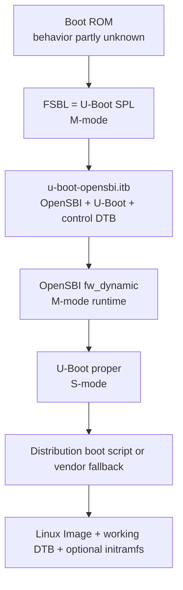
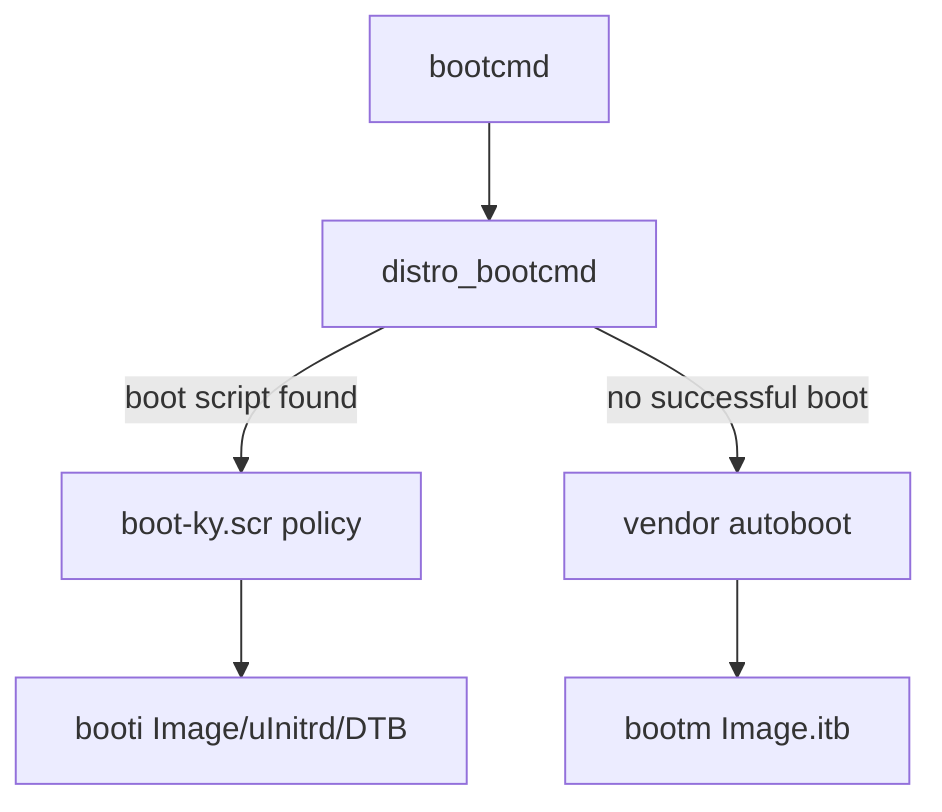
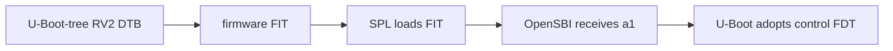
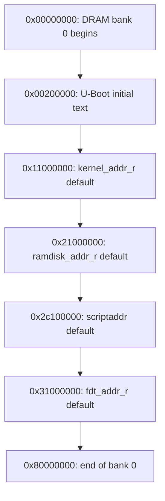
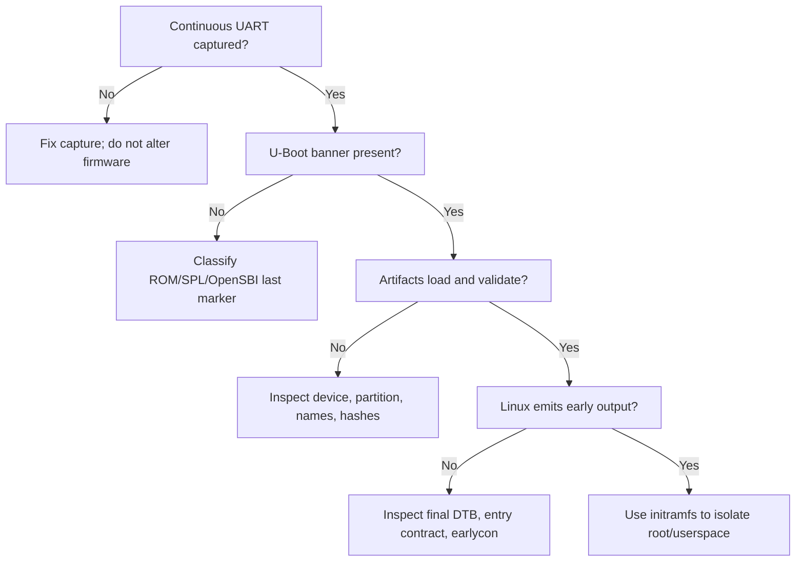

# U-Boot on Orange Pi RV2: RISC-V Boot Flow, Device Trees, and Linux Handoff

**Evidence-backed engineering handbook**  
**Research baseline:** 21 August 2026  
**Primary implementation anchors:** Orange Pi U-Boot `v2022.10-ky` at `89bff4a7e4cadfb5f130edb1ec44c39bff20a427`; Orange Pi Linux `orange-pi-6.6-ky` at `ae9e974d3e19f460b6397bfe8f0f1417a073ce05`.

> **Scope.** This handbook explains how executable control can reach U-Boot on an Orange Pi RV2, what the vendor U-Boot does, how the Orange Pi image boot policy selects Linux artifacts, and the architectural contract at the Linux jump. It is a source-derived model, not a substitute for a UART capture from the particular board and image under test.

## Contents

1. [Executive technical orientation](#1-executive-technical-orientation)
2. [RISC-V concepts required for this boot path](#2-risc-v-concepts-required-for-this-boot-path)
3. [How control reaches U-Boot](#3-how-control-reaches-u-boot)
4. [Vendor U-Boot source-code walkthrough](#4-vendor-u-boot-source-code-walkthrough)
5. [U-Boot runtime model on RV2](#5-u-boot-runtime-model-on-rv2)
6. [Device trees: control FDT versus Linux working DTB](#6-device-trees-control-fdt-versus-linux-working-dtb)
7. [Kernel, initramfs, and `booti` handoff](#7-kernel-initramfs-and-booti-handoff)
8. [RV2-native debugging and preservation procedure](#8-rv2-native-debugging-and-preservation-procedure)
9. [Senior-staff discussion guide](#9-senior-staff-discussion-guide)
10. [Practical source-reading labs](#10-practical-source-reading-labs)
11. [Glossary](#11-glossary)
12. [Indexed bibliography](#12-indexed-bibliography)
13. [Limitations and next evidence](#13-limitations-and-next-evidence)

## Evidence language

- **Confirmed** — directly supported by an authoritative source or by the source tree used to build the named artifact.
- **Strongly indicated** — converging credible evidence exists, but the behavior has not been observed on this exact board/image.
- **Inference** — a reasoned conclusion whose premises are stated; the observation needed to prove it is also stated.
- **Unknown / requires capture** — source material is insufficient; a board log, image inspection, or missing document is required.

These labels apply to the cited implementation baseline. A modified image, saved environment, different EEPROM identity, or newer branch can change runtime behavior.

## Evidence Register

| Claim | Classification | Source / artifact needed | Why it matters |
|---|---|---|---|
| RV2 uses a Ky/SpacemiT X1-class eight-core 64-bit RISC-V SoC | **Confirmed** | [Orange Pi product page](https://www.orangepi.org/html/hardWare/computerAndMicrocontrollers/details/Orange-Pi-RV2.html); [vendor Linux board DTS](https://github.com/orangepi-xunlong/linux-orangepi/blob/ae9e974d3e19f460b6397bfe8f0f1417a073ce05/arch/riscv/boot/dts/ky/x1_orangepi-rv2.dts#L15-L18) and [SoC DTSI](https://github.com/orangepi-xunlong/linux-orangepi/blob/ae9e974d3e19f460b6397bfe8f0f1417a073ce05/arch/riscv/boot/dts/ky/x1.dtsi) | Establishes the hardware family and hart topology. |
| The reviewed vendor U-Boot revision is `89bff4a…`, branch `v2022.10-ky` | **Confirmed** | [exact commit](https://github.com/orangepi-xunlong/u-boot-orangepi/commit/89bff4a7e4cadfb5f130edb1ec44c39bff20a427); [meta-riscv recipe](https://github.com/riscv/meta-riscv/blob/master/recipes-bsp/u-boot/u-boot-orangepi.bb) | Pins all code claims to a reproducible tree. |
| The reviewed vendor kernel is Linux 6.6.63 at `ae9e974d…` | **Confirmed** | [exact commit](https://github.com/orangepi-xunlong/linux-orangepi/commit/ae9e974d3e19f460b6397bfe8f0f1417a073ce05); [top-level Makefile](https://github.com/orangepi-xunlong/linux-orangepi/blob/ae9e974d3e19f460b6397bfe8f0f1417a073ce05/Makefile#L1-L5) | Couples the Linux DTB and kernel ABI claims. |
| The 4-GiB DT topology is two 2-GiB banks at `0` and `0x100000000` | **Confirmed** | [board DTS memory nodes](https://github.com/orangepi-xunlong/linux-orangepi/blob/ae9e974d3e19f460b6397bfe8f0f1417a073ce05/arch/riscv/boot/dts/ky/x1_orangepi-rv2.dts#L82-L91) | Affects valid load addresses, DMA, relocation, and overlap reasoning. |
| Orange Pi's SD image writer puts boot info at byte 0, FSBL at `0x20000`, environment at `0x60000`, and `u-boot-opensbi.itb` at `0xD0000` | **Confirmed** | [`ky.conf`, writes at sectors 0, 256, 768, 1664](https://github.com/orangepi-xunlong/orangepi-build/blob/bdba421984211da19191dc6ac6818a247817335f/external/config/sources/families/ky.conf#L34-L45) | Explains why partitioning or zeroing the device head destroys boot firmware. |
| The normal filesystem starts at 30 MiB in Orange Pi's build configuration | **Confirmed** | [`OFFSET=30`](https://github.com/orangepi-xunlong/orangepi-build/blob/bdba421984211da19191dc6ac6818a247817335f/external/config/sources/families/ky.conf#L8-L14) | Defines a preservation boundary for that image-building workflow; it does not mean every byte in the gap is firmware. |
| Boot ROM reads `bootinfo_sd.bin`, then selects the FSBL at the described offset | **Strongly indicated** | [SD boot-info JSON](https://github.com/orangepi-xunlong/u-boot-orangepi/blob/89bff4a7e4cadfb5f130edb1ec44c39bff20a427/board/ky/x1/configs/bootinfo_sd.json); a public X1 Boot ROM manual or trace would confirm the ROM algorithm | The on-media metadata and image writer agree, but the immutable ROM is not in the repository. |
| The FSBL is U-Boot SPL; it runs in M-mode, loads an FIT containing OpenSBI, U-Boot proper, and an RV2 DTB | **Confirmed** | [`x1_defconfig`](https://github.com/orangepi-xunlong/u-boot-orangepi/blob/89bff4a7e4cadfb5f130edb1ec44c39bff20a427/configs/x1_defconfig); [build `config.mk`](https://github.com/orangepi-xunlong/u-boot-orangepi/blob/89bff4a7e4cadfb5f130edb1ec44c39bff20a427/board/ky/x1/config.mk); [`uboot-opensbi.its`](https://github.com/orangepi-xunlong/u-boot-orangepi/blob/89bff4a7e4cadfb5f130edb1ec44c39bff20a427/uboot-opensbi.its#L1-L46) | Establishes the actual, not generic, pre-U-Boot composition. |
| OpenSBI `fw_dynamic` enters U-Boot proper at `0x00200000` in S-mode, with hart ID in `a0` and FDT pointer in `a1` | **Confirmed** | [`spl_opensbi.c`](https://github.com/orangepi-xunlong/u-boot-orangepi/blob/89bff4a7e4cadfb5f130edb1ec44c39bff20a427/common/spl/spl_opensbi.c#L129-L194); [FIT load address](https://github.com/orangepi-xunlong/u-boot-orangepi/blob/89bff4a7e4cadfb5f130edb1ec44c39bff20a427/uboot-opensbi.its#L8-L27); [OpenSBI switch code](https://github.com/orangepi-xunlong/u-boot-orangepi/blob/89bff4a7e4cadfb5f130edb1ec44c39bff20a427/opensbi/lib/sbi/sbi_hart.c) | Defines the exact architectural handoff into U-Boot. |
| The FIT DTB becomes U-Boot's prior-stage/control FDT | **Confirmed** | [FIT configuration](https://github.com/orangepi-xunlong/u-boot-orangepi/blob/89bff4a7e4cadfb5f130edb1ec44c39bff20a427/uboot-opensbi.its#L29-L44); [`board_fdt_blob_setup()`](https://github.com/orangepi-xunlong/u-boot-orangepi/blob/89bff4a7e4cadfb5f130edb1ec44c39bff20a427/board/ky/x1/x1.c#L1052-L1071) | Prevents confusing the device model's DT with Linux's later DTB. |
| Orange Pi distribution images load `Image`, `uInitrd`, and `dtb/${fdtfile}`, then call `booti` | **Confirmed as build policy; runtime requires capture** | [`boot-ky.cmd`](https://github.com/orangepi-xunlong/orangepi-build/blob/bdba421984211da19191dc6ac6818a247817335f/external/config/bootscripts/boot-ky.cmd#L34-L54); runtime `printenv` and UART would prove execution | Source establishes the generated script, but a saved environment or different image can select another path. |
| The vendor compiled fallback uses `Image.itb` and `bootm`, not `booti` | **Confirmed** | [`x1.env`](https://github.com/orangepi-xunlong/u-boot-orangepi/blob/89bff4a7e4cadfb5f130edb1ec44c39bff20a427/board/ky/x1/x1.env#L55-L62) and its MMC path at [lines 129–142](https://github.com/orangepi-xunlong/u-boot-orangepi/blob/89bff4a7e4cadfb5f130edb1ec44c39bff20a427/board/ky/x1/x1.env#L129-L142) | Avoids attributing a distribution script's behavior to compiled U-Boot defaults. |
| The reported reset loop after overwriting the first 1 MiB is caused by destruction of the early firmware region | **Inference** | Supplied observation plus confirmed offsets; compare hashes of an original and failing device | The write necessarily overlaps several boot components, but no failing UART/ROM trace identifies the first rejected component. |
| Native boot reached Linux or userspace | **Unknown / requires capture** | Continuous UART log, preferably with timestamps, through kernel and PID 1 | HDMI output alone cannot establish the last successful boundary. |

---

# 1. Executive technical orientation

The engineering question is not merely “does the board have U-Boot?” It is:

> Which immutable and mutable components execute, in which privilege modes and memory locations, before U-Boot proper; which firmware and device-tree state U-Boot inherits; which policy chooses the Linux artifacts; and exactly what state U-Boot presents at the Linux entry point?

The answer matters because each visible symptom belongs to a boundary. A reset loop before serial output suggests Boot ROM, boot metadata, or FSBL. An OpenSBI banner without U-Boot suggests the dynamic next-stage contract. A U-Boot prompt with no storage suggests driver/device-tree/environment policy. `Starting kernel …` followed by silence moves the fault boundary but does not prove the kernel executed.

## 1.1 Source-derived RV2 sequence



EPUB-safe equivalent:

| Boundary | RV2 implementation | Evidence |
|---|---|---|
| Reset → first mutable code | ROM consults SD boot metadata and reaches `FSBL.bin`/SPL | **Strongly indicated**; exact ROM logic unknown |
| SPL → firmware bundle | SPL loads `u-boot-opensbi.itb` from raw media | **Confirmed** in image layout and configuration |
| SPL → OpenSBI | `a0=boot_hart`, `a1=FIT FDT`, `a2=&fw_dynamic_info` | **Confirmed** in vendor source |
| OpenSBI → U-Boot | next address `0x00200000`, next mode S, `a0=hartid`, `a1=FDT` | **Confirmed** in vendor source |
| U-Boot → policy | Standard distro scan first, vendor `autoboot` fallback | **Confirmed** compiled environment; actual choice unknown without `printenv`/log |
| Script → Linux | Orange Pi script loads flat `Image`, `uInitrd`, external DTB, calls `booti` | **Confirmed** build policy; actual execution unknown |

The [official product page](https://www.orangepi.org/html/hardWare/computerAndMicrocontrollers/details/Orange-Pi-RV2.html) identifies an eight-core X1 RISC-V SoC. The reviewed Linux DTS models 4 GiB as [two non-contiguous 2-GiB banks](https://github.com/orangepi-xunlong/linux-orangepi/blob/ae9e974d3e19f460b6397bfe8f0f1417a073ce05/arch/riscv/boot/dts/ky/x1_orangepi-rv2.dts#L82-L91). This is relevant immediately: `0x80000000` through `0xffffffff` is not described as RAM for the 4-GiB board, and code that assumes one contiguous 4-GiB bank is wrong.

## 1.2 What is established and what remains observational

The repository proves what the named build _can produce_. It does not prove which binary is on a particular USB/SD device, what a saved environment overrides, whether an EEPROM changes `product_name`, or where execution stopped. Those require hashes, image extraction, `version`, `bdinfo`, `printenv`, and a continuous UART log.

The vendor tree embeds OpenSBI 1.3—see [`sbi_version.h`](https://github.com/orangepi-xunlong/u-boot-orangepi/blob/89bff4a7e4cadfb5f130edb1ec44c39bff20a427/opensbi/include/sbi/sbi_version.h)—inside its U-Boot build. An OpenSBI 1.8 banner observed under QEMU would therefore describe that QEMU firmware, not prove the RV2's native firmware version.

---

# 2. RISC-V concepts required for this boot path

## 2.1 Privilege modes and reset

RISC-V defines Machine (M), Supervisor (S), and User (U) privilege modes. M-mode controls the machine-level trap, interrupt, protection, and privilege-transition machinery; S-mode is the normal Linux kernel mode; U-mode hosts applications. The privileged architecture says a hart is in M-mode on reset; the precise reset vector and platform state are implementation-defined ([RISC-V privileged architecture, machine level](https://docs.riscv.org/reference/isa/v20260120/priv/machine.html)).

That general rule maps cleanly to the reviewed RV2 build:

- **Confirmed:** U-Boot SPL defaults to its RISC-V M-mode build while U-Boot proper selects `CONFIG_RISCV_SMODE=y` in [`x1_defconfig`](https://github.com/orangepi-xunlong/u-boot-orangepi/blob/89bff4a7e4cadfb5f130edb1ec44c39bff20a427/configs/x1_defconfig).
- **Confirmed:** SPL asks OpenSBI to enter the next stage in S-mode in [`spl_opensbi.c`](https://github.com/orangepi-xunlong/u-boot-orangepi/blob/89bff4a7e4cadfb5f130edb1ec44c39bff20a427/common/spl/spl_opensbi.c#L158-L166).
- **Unknown / requires capture:** the ROM's reset address, internal SRAM map, and reset state of every non-boot hart.

## 2.2 CSRs at the handoffs

Only a small set of control and status registers is essential here:

| CSR | Role in this path | Relevant condition |
|---|---|---|
| `mstatus` | Holds previous privilege (`MPP`) and machine interrupt state | OpenSBI sets `MPP=S` and clears `MPIE` before `mret` into U-Boot. |
| `mepc` | Return PC for `mret` | Set to U-Boot's next address. |
| `satp` | S-mode address translation and protection | Cleared for a physical-address handoff; Linux requires `satp=0` at entry. |
| `stvec` | S-mode trap vector | OpenSBI gives it a temporary valid value at the next-stage address; U-Boot installs its own trap vector. |
| `sie` / interrupt state | Supervisor interrupt enables | Cleared at the OpenSBI transition; U-Boot masks interrupts during early entry and before Linux. |
| `mhartid` / `a0` | Physical hart identity versus software argument | OpenSBI passes the boot hart ID in `a0`; Linux requires the hart ID in `a0`. |

The normative CSR definitions are in the [RISC-V privileged CSR chapter](https://docs.riscv.org/reference/isa/v20260120/priv/priv-csrs.html). The concrete RV2 transition is visible in the vendor OpenSBI [`sbi_hart_switch_mode()` implementation](https://github.com/orangepi-xunlong/u-boot-orangepi/blob/89bff4a7e4cadfb5f130edb1ec44c39bff20a427/opensbi/lib/sbi/sbi_hart.c).

## 2.3 Traps, delegation, SBI, and OpenSBI

A trap is a synchronous exception or asynchronous interrupt that redirects execution to a privilege-specific trap vector. M-mode firmware can delegate many traps and interrupts to S-mode, but some machine facilities remain inaccessible to Linux. The Supervisor Binary Interface (SBI) is the standardized call boundary by which an S-mode OS requests machine services such as timer/IPI operations, hart state management, reset, and console services where implemented ([official SBI specification repository](https://github.com/riscv-non-isa/riscv-sbi-doc)).

OpenSBI is an SBI implementation, not a bootloader policy engine. Its `fw_dynamic` firmware receives a small descriptor from a prior stage. The descriptor supplies the next address, next privilege mode, boot-hart selection, and options; the prior stage passes its pointer in `a2` ([OpenSBI `fw_dynamic` documentation](https://github.com/riscv-software-src/opensbi/blob/master/docs/firmware/fw_dynamic.md)).

For this RV2 build, **Confirmed:** SPL constructs that descriptor, OpenSBI remains resident in M-mode as the SBI runtime, and U-Boot proper runs in S-mode. Later, Linux also runs in S-mode and uses SBI. OpenSBI does not normally execute between every U-Boot instruction and the kernel jump; it is entered when S-mode issues an `ecall` or receives a non-delegated event.

## 2.4 Standard Linux RISC-V entry

The Linux RISC-V boot requirements are authoritative and compact ([Linux RISC-V boot requirements](https://docs.kernel.org/arch/riscv/boot.html)):

- `a0`: hart ID of the calling hart;
- `a1`: physical address of the device tree;
- `satp`: zero;
- the RV64 kernel must be placed at a PMD boundary, normally 2 MiB aligned;
- resident firmware memory must be described as reserved;
- only one hart enters the kernel under the preferred ordered-booting method; secondary harts are started through SBI HSM.

**Confirmed for the reviewed U-Boot path:** [`boot_jump_linux()`](https://github.com/orangepi-xunlong/u-boot-orangepi/blob/89bff4a7e4cadfb5f130edb1ec44c39bff20a427/arch/riscv/lib/bootm.c#L22-L63) calls the kernel with `gd->arch.boot_hart` and `images->ft_addr`. **Strongly indicated:** OpenSBI supplies the necessary SBI runtime and its platform code controls secondary harts. **Unknown / requires capture:** which physical hart is the runtime boot hart on the particular board and whether the current image uses ordered booting or vendor spin-wait behavior for all secondaries.

---

# 3. How control reaches U-Boot

This is the single focused pre-U-Boot chapter. It separates the generic model from the source-supported RV2 model.

## 3.1 Generic model

On a typical RISC-V SoC, immutable Boot ROM examines straps or boot metadata, authenticates an image if the platform requires it, and loads a small first-stage loader into on-chip SRAM. U-Boot calls its size-reduced first stage SPL; vendors may call the same artifact FSBL. SPL establishes enough clocks, pinmux, DRAM, console, and storage to load larger components. A machine-mode runtime such as OpenSBI then establishes SBI services and enters U-Boot proper in S-mode.

That is a pattern, not proof for RV2. TPL is an optional stage before SPL in U-Boot terminology; the reviewed RV2 configuration does not establish a separate TPL artifact. “FSBL” is the vendor package name for the header plus U-Boot SPL, not an additional confirmed executable between ROM and SPL.

## 3.2 RV2 media-to-SPL path

Orange Pi's SD image writer performs these writes ([`ky.conf`](https://github.com/orangepi-xunlong/orangepi-build/blob/bdba421984211da19191dc6ac6818a247817335f/external/config/sources/families/ky.conf#L34-L45)):

| Media byte offset | Artifact | Meaning |
|---:|---|---|
| `0x000000` | `bootinfo_sd.bin` | ROM-facing boot metadata |
| `0x020000` | `FSBL.bin` | 4-KiB vendor header plus U-Boot SPL |
| `0x060000` | `u-boot-env-default.bin` | Raw default environment placement |
| `0x0D0000` | `u-boot-opensbi.itb` | FIT with OpenSBI, U-Boot proper, and control FDT |
| `0x1E00000` | normal partition start | 30-MiB image-build offset |

The `dd` invocations use the default 512-byte block size, so sectors 256, 768, and 1664 correspond to the offsets above. The [SD boot-info description](https://github.com/orangepi-xunlong/u-boot-orangepi/blob/89bff4a7e4cadfb5f130edb1ec44c39bff20a427/board/ky/x1/configs/bootinfo_sd.json) contains `spl0_offset=0x20000`, `spl1_offset=0x80000`, and a size limit. **Confirmed:** those values are generated and written as described. **Unknown / requires capture:** whether the exact image under test includes a populated backup SPL at `0x80000`; the reviewed Orange Pi writer explicitly writes the primary FSBL only.

**Strongly indicated:** ROM consumes boot info at offset zero and loads the primary FSBL/SPL. That interpretation is supported by matching metadata and writer code. It remains short of **Confirmed** because no authoritative public ROM algorithm or ROM trace was found.

The FSBL header configuration sets a non-secure flag in the reviewed build recipe. This says something about the emitted header, not the complete immutable-ROM trust policy. **Unknown / requires capture/documentation:** fuse state, ROM key policy, rollback behavior, and whether a different official image enables verification. Secure boot is therefore outside the established boot model.

## 3.3 SPL work and next-stage selection

The RV2 SPL's [`board_init_f()` and `spl_board_init_f()`](https://github.com/orangepi-xunlong/u-boot-orangepi/blob/89bff4a7e4cadfb5f130edb1ec44c39bff20a427/board/ky/x1/spl.c#L444-L526) establish early pin control, U-Boot's early driver model, CPU state, console, PMIC/power, CPU clocking, EEPROM-derived DDR information, DRAM, and a timer. [`board_boot_order()`](https://github.com/orangepi-xunlong/u-boot-orangepi/blob/89bff4a7e4cadfb5f130edb1ec44c39bff20a427/board/ky/x1/spl.c#L709-L790) maps the decoded ROM boot mode to candidate devices.

For raw MMC, `CONFIG_SYS_MMCSD_RAW_MODE_U_BOOT_SECTOR=0x680` selects sector 1664, exactly the image writer's `0xD0000` placement. SPL's FIT load workspace is configured at `0x11000000`. The FIT then describes:

- U-Boot proper: load `0x00200000`;
- OpenSBI `fw_dynamic`: linked/dynamically placed, declared load and entry zero in the ITS;
- control FDT: `x1_orangepi-rv2.dtb`;
- configuration: OpenSBI as `firmware`, U-Boot as `loadables`, FDT as `fdt`.

All are **Confirmed** by [`uboot-opensbi.its`](https://github.com/orangepi-xunlong/u-boot-orangepi/blob/89bff4a7e4cadfb5f130edb1ec44c39bff20a427/uboot-opensbi.its#L8-L44) and the defconfig. The precise OpenSBI runtime placement is loader/linker-derived; do not infer it from the literal zero in the source ITS.

## 3.4 Exact SPL → OpenSBI → U-Boot contract

```mermaid
sequenceDiagram
    participant S as "SPL (M-mode)"
    participant O as "OpenSBI fw_dynamic"
    participant U as "U-Boot proper (S-mode)"
    S->>O: a0=boot hart, a1=FIT FDT, a2=&dynamic_info
    Note over S,O: next_addr=0x00200000; next_mode=S
    O->>U: mret with a0=hart ID, a1=FDT
    Note over O,U: satp=0, SIE=0, temporary stvec
```

EPUB-safe contract table:

| Item | SPL supplies to OpenSBI | OpenSBI supplies to U-Boot |
|---|---|---|
| PC | OpenSBI FIT entry | `0x00200000` via `mepc`/`mret` |
| Mode | SPL is M-mode | S-mode |
| `a0` | boot hart ID | hart ID |
| `a1` | FIT/control-FDT address | preserved FDT address |
| `a2` | aligned `fw_dynamic_info` pointer | not part of U-Boot's entry ABI |
| Translation | SPL implementation state | `satp=0` |
| Interrupts | prior-stage state | `SIE=0`, `mstatus.MPIE=0` |
| Trap state | OpenSBI establishes M-mode runtime | temporary `stvec`; U-Boot replaces it |

In [`spl_invoke_opensbi()`](https://github.com/orangepi-xunlong/u-boot-orangepi/blob/89bff4a7e4cadfb5f130edb1ec44c39bff20a427/common/spl/spl_opensbi.c#L129-L194), SPL finds the U-Boot node in the loaded FIT, chooses `CONFIG_SYS_TEXT_BASE`, fills `fw_dynamic_info` with the next address and S-mode, then calls OpenSBI with the three arguments. OpenSBI's dynamic firmware preserves the FDT argument, initializes its machine runtime, sets the privilege-transition CSRs, and executes `mret`. U-Boot's [`start.S`](https://github.com/orangepi-xunlong/u-boot-orangepi/blob/89bff4a7e4cadfb5f130edb1ec44c39bff20a427/arch/riscv/cpu/start.S) records `a0` as the boot hart and `a1` as the firmware FDT, creates a stack/global-data context, and reaches `board_init_f()`.

What is _not_ specified by that ABI: a C stack carried across stages, U-Boot's final relocation address, a Linux-ready DTB, or freely allocatable ownership of all RAM. Each stage establishes its own stack and reserves its own memory. OpenSBI remains resident; its region must not be overwritten.

## 3.5 What UART evidence would prove each boundary?

| Boundary | Discriminating evidence | What it would not prove |
|---|---|---|
| ROM → SPL | repeatable SPL earliest banner/character after power-on; change tied to an SPL build marker | exact ROM search order or authentication policy |
| SPL DRAM init | SPL log after DRAM probe, or deliberate marker after `UCLASS_RAM` succeeds | correctness of all DRAM or later cache coherency |
| SPL → OpenSBI | native OpenSBI banner/build ID following SPL load messages | successful entry to U-Boot proper |
| OpenSBI → U-Boot | U-Boot banner, `U-Boot 2022.10…`, then prompt or boot messages | correct saved environment or Linux artifacts |
| U-Boot policy | `printenv bootcmd boot_targets`, script echo/load lines, device/partition identities | successful `booti` validation or kernel execution |
| U-Boot → Linux | `Starting kernel …` followed by an early Linux banner/earlycon output | userspace or root filesystem success |
| Linux → PID 1 | `Run /init as init process`, initramfs shell, or init-system banner | health of final storage/network workload |

The vendor environment selects 115200 baud and `ttyS0` ([`x1.env` lines 1–10](https://github.com/orangepi-xunlong/u-boot-orangepi/blob/89bff4a7e4cadfb5f130edb1ec44c39bff20a427/board/ky/x1/x1.env#L1-L10)); the Linux board DTS also specifies `serial0:115200n8` ([DTS lines 117–121](https://github.com/orangepi-xunlong/linux-orangepi/blob/ae9e974d3e19f460b6397bfe8f0f1417a073ce05/arch/riscv/boot/dts/ky/x1_orangepi-rv2.dts#L117-L121)). Thus 115200 8N1 is **Confirmed as configuration**, though the physical header/pin wiring should be checked against the [official RV2 support documentation](https://www.orangepi.org/html/hardWare/computerAndMicrocontrollers/service-and-support/Orange-Pi-RV2.html).

---

# 4. Vendor U-Boot source-code walkthrough

## 4.1 Build identity and artifact graph

The authoritative board defconfig is **Confirmed** as [`configs/x1_defconfig`](https://github.com/orangepi-xunlong/u-boot-orangepi/blob/89bff4a7e4cadfb5f130edb1ec44c39bff20a427/configs/x1_defconfig); Orange Pi's board build config also names `x1_defconfig` and the Linux DTB `ky/x1_orangepi-rv2.dtb` ([`orangepirv2.conf`](https://github.com/orangepi-xunlong/orangepi-build/blob/bdba421984211da19191dc6ac6818a247817335f/external/config/boards/orangepirv2.conf)). The main vendor locations are:

| Location | Input | State/output | Visible failure mode |
|---|---|---|---|
| `configs/x1_defconfig` | Kconfig defaults | SPL/U-Boot feature set, addresses, commands | missing command/driver; different banner/config |
| `board/ky/x1/config.mk` | SPL, OpenSBI, U-Boot, DTBs, JSON | `FSBL.bin`, boot info, env binary, `u-boot-opensbi.itb` | missing or malformed build artifact |
| `board/ky/x1/spl.c` | boot mode, EEPROM, PMIC, RAM drivers | working DRAM and ordered load devices | reset, early hang, DDR/PMIC error on UART |
| `board/ky/x1/x1.c` | prior-stage FDT, EEPROM, RAM, device model | board identity, memory banks, late policy, FDT fixups | wrong product name, missing storage, bad fixup |
| `board/ky/x1/x1.env` | text environment | compiled default variables and scripts | wrong DTB/image name, fallback boot failure |
| `arch/riscv/cpu/start.S` | `a0`/`a1`, current execution state | global data, stack, C init, relocation path | trap/hang before banner |
| `common/spl/spl_opensbi.c` | loaded FIT and FDT | OpenSBI dynamic descriptor and jump | OpenSBI/U-Boot boundary failure |

The build graph matters operationally. `FSBL.bin` is not “OpenSBI”; `u-boot-opensbi.itb` is not “only U-Boot”; and the same FIT contains the FDT U-Boot later adopts as its control FDT.

## 4.2 Defconfig findings

Important confirmed values from [`x1_defconfig`](https://github.com/orangepi-xunlong/u-boot-orangepi/blob/89bff4a7e4cadfb5f130edb1ec44c39bff20a427/configs/x1_defconfig) are:

| Symbol | Value | Interpretation |
|---|---:|---|
| `CONFIG_SYS_TEXT_BASE` | `0x00200000` | link/entry address for U-Boot proper in this flow |
| `CONFIG_SPL_TEXT_BASE` | `0xC0801000` | configured SPL execution text base |
| `CONFIG_SPL_LOAD_FIT_ADDRESS` | `0x11000000` | SPL FIT load/work address |
| `CONFIG_SYS_MMCSD_RAW_MODE_U_BOOT_SECTOR` | `0x680` | raw media sector for next-stage FIT |
| `CONFIG_ENV_OFFSET` | `0x60000` | environment offset for applicable backend |
| `CONFIG_ENV_SIZE` | `0x4000` | environment size |
| `CONFIG_BOOTDELAY` | `0` | no intentional countdown |
| `CONFIG_AUTOBOOT_STOP_STR` | `s` | keyed autoboot stop character |
| `CONFIG_BOOTCOMMAND` | `bootm 0x11000000` | Kconfig-level command; generated environment can override it |

The tree enables multiple environment backends and devices. That does not mean all are simultaneously authoritative. Environment selection depends on boot medium/platform logic. `env info`, `printenv`, and source tracing are required to know the active backend. A corrupt or stale saved environment can override newly compiled defaults.

## 4.3 Initialization order

The useful U-Boot split is pre-relocation `board_init_f()` and post-relocation `board_init_r()`, described generically in [U-Boot initialization documentation](https://docs.u-boot.org/en/v2025.01/develop/init.html). On RV2:

1. **Assembly entry.** `start.S` captures hart ID/FDT, masks interrupts, initializes `gp`/stack/global data, and calls `board_init_f()`.
2. **Early generic init.** CPU, early malloc/logging, control FDT, driver-model scaffolding, serial, and DRAM discovery occur through the configured init sequence.
3. **Board/SPL-specific hardware.** SPL performs pinmux, PMIC, clocks, EEPROM/DDR selection, RAM driver probing, and timer setup.
4. **Reservation and relocation.** U-Boot calculates top-of-RAM reservations for U-Boot, malloc arena, FDT, framebuffer/video, stacks, and board data; it copies itself and applies relocations.
5. **`board_init_r()`.** Full driver model, console, storage/network devices, environment, stdio, late board init, boot delay, and command loop/autoboot become available.

Input → state → output → failure framing:

- The control FDT and configuration are inputs to driver probing. A missing/disabled controller node means no device even if silicon is functional.
- DRAM discovery changes `gd->ram_size` and bank descriptors; bad values corrupt relocation/load safety.
- Environment loading changes boot policy after the compiled defaults exist; CRC/backend failures should produce an environment warning and fall back to defaults.
- Relocation produces a new executing copy and updated pointers. A hang here can appear after an early banner but before normal commands.

## 4.4 Environment and boot-policy precedence

The vendor text environment is transformed into the compiled/default runtime environment by the board build rules and U-Boot environment machinery. Its [`bootcmd`](https://github.com/orangepi-xunlong/u-boot-orangepi/blob/89bff4a7e4cadfb5f130edb1ec44c39bff20a427/board/ky/x1/x1.env#L164-L175) is:

```text
run distro_bootcmd; run autoboot; echo "run autoboot"
```

This establishes a two-layer policy:

1. standard distribution scan over configured targets;
2. vendor device-specific fallback.

The configured distro targets in [`include/configs/x1.h`](https://github.com/orangepi-xunlong/u-boot-orangepi/blob/89bff4a7e4cadfb5f130edb1ec44c39bff20a427/include/configs/x1.h#L197-L216) include USB, multiple MMC instances, NVMe, PXE, and DHCP where compiled. Availability still depends on successful device probing and built commands.

If the distribution scan finds the generated Orange Pi boot script, [`boot-ky.cmd`](https://github.com/orangepi-xunlong/orangepi-build/blob/bdba421984211da19191dc6ac6818a247817335f/external/config/bootscripts/boot-ky.cmd#L34-L54) loads:

```text
uInitrd                    -> ${ramdisk_addr_r}
Image                      -> ${kernel_addr_r}
dtb/${fdtfile}             -> ${fdt_addr_r}
then: booti ${kernel_addr_r} ${ramdisk_addr_r} ${fdt_addr_r}
```

If it does not, the vendor fallback in [`x1.env`](https://github.com/orangepi-xunlong/u-boot-orangepi/blob/89bff4a7e4cadfb5f130edb1ec44c39bff20a427/board/ky/x1/x1.env#L95-L142) expects `Image.itb`, optionally a separate ramdisk and DTB, and calls `bootm`.

This distinction is central. A claim such as “RV2 boots with `booti`” must be phrased as “Orange Pi's reviewed distribution boot script uses `booti`; the vendor U-Boot compiled fallback uses `bootm`.” UART plus `printenv` proves the actual path.

## 4.5 Source-path walkthrough: four representative transitions

### A. ROM mode → SPL boot order

- **Input:** boot-mode value left by ROM/vendor state.
- **Code:** `fix_boot_mode()` and [`board_boot_order()`](https://github.com/orangepi-xunlong/u-boot-orangepi/blob/89bff4a7e4cadfb5f130edb1ec44c39bff20a427/board/ky/x1/spl.c#L709-L790).
- **Changed state:** ordered `spl_boot_list` of MMC/eMMC/NAND/NOR/USB candidates.
- **Output:** SPL loader attempts the corresponding device.
- **Failure signature:** no device/read, fallback/recovery messages, or reset depending on watchdog/error path.

### B. FIT → OpenSBI descriptor

- **Input:** loaded FIT, its `/fit-images` metadata, and FDT address.
- **Code:** [`common/spl/spl_opensbi.c`](https://github.com/orangepi-xunlong/u-boot-orangepi/blob/89bff4a7e4cadfb5f130edb1ec44c39bff20a427/common/spl/spl_opensbi.c#L25-L194).
- **Changed state:** populated `fw_dynamic_info`; caches flushed for the descriptor.
- **Output:** call to OpenSBI entry with `a0/a1/a2`.
- **Failure signature:** malformed FIT/OS node error, OpenSBI never banners, or no U-Boot after OpenSBI.

### C. Prior-stage FDT → control FDT

- **Input:** FDT pointer inherited in `a1` and saved in global data.
- **Code:** [`board_fdt_blob_setup()`](https://github.com/orangepi-xunlong/u-boot-orangepi/blob/89bff4a7e4cadfb5f130edb1ec44c39bff20a427/board/ky/x1/x1.c#L1052-L1071).
- **Changed state:** selects a valid prior-stage blob or fallback near `_end`.
- **Output:** U-Boot control FDT for driver model.
- **Failure signature:** bad FDT header, missing devices, console/storage probing failures.

### D. Distro script → `booti`

- **Input:** `${devtype}`, `${devnum}`, `${prefix}`, `${fdtfile}`, load-address variables, environment overrides.
- **Code:** [`boot-ky.cmd`](https://github.com/orangepi-xunlong/orangepi-build/blob/bdba421984211da19191dc6ac6818a247817335f/external/config/bootscripts/boot-ky.cmd).
- **Changed state:** RAM populated; working FDT selected, resized, modified, and overlaid; `bootargs` created.
- **Output:** `booti` invocation.
- **Failure signature:** `load` failure, bad FDT, overlay error, bad Linux magic, overlap/LMB error, or silence after `Starting kernel …`.

## 4.6 Material differences from upstream v2022.10

The fork adds a Ky X1 architecture/platform implementation, board code, X1 clock/power/DDR/cache behavior, storage/recovery commands, board EEPROM identity, video/display support, custom image construction, an embedded OpenSBI tree, and the vendor environment. The exact diff is large; for debugging, the important differences are not line count but ownership:

- platform reset/boot-mode and secondary-hart behavior are vendor code;
- DRAM topology and cache cleanup are X1-specific;
- the firmware bundle is produced by vendor build rules;
- the control FDT and board fixups are vendor-specific;
- the fallback boot policy is `x1.env`, not an upstream generic default.

Upstream documentation remains useful for APIs and concepts, but an upstream command's existence does not prove it was compiled into this image. Conversely, vendor commands may not appear upstream.

---

# 5. U-Boot runtime model on RV2

## 5.1 Relocation and reservations

U-Boot is linked to execute initially at `0x00200000`, but full U-Boot normally relocates toward the top of usable RAM after DRAM discovery. The RV2 board code limits the usable top for relocation when necessary because some devices have 32-bit DMA constraints; the 4-GiB Linux DT is non-contiguous. The actual relocated address is therefore runtime-derived, not safely guessed from `CONFIG_SYS_TEXT_BASE`.

Use:

```text
bdinfo
printenv kernel_addr_r ramdisk_addr_r fdt_addr_r scriptaddr
fdt addr -c
fdt header
```

`bdinfo` is the decisive runtime view: DRAM banks, relocation address/offset, FDT addresses, and boot parameters. Then use `meminfo` if present. Do not place a kernel merely “high in RAM”; account for the relocation image, malloc arena, control/working FDT, framebuffer, OpenSBI, reserved-memory, and the non-RAM hole.

The reviewed defaults in [`include/configs/x1.h`](https://github.com/orangepi-xunlong/u-boot-orangepi/blob/89bff4a7e4cadfb5f130edb1ec44c39bff20a427/include/configs/x1.h#L226-L239) include:

| Variable | Confirmed default | Intended object |
|---|---:|---|
| `kernel_addr_r` | `0x11000000` | Linux `Image` or FIT |
| `ramdisk_addr_r` | `0x21000000` | initramfs/uInitrd |
| `fdt_addr_r` | `0x31000000` | Linux working DTB |
| `scriptaddr` | `0x2c100000` | boot script |

These starts are not a proof of non-overlap. The loaded file sizes and any decompression destination must be checked. `iminfo`, `size`, `${filesize}`, `fdt header`, and memory-range arithmetic provide that check.

## 5.2 Driver model, console, storage, environment

U-Boot's driver model binds devices from compatible strings and probes them on demand; see the [official driver-model API documentation](https://docs.u-boot.org/en/v2025.04/api/dm.html). On RV2, the control FDT describes the controllers U-Boot needs. A Linux DTB with more nodes is not automatically a better U-Boot control FDT: drivers and bindings may differ between the vendor U-Boot and Linux trees.

Console variables route streams:

- `stdin`: accepted input devices;
- `stdout`: normal output devices;
- `stderr`: diagnostic output devices;
- `serial`: UART console;
- `vidconsole`: video console where compiled/probed.

The compiled RV2 environment sets stdout/stderr to serial. Video appearing proves that U-Boot initialized a display path; it does not prove characters are visible on UART, Linux selected the same DTB, Linux has the correct display pipeline drivers, or the kernel ran.

Environment has three conceptual layers: compiled defaults, a persistent environment loaded from a backend, and temporary runtime edits. `env default -a` changes the in-memory view; `saveenv` makes a persistent write and should not be used during initial evidence collection. The official [U-Boot environment documentation](https://docs.u-boot.org/en/v2023.10/usage/environment.html) describes the generic model.

## 5.3 Runtime boot-policy chain



EPUB-safe statement: `bootcmd` first runs the configured distro scan. A successful script uses `booti`; otherwise the vendor fallback chooses a path from `boot_device` and normally uses `bootm` with `Image.itb`.

`bootdelay=0` and stop string `s` make interruption timing tight. Capture UART before power-on and transmit `s` repeatedly around reset if necessary. Do not infer that a missing prompt means U-Boot did not execute; it may have immediately run policy.

## 5.4 Diagnostic command matrix

| Command | Diagnostic value | Status for reviewed build |
|---|---|---|
| `version` | banner/build identity | generic command; expected, runtime-confirm |
| `bdinfo` | DRAM banks, relocation, FDT/boot state | configured standard command; runtime-confirm |
| `printenv` / `env info` | active policy and environment backend | environment commands enabled; runtime-confirm backend |
| `mmc list`; `mmc dev`; `mmc info` | controller/device mapping | MMC enabled **Confirmed** |
| `usb start`; `usb tree`; `usb storage` | USB enumeration/storage | USB and storage enabled **Confirmed** |
| `nvme scan`; `nvme info` | NVMe enumeration | target policy references NVMe; command presence runtime-confirm |
| `part list`; `part uuid` | partition discovery/identity | partition commands enabled **Confirmed** |
| `ls`; `load`; `ext4ls`; `fatls` | filesystem artifact inspection | depends on compiled FS command; runtime-confirm exact set |
| `fdt addr`; `fdt addr -c`; `fdt header`; `fdt print /chosen` | working versus control FDT and fixups | FDT command enabled **Confirmed** |
| `iminfo`; `imls` | image/FIT inspection | image command status runtime-confirm |
| `md.b`; `crc32` | non-destructive memory inspection/hash | common commands; runtime-confirm |
| `booti`; `bootm` | Linux flat Image versus legacy/FIT boot | both paths present in source **Confirmed** |

Treat commands that write (`mw`, `mmc write`, `sf write`, `saveenv`, `erase`) as out of scope during capture. Even `fdt rm` changes the RAM copy; that is reversible at reset, but record the original first.

---

# 6. Device trees: control FDT versus Linux working DTB

## 6.1 FDT is data, not firmware code

A Device Tree Blob (DTB) is the flattened binary representation of a tree of nodes and properties. It describes processors, memory, buses, devices, interrupt topology, reserved regions, chosen boot arguments, and board wiring. A CPU does not “execute the DTB.” Firmware and kernels parse it and act on its data.

The term FDT often refers to the in-memory blob and DTB to a stored file, but both use the same flattened format. A DTS is source; `dtc` produces a DTB.

## 6.2 The two roles

| Property | U-Boot control FDT | Linux working DTB |
|---|---|---|
| Consumer | U-Boot driver model and board code | Linux at entry in `a1` |
| Origin in reviewed RV2 flow | `x1_orangepi-rv2.dtb` inside `u-boot-opensbi.itb`, passed through OpenSBI | `dtb/ky/x1_orangepi-rv2.dtb` loaded by Orange Pi script, or a DT selected inside/following another boot format |
| Address selection | prior-stage pointer; inspect `fdtcontroladdr` / `fdt addr -c` | `${fdt_addr_r}` then relocation/fixups; inspect `fdt addr` and `bdinfo` |
| Mutability | should be treated as control data; use `-c` only for inspection unless debugging deliberately | resized, overlaid, and fixed up before Linux |
| Source tree | vendor U-Boot `arch/riscv/dts` | vendor Linux `arch/riscv/boot/dts/ky` |
| Must be identical? | No | No; it must match board and target kernel bindings |

Official U-Boot documentation explicitly distinguishes the [control FDT](https://docs.u-boot.org/en/v2025.10/develop/devicetree/control.html) from the [working FDT manipulated by the `fdt` command](https://docs.u-boot.org/en/v2026.04/usage/cmd/fdt.html). `fdt addr -c` selects/displays the control side; ordinary `fdt addr` addresses the working blob.

## 6.3 RV2 control-FDT path



The firmware FIT's `conf_14` selects the RV2 FDT alongside OpenSBI and U-Boot ([ITS lines 29–44](https://github.com/orangepi-xunlong/u-boot-orangepi/blob/89bff4a7e4cadfb5f130edb1ec44c39bff20a427/uboot-opensbi.its#L29-L44)). SPL passes that address as `a1`. U-Boot saves it as `gd->arch.firmware_fdt_addr`; [`board_fdt_blob_setup()`](https://github.com/orangepi-xunlong/u-boot-orangepi/blob/89bff4a7e4cadfb5f130edb1ec44c39bff20a427/board/ky/x1/x1.c#L1052-L1071) returns it if its header is valid. That chain is **Confirmed**.

The U-Boot-tree DTS is intentionally tailored to firmware. It must describe enough clocks, pinctrl, buses, UART, storage, and display for compiled U-Boot drivers. It is not evidence that Linux has or uses corresponding drivers.

## 6.4 RV2 Linux-working-DTB path

Orange Pi's board build names [`ky/x1_orangepi-rv2.dtb`](https://github.com/orangepi-xunlong/orangepi-build/blob/bdba421984211da19191dc6ac6818a247817335f/external/config/boards/orangepirv2.conf). Its script loads that file from `dtb/${fdtfile}` into `${fdt_addr_r}`, makes it the working FDT, removes a backlight phandle, adds 64 KiB of expansion room, then applies vendor and user overlays ([`boot-ky.cmd` lines 34–54](https://github.com/orangepi-xunlong/orangepi-build/blob/bdba421984211da19191dc6ac6818a247817335f/external/config/bootscripts/boot-ky.cmd#L34-L54)). That is **Confirmed build policy**.

After the script invokes `booti`, generic U-Boot image setup relocates the blob if needed, validates it, and applies fixups. The RV2 board's [`ft_board_setup()`](https://github.com/orangepi-xunlong/u-boot-orangepi/blob/89bff4a7e4cadfb5f130edb1ec44c39bff20a427/board/ky/x1/x1.c#L1284-L1322) adds board-specific modifications, including relevant partition/framebuffer/CPU fixups. Generic fixups can include:

- `/chosen/bootargs` from U-Boot's `bootargs`;
- `/chosen/linux,initrd-start` and `linux,initrd-end`;
- memory and reserved-memory descriptions where platform code requests changes;
- MAC addresses and board data;
- boot-hart/CPU state and platform-specific reserved regions.

Not every U-Boot build applies every item. Inspect the final blob rather than assume.

## 6.5 Embedded, separate, FIT-contained, and relocated DTBs

These are placement choices, not different DT formats:

- **Embedded:** linked into the executable or appended to it; common for constrained firmware.
- **Separate file:** loaded from a filesystem, as Orange Pi's Linux DTB is in `boot-ky.cmd`.
- **FIT-contained:** an `images` node inside an FIT, selected by a configuration; the RV2 firmware control FDT uses this mechanism.
- **Runtime copy:** any of the above can be copied/relocated to writable, aligned RAM with expansion space.

The vendor fallback's `loaddtb` can use an external DTB and fall back to a built-in one. That fallback is a separate path from the distribution script and must be traced using the active environment.

## 6.6 How to prove which DTB Linux receives

At an interrupted U-Boot prompt, collect without saving environment:

```text
version
bdinfo
printenv fdtfile fdt_addr_r fdt_addr fdtcontroladdr bootcmd
fdt addr -c
fdt header
fdt print / model
fdt addr ${fdt_addr_r}
fdt header
fdt print / model
fdt print /chosen
```

After the script loads/fixes the blob but before the jump, hash/dump it if commands permit. In Linux, compare:

```sh
tr -d '\0' </proc/device-tree/model
tr '\0' '\n' </proc/device-tree/compatible
cat /proc/cmdline
dtc -I fs -O dts /sys/firmware/devicetree/base > running.dts
```

The strongest proof is a byte/semantic comparison of the pre-jump U-Boot working FDT and `/sys/firmware/devicetree/base`, allowing for Linux's representation and bootloader fixups. A filename in an environment variable is weaker evidence than the final pointer and content.

## 6.7 HDMI is not a cross-stage proof

U-Boot and Linux use different driver stacks, DT bindings, clocks, resets, framebuffer handoff, and mode-setting paths. Therefore:

- a U-Boot logo/console confirms some U-Boot display path and its control data;
- it does not confirm the Linux DTB's display graph, kernel driver, firmware dependencies, or console routing;
- Linux can boot successfully with a dark HDMI display;
- HDMI can remain on a stale framebuffer even if the CPU resets or stalls.

UART is the boundary instrument; HDMI is a subsystem observation.

## 6.8 RV2-specific conclusions

| Conclusion | Status | Basis |
|---|---|---|
| The firmware FIT contains an RV2 control DTB | **Confirmed** | `uboot-opensbi.its` |
| U-Boot receives that FDT through OpenSBI in `a1` | **Confirmed** | SPL/OpenSBI/U-Boot source chain |
| The Orange Pi Linux build produces a separate RV2 DTB | **Confirmed** | kernel DTS/Makefile and board build configuration |
| Orange Pi's distribution script loads that DTB at `0x31000000` by default | **Confirmed** | `boot-ky.cmd` + `x1.h` defaults |
| The exact device under test executed that script and supplied that file | **Unknown / requires capture** | UART, `printenv`, and FDT inspection |
| The control FDT and Linux DTB are interchangeable because names match | **False; Confirmed distinction** | different source trees, consumers, content, and binding expectations |
| U-Boot HDMI success proves Linux HDMI configuration | **False; Confirmed architectural distinction** | different consumers/drivers and handoff state |

Loading an arbitrary external “RV2 DTB” is dangerous. A DTB must match the board revision, firmware-reserved regions, kernel binding version, clock/reset providers, interrupt topology, and any bootloader fixups. The failure can range from a missing device to memory corruption. Keep kernel `Image`, modules, DTB, and firmware as a tested set.

---

# 7. Kernel, initramfs, and `booti` handoff

## 7.1 Storage-to-RAM path

In the reviewed distribution policy:

1. The distro framework identifies a bootable device/partition and executes the Orange Pi script.
2. `load` reads `uInitrd` to `ramdisk_addr_r`.
3. `load` reads the flat, uncompressed-or-kernel-supported `Image` to `kernel_addr_r`.
4. `load` reads `dtb/${fdtfile}` to `fdt_addr_r`.
5. The script selects and expands the working FDT, applies a board edit and overlays.
6. It invokes `booti` with the three addresses.

The source does not test every `load` before proceeding. A failure can leave stale RAM from a prior attempt. Read each command's status/output and verify `${filesize}` immediately after load when reproducing manually.

## 7.2 `booti` syntax

The official syntax is ([U-Boot `booti` documentation](https://docs.u-boot.org/en/v2026.04/usage/cmd/booti.html)):

```text
booti <kernel_addr> <initrd_addr[:size] | -> <fdt_addr>
```

- `<kernel_addr>`: address of a RISC-V Linux `Image` with a valid boot-image header.
- `<initrd_addr[:size]>`: initrd/uInitrd region. For a raw initrd, size is required; a wrapped image may carry size metadata. `-` means no initrd while retaining the third argument.
- `<fdt_addr>`: working Linux FDT.

The Orange Pi script passes `${ramdisk_addr_r}` without an explicit size because `uInitrd` is expected to be an image format whose header carries size/type information. A raw `cpio.gz` at that address would require `address:size`.

## 7.3 Validation and relocation

The vendor [`booti_setup()`](https://github.com/orangepi-xunlong/u-boot-orangepi/blob/89bff4a7e4cadfb5f130edb1ec44c39bff20a427/arch/riscv/lib/image.c#L36-L84) checks the RISC-V Linux image magic and a non-zero image size, computes the effective size, and relocates an image already in DRAM to `ram_base + text_offset` if required. The 64-byte header and fields are documented in the [Linux RISC-V boot image header](https://docs.kernel.org/arch/riscv/boot-image-header.html).

If compression support recognizes a compressed kernel, `cmd/booti.c` uses `kernel_comp_addr_r`/`kernel_comp_size` and a configured decompressor. A normal flat Linux `Image` is not decompressed by `booti`. `booti` then uses the common bootm state machine to locate the ramdisk/FDT, reserve ranges with LMB, prepare Linux, disable interrupts, and jump.

`booti` does **not** by itself prove:

- that the kernel and DTB came from a trusted source;
- that modules match the kernel;
- that DT bindings are compatible;
- that the root filesystem exists;
- that all DMA/cache/platform state is correct;
- that a raw initrd size was inferred safely;
- that an arbitrary load address does not overlap data before LMB sees it.

FIT signature verification is a separate policy. The reviewed firmware FIT build support must not be conflated with verified Linux boot.

## 7.4 Memory-layout discipline

Illustrative—not runtime-measured—layout using confirmed default starts:



EPUB-safe caveats:

| Range/start | Meaning | Confidence |
|---:|---|---|
| `0x00000000–0x7fffffff` | first 2-GiB bank described by Linux DT | **Confirmed** |
| `0x00200000` | U-Boot link/initial text address | **Confirmed**; not final relocation address |
| `0x11000000` | default kernel load start | **Confirmed default**; end depends on image size |
| `0x21000000` | default initrd load start | **Confirmed default**; end depends on image size |
| `0x2c100000` | default script address | **Confirmed default** |
| `0x31000000` | default working DTB load start | **Confirmed default** |
| `0x80000000–0xffffffff` | not described as RAM by the reviewed 4-GiB DTS | **Confirmed for that DTS** |
| `0x100000000–0x17fffffff` | second 2-GiB bank | **Confirmed** |
| top-of-bank reservations | relocated U-Boot, stack, malloc, video, FDT, etc. | **Runtime-derived**; inspect `bdinfo` |

To validate non-overlap, compute half-open ranges `[start, start+size)` for kernel, decompressed kernel, initrd, FDT expansion, script, and any FIT. Compare them with `bdinfo` reservations and `/reserved-memory`. If compression is used, the destination size—not just compressed size—matters.

## 7.5 FDT preparation

Common image setup calls Linux-FDT preparation before the jump. The working blob is made writable/relocatable, `/chosen` is populated from `bootargs`, initrd boundaries are recorded, platform fixups run, and U-Boot ensures the final address is the one stored in `images->ft_addr`. The source path begins in common image/FDT setup and reaches RV2 [`ft_board_setup()`](https://github.com/orangepi-xunlong/u-boot-orangepi/blob/89bff4a7e4cadfb5f130edb1ec44c39bff20a427/board/ky/x1/x1.c#L1284-L1322).

The DTB at `${fdt_addr_r}` before `booti` is not necessarily byte-for-byte the DTB Linux receives. Inspect after fixups by using a controlled breakpoint/manual sequence, increasing boot delay, or instrumenting a build. Linux's live tree is the final post-entry evidence.

## 7.6 Exact final contract to Linux

The final call in the reviewed RISC-V U-Boot path is conceptually:

```c
kernel(gd->arch.boot_hart, images->ft_addr);
```

The complete contract is:

| State | Required/provided condition |
|---|---|
| Entry PC | RISC-V Linux image entry after `booti_setup()` alignment/relocation |
| Privilege | S-mode; OpenSBI remains M-mode SBI provider |
| `a0` | boot hart ID |
| `a1` | physical address of final working FDT |
| `satp` | zero as required by Linux boot ABI |
| MMU | off/bare physical addressing |
| Interrupts | disabled/masked for handoff |
| Cache/device state | platform `cleanup_before_linux()` performs vendor cache flush and interrupt cleanup |
| Resident firmware | OpenSBI remains protected/reserved and callable through SBI |
| Secondary harts | must not enter Linux unsafely; preferred control is SBI HSM ordered booting |
| Initramfs | address range expressed in `/chosen` if supplied |
| Command line | `/chosen/bootargs` in final FDT |

The authoritative OS-side conditions are the [Linux RISC-V boot requirements](https://docs.kernel.org/arch/riscv/boot.html). The U-Boot-side call and `Starting kernel …` print are in [`arch/riscv/lib/bootm.c`](https://github.com/orangepi-xunlong/u-boot-orangepi/blob/89bff4a7e4cadfb5f130edb1ec44c39bff20a427/arch/riscv/lib/bootm.c#L22-L63). X1 cache cleanup is vendor platform code, so a generic upstream account is insufficient for a post-print stall.

## 7.7 Interpreting `Starting kernel …`

That string proves U-Boot completed image discovery/preparation far enough to enter `boot_jump_linux()` and print immediately before device cleanup/cache handling and the function call. It does **not** prove:

- the kernel entry instruction executed;
- `a0`/`a1` were usable by the kernel;
- the DTB survived/cache-flushed correctly;
- early page-table setup succeeded;
- the configured early console matches hardware;
- Linux reached `start_kernel()`.

The next expected useful output, when configured, is Linux's early console/banner—not a second OpenSBI boot banner. OpenSBI may print its banner when initialized before U-Boot; later Linux SBI calls do not normally replay that banner. The reviewed DTS requests `earlycon=sbi` and `console=ttyS0,115200n8`; the exact first line and ordering can vary with kernel config and console driver.

## 7.8 Why a static BusyBox initramfs helps—and its limit

A statically linked BusyBox initramfs removes dynamic-loader, shared-library, storage driver, partition, mount, and final-root dependencies from the first userspace test. With `/init` that mounts `proc`, `sysfs`, and `devtmpfs` then opens a shell, it can prove kernel-to-userspace execution and provide inspection tools.

It cannot prove the kernel reached early initialization. A failure before initramfs unpacking, scheduler initialization, console registration, or `Run /init` is unaffected by BusyBox. Thus an initramfs is a good _late-stage isolator_, not a cure for silence immediately after `Starting kernel …`.

---

# 8. RV2-native debugging and preservation procedure

## 8.1 Preserve the hidden firmware region

Partitioning tools display partitions, not necessarily all meaningful bytes before partition 1. On the Orange Pi RV2 image, boot metadata and three firmware artifacts occupy raw sectors before the 30-MiB partition boundary. Writing an ISO/filesystem image at LBA 0, creating a new partition table, or zeroing the first MiB overwrites boot data before touching the visible filesystem.

The supplied observation—reset loops after overwriting the first 1 MiB and restored progress after preserving the pre-partition area—is consistent with the confirmed layout. The first MiB covers boot info, FSBL, environment, and the beginning of `u-boot-opensbi.itb`. It is not yet proof of which damaged component caused the reset.

## 8.2 Read-only inspection before modification

On a trusted Linux host, identify the device by stable attributes, unmount it, and prevent automount. Replace `/dev/sdX` only after checking model, serial, size, and partitions:

```sh
lsblk -o NAME,PATH,SIZE,MODEL,SERIAL,TRAN,RO,FSTYPE,MOUNTPOINTS
udevadm info --query=property --name=/dev/sdX
sudo blockdev --setro /dev/sdX
sudo blockdev --getro /dev/sdX
sudo fdisk -l /dev/sdX
sudo sfdisk --dump /dev/sdX
```

Then make byte-exact, read-only captures. Use a destination on another filesystem with sufficient space:

```sh
sudo dd if=/dev/sdX of=rv2-device-full.img bs=4M iflag=fullblock status=progress
sudo dd if=/dev/sdX of=rv2-device-head-32MiB.bin bs=1M count=32 iflag=fullblock status=progress
sha256sum rv2-device-full.img rv2-device-head-32MiB.bin > SHA256SUMS
sync
```

Read-only analysis:

```sh
sha256sum -c SHA256SUMS
fdisk -l rv2-device-full.img
sfdisk --dump rv2-device-full.img
file rv2-device-head-32MiB.bin
xxd -g 1 -l 512 rv2-device-head-32MiB.bin
binwalk rv2-device-head-32MiB.bin
```

Keep two independently hashed copies before any write. Record device identity, command transcript, UTC timestamp, and tool versions. A head-only capture is useful for firmware comparison but is not a complete backup.

## 8.3 Minimum evidence before changing artifacts

Collect:

1. uninterrupted UART from power-on through failure, at 115200 8N1 for this source baseline;
2. photo/diagram of UART wiring and adapter voltage level (3.3 V TTL, not RS-232);
3. `version` and `bdinfo`;
4. `printenv` at least for `bootcmd`, `boot_targets`, `boot_device`, `fdtfile`, load addresses, `console`, and `bootargs`;
5. `mmc list`, `usb tree`, `nvme info` as applicable;
6. `part list` and filesystem listing of the actual boot partition;
7. sizes and SHA-256 hashes of `Image`, `uInitrd`, DTB, and `boot.scr`/source `boot.cmd`;
8. partition table and the first 32 MiB of the unmodified media;
9. final working FDT identity/content if execution reaches `booti`;
10. exact reproduction steps and power/reset behavior.

Do not change kernel, DTB, script, and firmware simultaneously. A one-variable change with before/after hashes preserves causal information.

## 8.4 Boundary diagnosis

| Last reliable evidence | Probable fault domain | Next discriminating observation |
|---|---|---|
| no UART, repeated resets, no stable display | power, ROM, boot metadata, FSBL, UART wiring | compare first 32 MiB hash; validate adapter/pins; known-good untouched media |
| SPL output, no OpenSBI banner | DRAM, media read, FIT parse/load, OpenSBI entry | enable SPL debug; inspect FIT with `dumpimage`; compare offset/hash |
| OpenSBI banner, no U-Boot banner | dynamic info, U-Boot load/entry, FDT, S-mode transition | record OpenSBI domain/next-address output; instrument U-Boot `_start` |
| U-Boot banner, no devices/policy progress | control FDT, driver bind/probe, environment, console routing | `dm tree`, `bdinfo`, `printenv`, per-bus enumeration |
| load errors before `booti` | target order, partition/filesystem, filename, address | manual `load`, `ls`, `${filesize}`, hashes |
| `Bad Linux…`/FDT error | wrong artifact format, corrupt load, wrong DTB/header | inspect image header, `fdt header`, compare hashes |
| `Starting kernel …`, then silence | cleanup/jump, kernel header/entry, DTB, early MMU, early console | add kernel earlycon, instrument earliest entry, simplify working DTB only with matched kernel |
| Linux banner, mount/root panic | initramfs, drivers, root=, partition, filesystem | static initramfs shell; inspect `/proc/cmdline`, devices, mounts |
| `/init` starts, service failure | userspace/configuration | userspace logs and controlled root switch |

## 8.5 UART-first procedure

1. Power off the board and adapter before wiring.
2. Confirm the board documentation's debug UART pins and ground; do not connect the adapter's VCC pin unless the official procedure explicitly requires it.
3. Use a 3.3-V TTL adapter. Cross adapter TX to board RX and adapter RX to board TX; connect ground.
4. Configure 115200 baud, 8 data bits, no parity, 1 stop bit, no hardware/software flow control.
5. Start capture with timestamps before applying board power.
6. Preserve raw bytes and a readable transcript; do not paste only the final line.
7. To interrupt zero-delay autoboot, transmit `s` around reset, consistent with the compiled stop string.

The source confirms baud/console configuration, but pin identity and electrical details should be checked against the [official RV2 manual/support page](https://www.orangepi.org/html/hardWare/computerAndMicrocontrollers/service-and-support/Orange-Pi-RV2.html).

## 8.6 Decision tree



EPUB-safe rule set:

1. No continuous UART → establish capture first.
2. No U-Boot banner → find the last ROM/SPL/OpenSBI marker; inspect raw firmware, not Linux files.
3. U-Boot present but load fails → prove device, partition, filename, format, and hash.
4. `booti` validates but no Linux output → prove final FDT and entry/early-console conditions.
5. Linux starts but cannot mount root → introduce a minimal static initramfs.
6. Change only the smallest artifact implicated by the last proven boundary.

---

# 9. Senior-staff discussion guide

## 9.1 Ten difficult questions and defensible answers

### 1. “How do you know OpenSBI is before U-Boot rather than launched by it?”

The firmware FIT declares OpenSBI as `firmware` and U-Boot as a `loadables` component. SPL's `spl_invoke_opensbi()` constructs `fw_dynamic_info` with U-Boot's next address/mode and calls OpenSBI. OpenSBI then executes `mret` into S-mode U-Boot. This is confirmed source behavior for the pinned vendor build, not a generic assumption.

### 2. “What exactly is `FSBL.bin` here?”

It is the vendor-generated first-stage artifact: a 4-KiB header plus U-Boot SPL. “FSBL” is packaging terminology; it is not evidence of a separate proprietary executable followed by SPL. The Boot ROM algorithm that consumes its header is strongly indicated but not publicly verified in this research.

### 3. “Why are there two DTBs named for the RV2?”

They serve different consumers. The U-Boot-tree DTB is packaged with OpenSBI/U-Boot and becomes U-Boot's control FDT. The Linux-tree DTB is loaded by the distribution script and becomes the working DTB passed to Linux after overlays/fixups. Matching filenames do not make their content or bindings interchangeable.

### 4. “Does `Starting kernel …` prove the kernel ran?”

No. It proves U-Boot reached `boot_jump_linux()` and printed immediately before platform cleanup/cache work and the indirect kernel call. It narrows the failure to cleanup/jump/entry/early Linux or console visibility, but the first kernel instruction is unproven until instrumented or observed.

### 5. “Where is U-Boot loaded and where does it run?”

The FIT and defconfig place initial U-Boot proper at `0x00200000`. Full U-Boot later relocates to a runtime-computed high-RAM region after reservations. `bdinfo` gives the executing relocation address; `CONFIG_SYS_TEXT_BASE` is not that final address.

### 6. “Why did overwriting only the first MiB break boot?”

The official image writer puts boot info at 0, FSBL at 128 KiB, environment at 384 KiB, and starts the OpenSBI/U-Boot FIT at 832 KiB. A one-MiB overwrite necessarily damages several of those. Which damage first caused the reset remains unknown without comparing the failing image and UART/ROM behavior.

### 7. “Is 30 MiB the firmware size?”

No. It is the configured offset before the first normal partition. Known artifacts occupy specific offsets within it. The remaining gap may be alignment/reservation and must be preserved unless authoritative layout data says otherwise.

### 8. “Does this board boot with `booti` or `bootm`?”

Both paths exist. The Orange Pi distribution script uses `booti` for `Image` plus `uInitrd` and an external DTB. The vendor compiled fallback expects `Image.itb` and calls `bootm`. The active saved environment and discovered script decide which one ran.

### 9. “Who performs the M-to-S privilege transition?”

OpenSBI. SPL is M-mode, passes a dynamic descriptor requesting S-mode, and OpenSBI programs `mstatus.MPP`, `mepc`, `satp`, supervisor trap/interrupt state, then `mret`s to U-Boot. Linux later remains S-mode and uses OpenSBI as its M-mode SBI provider.

### 10. “What single capture would most improve confidence?”

A continuous native UART log from power-on through failure, paired with a read-only first-32-MiB dump and runtime `version`, `bdinfo`, and `printenv`. That links static source to the exact binary, media layout, environment, and last executed boundary.

## 9.2 One-page verbal narrative

The Orange Pi RV2 reviewed here is an eight-hart 64-bit RISC-V X1 platform. On reset each hart is architecturally in Machine mode, but the exact X1 Boot ROM search and trust algorithm is not publicly established in the sources reviewed. What we can show is the official image layout: ROM-facing boot information is at byte zero, a vendor-wrapped U-Boot SPL called `FSBL.bin` starts at 128 KiB, the environment is at 384 KiB, and a combined OpenSBI/U-Boot FIT begins at 832 KiB. The first normal partition is deliberately delayed until 30 MiB. That is why conventional repartitioning at LBA zero can destroy boot without touching the visible root filesystem.

SPL is the hardware-enablement stage. It runs in M-mode, establishes pinmux, early console, power and clock state, reads DDR identity, initializes DRAM, and selects a loader based on the ROM boot mode. It loads `u-boot-opensbi.itb`. That FIT is important: OpenSBI is its firmware component, U-Boot proper is a loadable at `0x00200000`, and an RV2 FDT accompanies both.

SPL does not jump directly to S-mode U-Boot. It calls OpenSBI `fw_dynamic` with the boot hart in `a0`, the FIT FDT in `a1`, and a descriptor in `a2`. The descriptor says that the next stage is U-Boot at `0x00200000` in Supervisor mode. OpenSBI installs its M-mode SBI runtime, clears translation for the handoff, prepares trap and interrupt state, and executes `mret`. U-Boot entry records the hart ID and FDT pointer, initializes global data and a stack, discovers DRAM, and relocates itself after reserving RAM.

The FDT point is easy to get wrong. The DTB arriving with the firmware FIT is U-Boot's _control FDT_: it describes hardware to U-Boot's driver model. Orange Pi's Linux distribution script later loads a separate Linux-tree `x1_orangepi-rv2.dtb` to the working-FDT address. It edits, resizes, overlays, and passes that blob into common U-Boot fixups. U-Boot adds `/chosen` information such as the command line and initrd bounds and performs board-specific fixups. The final working DTB—not the control FDT filename—is placed in `a1` for Linux.

Boot policy is also layered. The compiled vendor environment first runs the standard distribution scan. If it finds Orange Pi's `boot-ky` script, that script loads a flat `Image`, `uInitrd`, and Linux DTB and calls `booti`. If distribution boot does not succeed, the vendor fallback expects `Image.itb` and normally calls `bootm`. Therefore source alone cannot say which path a particular board followed; `printenv` and UART can.

On `booti`, U-Boot checks the RISC-V image header, calculates relocation/alignment, identifies the initramfs and working FDT, reserves ranges, applies FDT fixups, disables interrupts, flushes platform cache state, and calls Linux in S-mode. The architectural arguments are `a0=boot hart ID` and `a1=final DTB physical address`, with `satp=0`; OpenSBI remains the M-mode SBI provider. `Starting kernel …` is printed immediately before cleanup and the call. It is evidence of U-Boot's last stage, not evidence that Linux executed. Only early kernel serial output moves the boundary into Linux, and only an `/init` indication moves it into userspace.

The practical next step is therefore evidence preservation, not speculative rewrites: capture UART from before power-on, image and hash the media head, record `version`, `bdinfo`, and environment, identify the executed boot script, and inspect the final working FDT. Then change the one artifact implicated by the last proven boundary.

## 9.3 Known / unknown / next proof

| Known | Unknown | Next proof |
|---|---|---|
| exact vendor source commits and build version | exact binaries on target media | artifact extraction and hashes |
| image-builder offsets and 30-MiB partition start | exact ROM algorithm/fuse policy | X1 ROM manual or trace |
| SPL M-mode → OpenSBI → S-mode U-Boot source contract | last native boundary reached | continuous UART |
| control-FDT origin | final working DTB on target | pre-jump dump + Linux live DT |
| distro `booti` and fallback `bootm` policies | active saved environment/path | `printenv` + script trace |
| Linux ABI at entry | whether kernel executes | earliest-entry/earlycon evidence |
| 115200 serial configuration in source | wiring and signal integrity on setup | scope/logic analyzer + official pinout |

---

# 10. Practical source-reading labs

All labs are read-only until explicitly stated otherwise.

## Lab 1 — Derive the RV2 build and boot policy

**Objective:** prove the board defconfig and separate build-time settings from runtime policy.

**Inspect:**

- `configs/x1_defconfig`
- `include/configs/x1.h`
- `board/ky/x1/Kconfig`, `Makefile`, `config.mk`
- Orange Pi `external/config/boards/orangepirv2.conf`

**Functions/symbols:** `CONFIG_TARGET_KY_X1`, `CONFIG_SYS_TEXT_BASE`, `CONFIG_SPL_*`, `CONFIG_BOOTCOMMAND`, `BOOT_TARGET_DEVICES`, environment backend symbols.

**Expected observations:** `x1_defconfig`; SPL M-mode/U-Boot S-mode; raw FIT sector `0x680`; zero boot delay; distro targets; board build emits RV2-specific artifacts.

**Interpretation:** create a table of compile-time capabilities versus runtime choices. A symbol enabling USB does not prove a USB device probes.

**Pitfalls:** reading only `.config` from another build; treating Kconfig `CONFIG_BOOTCOMMAND` as final when the compiled or saved environment overrides it.

## Lab 2 — Trace text environment to `bootcmd`

**Objective:** follow policy from the vendor environment and identify the distribution-script branch.

**Inspect:**

- `board/ky/x1/x1.env`
- U-Boot environment build rules and `scripts/get_default_envs.sh`
- `include/configs/x1.h`
- Orange Pi `external/config/bootscripts/boot-ky.cmd`

**Expected observations:** `bootcmd=run distro_bootcmd;run autoboot`; fallback uses `Image.itb`/`bootm`; distribution script uses `Image`/`uInitrd`/external DTB/`booti`.

**Interpretation:** draw the condition under which each boot primitive is reached.

**Pitfalls:** assuming the text default wins over a persistent environment; assuming `boot.scr` is identical to `boot.cmd` without decompiling/checking it.

## Lab 3 — Trace `booti`

**Objective:** follow the flat RISC-V Image from command parsing to kernel call.

**Inspect:**

- `cmd/booti.c`
- `arch/riscv/lib/image.c::booti_setup()`
- common `bootm` image-state code
- `boot/image-fdt.c` and FDT support
- `arch/riscv/lib/bootm.c::boot_prep_linux()`, `boot_jump_linux()`
- `arch/riscv/cpu/x60/cpu.c::cleanup_before_linux()`

**Expected observations:** header magic/size validation, optional decompression, alignment/relocation, LMB reservation, ramdisk/FDT discovery, FDT setup, interrupt disable, cleanup, `a0/a1` call.

**Interpretation:** annotate each failure return with the last possible UART message.

**Pitfalls:** assuming `booti` decompresses every `Image`; confusing a `uImage`/FIT header with the RISC-V Linux Image header; claiming the print proves entry.

## Lab 4 — Find both FDT sources

**Objective:** prove the control-FDT source and determine the Linux DTB selected at runtime.

**Inspect:**

- `uboot-opensbi.its`
- U-Boot `arch/riscv/dts/x1_orangepi-rv2.dts`
- `common/spl/spl_opensbi.c`
- `arch/riscv/cpu/start.S`
- `board/ky/x1/x1.c::board_fdt_blob_setup()`
- Linux `arch/riscv/boot/dts/ky/x1_orangepi-rv2.dts`
- Orange Pi board config and `boot-ky.cmd`

**Expected observations:** FIT FDT → `a1` → firmware FDT → control FDT; separate filesystem Linux DTB → working FDT.

**Interpretation:** list which drivers consume each node set and compare `model`, `compatible`, `/memory`, `/reserved-memory`, serial, and display nodes.

**Pitfalls:** comparing filenames only; using the U-Boot DTB as a Linux replacement; forgetting overlays/fixups.

## Lab 5 — Identify `/chosen` mutation

**Objective:** locate every writer that can affect Linux boot arguments and initrd bounds.

**Inspect:**

- `boot-ky.cmd` construction of `bootargs`
- common `image_setup_linux()`/`image_setup_libfdt()` path
- `boot/image-fdt.c`
- `fdt_chosen()` and `fdt_initrd()` implementations
- RV2 `ft_board_setup()`

**Expected observations:** environment produces `bootargs`; common code creates/updates `/chosen`; initrd addresses are injected; board fixups run afterward/within the setup sequence.

**Interpretation:** distinguish the source DT's static `chosen` node from the final runtime node.

**Pitfalls:** inspecting the filesystem DTB and assuming `/chosen` is final; overlooking command-line environment overrides.

## Lab 6 — Read-only vendor-image inspection plan

**Objective:** prove firmware placement without mounting or modifying the image.

**Inspect:**

- `ky.conf::write_uboot_platform()`
- `board/ky/x1/configs/bootinfo_sd.json`
- `board/ky/x1/config.mk`
- a byte-exact image copy

**Expected observations:** signatures/data at 0, `0x20000`, `0x60000`, and `0xD0000`; partition start at 30 MiB; FIT parseable by `dumpimage -l` if intact.

**Interpretation:** produce a media map with start, length, hash, parser, and confidence. Mark gaps as unknown, not unused.

**Pitfalls:** running repair tools; using `dd of=/dev/…`; assuming a partition-table tool reports raw boot blobs; extracting without recording hashes.

---

# 11. Glossary

**Boot hart** — the hart selected to perform the ordered boot path and enter the next stage.

**Boot ROM** — immutable SoC code executed at reset; platform-specific.

**CSR** — control and status register controlling RISC-V privilege, traps, translation, and related state.

**Control FDT** — the FDT U-Boot consumes for its own hardware/driver model.

**DTB/FDT** — binary flattened device tree; descriptive data, not executable code.

**FIT** — Flattened Image Tree, an FDT-shaped container describing one or more firmware/kernel/FDT/ramdisk images and configurations.

**FSBL** — first-stage bootloader. In this vendor build, the named artifact wraps U-Boot SPL.

**Hart** — a RISC-V hardware thread with its own architectural state.

**LMB** — U-Boot logical memory-block allocator/reservation mechanism used to avoid image overlap.

**OpenSBI** — M-mode firmware implementing the RISC-V Supervisor Binary Interface.

**SBI** — standardized S-mode-to-machine-firmware call interface.

**SPL** — U-Boot's Secondary Program Loader, a size-reduced stage that brings up enough hardware to load U-Boot proper/firmware.

**TPL** — U-Boot's optional Tertiary Program Loader, used before SPL on some constrained platforms; not established as a separate RV2 stage here.

**Working FDT** — the mutable DTB U-Boot prepares and passes to the operating system.

---

# 12. Indexed bibliography

## Orange Pi and board build

1. Orange Pi, [Orange Pi RV2 product page](https://www.orangepi.org/html/hardWare/computerAndMicrocontrollers/details/Orange-Pi-RV2.html). Hardware identity and high-level specifications.
2. Orange Pi, [RV2 service and support](https://www.orangepi.org/html/hardWare/computerAndMicrocontrollers/service-and-support/Orange-Pi-RV2.html). Official manual, schematic, image, and tool entry point.
3. Orange Pi, [`orangepirv2.conf`](https://github.com/orangepi-xunlong/orangepi-build/blob/bdba421984211da19191dc6ac6818a247817335f/external/config/boards/orangepirv2.conf). Board defconfig and Linux DTB selection.
4. Orange Pi, [`ky.conf`](https://github.com/orangepi-xunlong/orangepi-build/blob/bdba421984211da19191dc6ac6818a247817335f/external/config/sources/families/ky.conf). Image offsets and firmware writes.
5. Orange Pi, [`boot-ky.cmd`](https://github.com/orangepi-xunlong/orangepi-build/blob/bdba421984211da19191dc6ac6818a247817335f/external/config/bootscripts/boot-ky.cmd). Distribution Linux load and `booti` policy.

## Vendor U-Boot and embedded OpenSBI

1. Orange Pi, [U-Boot RV2 exact commit `89bff4a…`](https://github.com/orangepi-xunlong/u-boot-orangepi/commit/89bff4a7e4cadfb5f130edb1ec44c39bff20a427).
2. Orange Pi, [`x1_defconfig`](https://github.com/orangepi-xunlong/u-boot-orangepi/blob/89bff4a7e4cadfb5f130edb1ec44c39bff20a427/configs/x1_defconfig).
3. Orange Pi, [`uboot-opensbi.its`](https://github.com/orangepi-xunlong/u-boot-orangepi/blob/89bff4a7e4cadfb5f130edb1ec44c39bff20a427/uboot-opensbi.its).
4. Orange Pi, [`spl_opensbi.c`](https://github.com/orangepi-xunlong/u-boot-orangepi/blob/89bff4a7e4cadfb5f130edb1ec44c39bff20a427/common/spl/spl_opensbi.c).
5. Orange Pi, [`board/ky/x1/spl.c`](https://github.com/orangepi-xunlong/u-boot-orangepi/blob/89bff4a7e4cadfb5f130edb1ec44c39bff20a427/board/ky/x1/spl.c).
6. Orange Pi, [`board/ky/x1/x1.c`](https://github.com/orangepi-xunlong/u-boot-orangepi/blob/89bff4a7e4cadfb5f130edb1ec44c39bff20a427/board/ky/x1/x1.c).
7. Orange Pi, [`board/ky/x1/x1.env`](https://github.com/orangepi-xunlong/u-boot-orangepi/blob/89bff4a7e4cadfb5f130edb1ec44c39bff20a427/board/ky/x1/x1.env).
8. Orange Pi, [`include/configs/x1.h`](https://github.com/orangepi-xunlong/u-boot-orangepi/blob/89bff4a7e4cadfb5f130edb1ec44c39bff20a427/include/configs/x1.h).
9. Orange Pi, [`bootinfo_sd.json`](https://github.com/orangepi-xunlong/u-boot-orangepi/blob/89bff4a7e4cadfb5f130edb1ec44c39bff20a427/board/ky/x1/configs/bootinfo_sd.json).
10. Orange Pi, [vendor OpenSBI version](https://github.com/orangepi-xunlong/u-boot-orangepi/blob/89bff4a7e4cadfb5f130edb1ec44c39bff20a427/opensbi/include/sbi/sbi_version.h).
11. OpenEmbedded meta-riscv, [Orange Pi U-Boot recipe](https://github.com/riscv/meta-riscv/blob/master/recipes-bsp/u-boot/u-boot-orangepi.bb). Independent revision/build corroboration.

## Vendor Linux

1. Orange Pi, [Linux RV2 exact commit `ae9e974d…`](https://github.com/orangepi-xunlong/linux-orangepi/commit/ae9e974d3e19f460b6397bfe8f0f1417a073ce05).
2. Orange Pi, [Linux 6.6.63 Makefile](https://github.com/orangepi-xunlong/linux-orangepi/blob/ae9e974d3e19f460b6397bfe8f0f1417a073ce05/Makefile#L1-L5).
3. Orange Pi, [`x1_orangepi-rv2.dts`](https://github.com/orangepi-xunlong/linux-orangepi/blob/ae9e974d3e19f460b6397bfe8f0f1417a073ce05/arch/riscv/boot/dts/ky/x1_orangepi-rv2.dts).
4. Orange Pi, [`x1.dtsi`](https://github.com/orangepi-xunlong/linux-orangepi/blob/ae9e974d3e19f460b6397bfe8f0f1417a073ce05/arch/riscv/boot/dts/ky/x1.dtsi).

## Upstream specifications and documentation

1. U-Boot, [`booti` command](https://docs.u-boot.org/en/v2026.04/usage/cmd/booti.html).
2. U-Boot, [control device tree](https://docs.u-boot.org/en/v2025.10/develop/devicetree/control.html).
3. U-Boot, [`fdt` command](https://docs.u-boot.org/en/v2026.04/usage/cmd/fdt.html).
4. U-Boot, [initialization sequence](https://docs.u-boot.org/en/v2025.01/develop/init.html).
5. U-Boot, [driver model](https://docs.u-boot.org/en/v2025.04/api/dm.html).
6. U-Boot, [environment](https://docs.u-boot.org/en/v2023.10/usage/environment.html).
7. U-Boot, [generic distro boot](https://docs.u-boot.org/en/v2025.04/develop/distro.html).
8. Linux kernel, [RISC-V boot requirements](https://docs.kernel.org/arch/riscv/boot.html).
9. Linux kernel, [RISC-V boot image header](https://docs.kernel.org/arch/riscv/boot-image-header.html).
10. OpenSBI, [`fw_dynamic` documentation](https://github.com/riscv-software-src/opensbi/blob/master/docs/firmware/fw_dynamic.md).
11. OpenSBI, [firmware documentation](https://github.com/riscv-software-src/opensbi/blob/master/docs/firmware/fw.md).
12. RISC-V International, [privileged architecture: machine level](https://docs.riscv.org/reference/isa/v20260120/priv/machine.html).
13. RISC-V International, [privileged CSRs](https://docs.riscv.org/reference/isa/v20260120/priv/priv-csrs.html).
14. RISC-V International, [SBI specification repository](https://github.com/riscv-non-isa/riscv-sbi-doc).

---

# 13. Limitations and next evidence

This handbook can establish source and build policy, but it cannot reconstruct the exact target's execution history. The following missing artifacts materially limit confidence:

- **Exact boot-image dump:** needed to hash/extract the actual boot info, FSBL, environment, firmware FIT, partitions, and Linux artifacts.
- **Continuous serial boot log:** needed to prove the last native boundary and exact OpenSBI/U-Boot/kernel versions.
- **Exact vendor U-Boot binary provenance:** the pinned commit is the strongest candidate, but a build ID/config/hash from the target is needed to prove correspondence.
- **Board schematic/manual revision and SoC Boot ROM manual:** needed for authoritative straps, media search order, reset vector, trust policy, UART pins, and electrical details.
- **Actual `boot.cmd` and compiled `boot.scr`:** needed to prove that the device script matches the reviewed Orange Pi build source.
- **Partition table and raw pre-partition region:** needed to map the target media rather than the reference builder.
- **Runtime U-Boot environment:** needed to establish backend, saved overrides, `bootcmd`, `boot_targets`, product identity, addresses, and selected DTB.
- **Final pre-jump working FDT:** needed to prove Linux's actual hardware description and boot arguments.
- **Kernel `.config`, `Image`, initramfs, modules, and hashes:** needed to validate earlycon, SBI/HSM, drivers, artifact compatibility, and init path.
- **EEPROM/product-name capture:** needed because vendor policy can derive board identity and DTB selection from EEPROM/environment.

Until those are captured, the strongest defensible conclusion is: **the pinned Orange Pi sources define a coherent ROM-metadata → U-Boot SPL → OpenSBI `fw_dynamic` → S-mode U-Boot → distribution-script `booti` or vendor-fallback `bootm` model, but the precise last successful stage on the physical RV2 remains unknown.**
