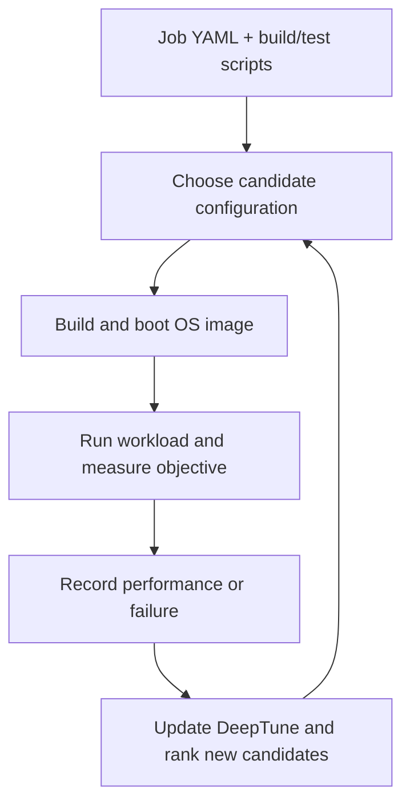
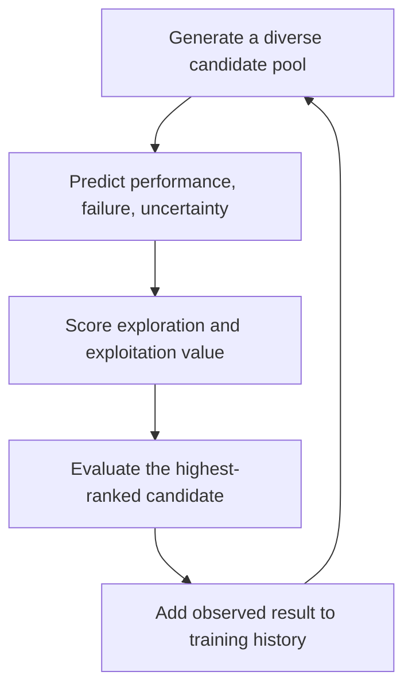

# Wayfinder: Automated Operating System Specialization

## Self-contained paper notes and final-seminar presentation plan

**Status:** Draft for Mr. Prabin's confirmation. No slide deck should be created until these notes are approved.  
**Paper:** Alexander Jung et al., _Wayfinder: Automated Operating System Specialization_  
**Venue:** 21st European Conference on Computer Systems (EuroSys 2026), ACM, pp. 710–727  
**DOI:** [10.1145/3767295.3803589](https://doi.org/10.1145/3767295.3803589)  
**Open paper:** [arXiv HTML](https://arxiv.org/html/2603.23425) · [PDF](https://arxiv.org/pdf/2603.23425)  
**Artifact:** [EuroSys 2026 artifact repository](https://github.com/unikraft/wayfinder-eurosys26-ae) · [Wayfinder source repository](https://github.com/unikraft/wayfinder)  
**Seminar slot:** 60 minutes total — 40-minute presentation and 20-minute Q&A/discussion  
**Prepared:** 6 August 2026

---

## 1. What you should understand before preparing slides

### The paper in one sentence

Wayfinder automatically searches the enormous and failure-prone configuration space of an operating system to find a configuration tailored to one application, workload, machine, and measurable objective; its DeepTune neural model predicts performance, uncertainty, and likely failures so that fewer expensive trials are wasted.

### A 30-second explanation

Linux is designed to support many machines and workloads, but a deployment may need only a small subset of that generality. Its compile-time, boot-time, and runtime settings can strongly affect throughput and memory use. Manually choosing good values is difficult because Linux has roughly 20,000 compile-time options in version 6.0, plus many boot and runtime controls, and some apparently valid combinations fail to build, boot, or run. Wayfinder automates the experiment loop: choose a configuration, build and boot it, benchmark the application, learn from the result, and choose a better configuration. Its best reported Linux result improves Nginx throughput by 24%, and its RISC-V Linux experiment reduces memory use by 8.5% relative to the paper's default configuration.

### The central argument

The paper is not merely about making a kernel smaller. Its broader claim is:

> Operating-system configuration can be treated as a large, mixed-type, expensive, and failure-prone black-box optimization problem, and an online learning system can search it more effectively than uninformed search.

The four conditions in that sentence matter:

1. **Large and mixed-type:** options may be Boolean, categorical, integer, or effectively continuous.
2. **Expensive:** testing one candidate may require a build, VM boot, benchmark, and validation.
3. **Failure-prone:** a configuration accepted by Kconfig may still fail later.
4. **Black-box:** the optimizer measures outcomes instead of requiring a complete analytical model of the kernel and workload.

### What Wayfinder is—and is not

| Wayfinder is | Wayfinder is not |
|---|---|
| An automated configuration-search and benchmarking framework | A new kernel architecture |
| A way to tune compile-, boot-, and runtime parameters | A guarantee that every result is safe for production |
| Workload-, metric-, and hardware-specific | One universally optimal Linux configuration |
| Able to optimize any measurable scalar objective in principle | Evidence that every claimed objective, especially security, was evaluated |
| A framework containing the DeepTune search algorithm | Another name for DeepTune; the two names refer to different layers |

---

## 2. Essential background, without assuming you have read the paper

### 2.1 Why specialize an operating system?

A general-purpose OS must support many processors, devices, filesystems, network protocols, debugging modes, security mechanisms, and workload types. That breadth improves portability and compatibility but may also add code, background work, memory use, or conservative defaults that do not suit one fixed deployment.

**OS specialization** means tailoring the OS to a particular combination of:

- application, such as Nginx;
- workload, such as a given HTTP request pattern;
- hardware or virtual platform;
- objective, such as throughput, latency, memory, energy, or attack surface.

There are several ways to specialize an OS:

- **redesign a subsystem** for a workload;
- **remove unused code or features**, often called debloating or tailoring;
- **tune existing configuration values**, which is Wayfinder's main focus.

Configuration-based specialization usually produces smaller gains than redesigning an OS subsystem, but it is more automatable and does not require implementing a new OS.

### 2.2 The three configuration stages

| Stage | When it is fixed | Linux mechanism | Example | Evaluation cost |
|---|---|---|---|---|
| Compile time | Before building the kernel | Kconfig and `.config` | include or omit a driver, filesystem, or debugging feature | Often requires rebuilding the kernel |
| Boot time | When the kernel starts | Kernel command line / boot configuration | CPU isolation or memory-policy parameter | Usually requires rebooting the candidate |
| Runtime | After the system is running | `/proc/sys`, `sysctl`, and writable `/sys` files | `net.core.somaxconn` or VM tuning | Often writable without a rebuild or reboot |

Linux Kconfig is not a flat list. Options have types, defaults, visibility rules, and dependencies; a child option may be visible only when its parent dependency is enabled. See the official [Kconfig language documentation](https://docs.kernel.org/kbuild/kconfig-language.html). Linux also documents a large set of [kernel command-line parameters](https://docs.kernel.org/admin-guide/kernel-parameters.html). The `/proc` filesystem exposes kernel information and allows some runtime parameters to be changed through sysctl; the official documentation warns that unsafe values can destabilize a system. See the [`/proc` documentation](https://docs.kernel.org/filesystems/proc.html) and the [`/proc/sys` VM controls](https://docs.kernel.org/admin-guide/sysctl/vm.html).

This explains why the paper evaluates candidates in VMs: experimentation may crash or hang the candidate OS, so containment and restartability are important.

### 2.3 Specialization versus debloating

This distinction is important in the seminar:

- **Debloating** asks, “Which components can be removed while preserving required behaviour?” Typical objectives are image size, memory, and attack surface.
- **Performance tuning** asks, “Which enabled features and numeric values make this workload faster?” The best setting is not necessarily the smallest setting.
- **Wayfinder covers both kinds of parameters**, but its distinctive contribution is extending automated search to numeric, categorical, boot-time, and runtime choices and to measurable performance objectives.

### 2.4 Optimization vocabulary used in the paper

| Term | Meaning in this paper |
|---|---|
| Configuration / permutation | One complete assignment of values to the parameters being explored |
| Search space | All candidate assignments allowed by the job description |
| Objective / target metric | The number to maximize or minimize, such as requests/s or memory |
| Black-box evaluation | Run a real experiment to learn a candidate's outcome |
| Exploration | Try unfamiliar regions to discover influential parameters or better optima |
| Exploitation | Refine a region already predicted to perform well |
| Uncertainty | The model's estimate that its performance prediction may be unreliable |
| Failure / crash | The paper's umbrella label for build failure, boot failure, crash, or hang |
| Transfer learning | Reuse a model trained on one application to start another application's search with prior knowledge |
| Convergence | Progress toward a strong configuration within an iteration or time budget |

### 2.5 Systems and benchmarks mentioned

| Name | Context needed for the seminar |
|---|---|
| Nginx | Network-intensive web server; benchmarked with `wrk`; objective is higher requests/s |
| Redis | Primarily single-threaded key-value store; benchmarked with `redis-benchmark`; objective is higher requests/s |
| SQLite | Embedded database; the experiment issues many inserts; objective is lower microseconds per operation |
| NAS Parallel Benchmarks (NPB) | CPUand memory-intensive scientific kernels; objective is higher million operations/s |
| QEMU/KVM | VM/emulation environment used to isolate candidate OS images; KVM accelerates same-ISA virtualization |
| Lupine Linux | The default/general-purpose-specialized Linux baseline used in Table 2, not a stock distribution kernel in every possible sense |
| Unikraft | A configurable micro-library OS / unikernel SDK for building single-purpose images; see the [Unikraft paper](https://arxiv.org/abs/2104.12721) |
| Cozart | Prior compile-time Linux debloating work based on dynamic analysis; Wayfinder is applied after it for runtime tuning |
| Unicorn | A causal-inference configuration optimizer used in the scalability comparison |

---

## 3. Problem statement and research questions

### The problem

Manual OS tuning requires expertise, exhaustive search is impossible, and random search wastes many trials on poor or invalid configurations. Existing automated kernel-specialization work mainly turns compile-time features on or off for memory or attack-surface reduction. It does not directly solve large-scale performance tuning across compile-, boot-, and runtime controls.

### Why the problem is difficult

1. **Scale:** Linux 6.0 has about 20,000 compile-time options, including more than 3,000 integer-valued options, before boot and runtime controls are added.
2. **Unknown domains:** some runtime parameters are poorly documented and their valid ranges depend on machine state, such as installed RAM.
3. **Mixed data:** the optimizer must handle Boolean, categorical, and numeric values.
4. **Dependencies:** Kconfig choices constrain other choices.
5. **Failures:** configurations may pass static dependency checks but still fail to build, boot, or execute.
6. **Expensive measurements:** one evaluation takes roughly 60–80 seconds in the main experiments.
7. **Non-portability of the optimum:** a configuration found for one workload and machine may not be optimal after either changes.

### Research questions answered by the evaluation

1. How quickly does Wayfinder find a strong application-specific configuration, and how does it compare with baselines?
2. Does transfer learning reduce search time and failures for related applications?
3. Can DeepTune predict invalid or failing configurations well enough to avoid wasted trials?
4. Does the approach generalize beyond one OS and one objective?

### The paper's two formal contributions

1. **Wayfinder:** an end-to-end platform that configures, builds, boots, tests, and benchmarks OS images.
2. **DeepTune:** a neural search method that predicts failure, performance, and uncertainty and balances exploration with exploitation.

### Important non-goals

The paper does not provide:

- a universally optimal Linux kernel;
- native RISC-V performance results;
- a production-safety proof;
- a new scheduler or kernel architecture;
- evidence for security optimization, despite presenting security as a possible measurable objective;
- robustness across changing workloads or hardware without rerunning the search.

---

## 4. Motivation experiment: why random configuration is inadequate

The authors first create **800 valid random configurations of Linux 4.19**. Each is run in a KVM VM with Nginx and measured using `wrk` on a dual-socket Intel Xeon E5-2697 v2 system.

Key observations:

- Nginx throughput spans roughly **under 10,000 to 18,000 requests/s**, an approximately 80% range.
- The fastest random configuration is **12% faster than the default**.
- **64%** of valid random configurations are worse than the default.
- Approximately **one-third of attempted configurations fail** before the authors obtain the 800 valid results.

Interpretation:

- Kernel configuration materially affects a system-intensive workload.
- A large opportunity exists, but uniformly random trials are inefficient.
- Static configuration validity is not sufficient; observed build/boot/runtime validity is part of the learning problem.

This is an excellent early seminar figure. Use **Figure 2** and explain both sides of the story: configurations can improve Nginx, but most random choices are worse and many never run.

---

## 5. Wayfinder system design

### 5.1 End-to-end loop

The user supplies:

- a YAML job description containing parameters, types, and candidate values;
- scripts to build the OS/application image;
- a benchmark and measurable objective;
- a time or iteration budget;
- optionally, fixed values and functional tests that constrain unsafe parts of the space.

Wayfinder then repeats the loop until the budget is exhausted and returns the best observed configuration.

### 5.2 Implementation details

- Approximately **15,000 lines of Go**.
- Implemented as a collection of microservices with persistence, monitoring, and logging.
- Runs on a Linux host; candidates run with QEMU/KVM.
- Supports random, grid, Bayesian, and DeepTune search through a modular API.
- Splits a candidate evaluation into a build task and a test task.
- Skips rebuilding when the change affects only runtime parameters.

The key engineering contribution is that the search method is connected to a reproducible system experiment loop. A model alone cannot specialize an OS; it needs reliable build, boot, test, timeout, failure-recording, and metric-collection machinery.

---

## 6. DeepTune: the search algorithm

### 6.1 Conceptual operation

DeepTune does not attempt to enumerate the full OS space. In each cycle, it generates candidates, estimates their behaviour, chooses one worth paying to evaluate, and learns from the observed result.

### 6.2 DeepTune Model outputs

For a configuration vector **x**, the model conceptually predicts:

- **failure probability** \(\hat{k}\);
- **expected objective value** \(\hat{y}\);
- **prediction uncertainty** \(\hat{\sigma}\).

It uses two parallel ideas:

1. A conventional feed-forward neural branch predicts performance and failure probability.
2. A radial-basis-function (RBF) branch estimates whether the candidate resembles learned prototypes. A candidate far from known prototypes should receive greater uncertainty.

The paper represents categorical/discrete and numeric parameters separately at the input level. For presentation purposes, the important point is not the exact layer count; it is that the model jointly learns **quality**, **danger**, and **confidence**.

### 6.3 Why uncertainty matters

If the search always chooses the highest predicted performance, it can become trapped around an early local optimum. Uncertainty and dissimilarity give unexplored candidates a reason to be tried. This creates the exploration–exploitation balance:

- high expected quality supports exploitation;
- high uncertainty or distance from known samples supports exploration;
- high failure probability discourages a costly, likely-invalid trial.

### 6.4 Training losses

| Loss | Role |
|---|---|
| Categorical cross-entropy | Learn which configurations are likely to fail |
| Regression loss with uncertainty | Predict the objective and expected prediction error |
| Chamfer-distance regularization | Position RBF centroids/prototypes near the observed data distribution |

The combined loss is presented as:

\[  
\mathcal{L}=L_{\mathrm{CCE}}+L_{\mathrm{Reg}}+L_{\mathrm{Cham}}.  
\]

The paper's dissimilarity term is:

\[  
\mathrm{ds}(\mathbf{x},X)=1-\frac{1}{1+\lVert \mathbf{x}-X\rVert_2^2}.  
\]

Its reported exploration score combines dissimilarity and uncertainty with \(\alpha=0.5\):

\[  
\mathrm{sf}(\mathbf{x},X)=\alpha\,\mathrm{ds}(\mathbf{x},X)+(1-\alpha)F^u(\mathbf{x}).  
\]

Do not spend more than one minute deriving these equations in the seminar. Explain what each term accomplishes. Also note that the prose describes the overall candidate policy as using predicted performance, crash likelihood, uncertainty, and dissimilarity, while the displayed scoring equation explicitly contains only dissimilarity and uncertainty. Treat the candidate-ranking process as a pipeline rather than claiming that Equation 3 alone contains every signal.

### 6.5 Why not ordinary Bayesian optimization?

The authors argue that classic Gaussian-process Bayesian optimization is a poor fit because:

- model update cost grows with collected observations;
- Gaussian processes have classical \(O(n^3)\) time and \(O(n^2)\) memory scaling;
- very high-dimensional mixed categorical/numeric spaces are difficult;
- ordinary Bayesian optimization does not directly learn the paper's broad failure label.

This comparison should be phrased carefully. These are limitations of the conventional techniques considered by the paper; modern scalable or mixed-variable Bayesian variants exist, but were not evaluated.

---

## 7. Transfer learning

A search normally begins with an untrained model. Transfer learning reuses a model trained on another application.

The intuition is subsystem similarity:

- Nginx and Redis are both network intensive, so TCP and socket parameters may matter to both.
- Redis and SQLite are both data stores, although their I/O paths differ.
- NPB is compute/memory intensive, so it is less sensitive to the same kernel controls.

The authors build a cross-application similarity matrix using 2,000 random Linux configurations per application, calculate parameter importance, and compare the importance vectors. Nginx, Redis, and SQLite show more similarity than NPB.

In the main transfer experiment, a model is trained on Redis for 250 iterations, taking **4.6 hours**, and then transferred to the other workloads. It typically starts with better candidates, keeps failure rates below 10% in most cases, and reduces the reported time to reach the best listed configuration by approximately **3.2× to 4.5×**.

Critical interpretation: the 4.6-hour pretraining cost is worthwhile when amortized across related deployments. It may not help a one-off tuning task unless a suitable pretrained model already exists.

---

## 8. Automatically defining the search space

Wayfinder still needs a parameter list, types, and candidate ranges. For Linux runtime parameters, the authors attempt to infer this automatically:

1. Boot the target Linux version in a VM.
2. enumerate writable files under `/proc/sys` and `/sys`;
3. read the current value as the default;
4. classify numeric 0 or 1 as Boolean and other numeric values as integers;
5. multiply or divide the default by 10, attempt the writes, and retain values that do not immediately crash the VM;
6. leave the detailed performance search to Wayfinder.

Strength: this avoids requiring complete documentation for thousands of runtime controls.

Weaknesses:

- a numeric parameter whose default happens to be 0 or 1 can be misclassified as Boolean;
- multiplying/dividing by 10 samples the domain coarsely and can miss useful values;
- “the write succeeded” does not prove long-term correctness;
- many string parameters are not explored automatically;
- some valid bounds depend on hardware and current system state;
- the VM makes dangerous probing recoverable, but it does not make a resulting production configuration safe.

This heuristic is a practical contribution, but not a formal configuration specification.

---

## 9. Production workflow and safety

The intended deployment process is:

1. use representative hardware and workload during application testing;
2. run Wayfinder within a constrained search space;
3. include functional tests in the benchmark step;
4. fix security-critical parameters to safe values;
5. have a reliability or systems engineer review the result before production.

This qualifies the paper's phrase “without expert knowledge.” A user may not need expertise to identify performance-sensitive settings manually, but still needs enough engineering knowledge to:

- define or approve the search domain;
- supply a representative workload;
- choose the right objective;
- protect security and correctness constraints;
- validate the final image.

Wayfinder reduces **performance-tuning expertise**; it does not remove **deployment responsibility**.

---

## 10. Evaluation methodology

### 10.1 Main Linux performance setup

| Item | Paper setup |
|---|---|
| Host | Dual-socket Intel Xeon E5-2697 v2, 2 × 24 cores at 2.70 GHz, 128 GB RAM |
| Host OS | Debian 10 |
| Candidate kernel | Linux 4.19 |
| Execution | QEMU/KVM; one candidate at a time |
| Noise controls | CPU isolation, performance governor, hyperthreading and ASLR disabled, single NUMA node |
| Workloads | Nginx, Redis, SQLite, selected OpenMP NPB programs |
| Search budget | 250 iterations, about 3.5–5.2 hours depending on workload |
| Repetitions | Figure 6 shows five-run results, smoothed; shaded area shows spread |
| Primary baseline | Random search; Lupine Linux provides the default performance numbers in Table 2 |

Disabling ASLR improves measurement stability but makes the setup unlike a normal security-hardened production system. It is an experimental-control choice, not a deployment recommendation.

### 10.2 Metrics

| Application | Workload character | Benchmark | Metric | Direction |
|---|---|---|---|---|
| Nginx | Network/system intensive | `wrk` | requests/s | Higher is better |
| Redis | Network/system intensive | `redis-benchmark` | requests/s | Higher is better |
| SQLite | Storage intensive | LevelDB SQLite benchmark | microseconds/operation | Lower is better |
| NPB | CPU/memory intensive | FT, MG, CG, IS across selected classes | Mop/s | Higher is better |

### 10.3 Baseline scope

- Random search is the direct baseline in the large Linux search.
- Grid search is omitted because the space is too large.
- Unicorn is compared on a synthetic, smaller problem because the authors report it cannot scale to the Linux space.
- Bayesian optimization is compared directly in the smaller Unikraft experiment, not in the full Linux experiment.
- Cozart is a complementary compile-time optimizer, not a like-for-like replacement for Wayfinder.

Therefore, do not say, “DeepTune defeated every competitor on the same Linux benchmark.” The comparisons use different feasible scopes.

---

## 11. Evaluation results and how to explain them

### 11.1 Best Linux configurations after 250 iterations

| Application | Lupine/default | Wayfinder | Relative result | Average time to find, no TL | With TL |
|---|---:|---:|---:|---:|---:|
| Nginx | 15,731 req/s | 19,593 req/s | **1.24×** | 415 s | 92 s |
| Redis | 58,000 req/s | 66,118 req/s | **1.14×** | 312 s | 69 s |
| SQLite | 284 µs/op | 284 µs/op | **1.00×** | 248 s | 76 s |
| NPB | 1,497 Mop/s | 1,522 Mop/s | **1.02×** | 243 s | 76 s |

The most important interpretation is not simply that “24% is good.” The workload dependence is the scientific point:

- Nginx benefits most because networking and kernel activity are central to its throughput.
- Redis benefits meaningfully for a similar reason.
- NPB mostly executes CPU and memory operations, so kernel tuning contributes little.
- SQLite shows no improvement, suggesting that this workload/default was already efficient or the explored controls were not the limiting factor.

The zero-gain SQLite result strengthens the paper's honesty: specialization is useful only when OS configuration affects the bottleneck.

### 11.2 Convergence and failures

At the start, DeepTune behaves similarly to random search because it has little evidence. As observations accumulate, it identifies useful regions and increasingly outperforms random search. For Nginx, the smoothed throughput after 250 iterations is more than 20% above random search, while the failure rate falls from about 0.3 to 0.1.

### 11.3 Search-method scalability

On a synthetic problem sized to the original Unicorn study, the authors report that Unicorn's time and memory grow sharply because of its causal-analysis method, whereas DeepTune grows approximately linearly. This supports the choice of a neural incremental model, but it is not an end-to-end Linux comparison with Unicorn.

### 11.4 Where time is spent

- DeepTune update/selection: **less than one second** per iteration.
- Build/boot/benchmark evaluation: **about 60–80 seconds**.

Conclusion: the dominant cost is obtaining a trustworthy system measurement, not running the neural network. Future work that reduces evaluation cost, reuses images, executes safe trials in parallel, or builds better performance surrogates may matter more than shaving milliseconds from the model.

### 11.5 Parameters found for Nginx

Positive/high-impact examples:

- `net.core.somaxconn`: maximum queued connections per socket backlog;
- `net.core.rmem_default`: default receive-buffer size;
- `net.ipv4.tcp_keepalive_time`: TCP keepalive timing;
- `vm.stat_interval`: frequency of virtual-memory statistics updates.

Negative examples:

- excessive `printk` verbosity;
- `printk_delay`;
- `vm.block_dump` block-I/O debugging.

These examples make the model concrete: network queue and buffer controls can aid a network server, while frequent logging/debugging adds work.

### 11.6 Transfer-learning result

The Redis-pretrained model generally provides stronger initial candidates and fewer failures. Table 2's time-to-best numbers imply improvements of about 4.5× for Nginx and 3.2× for NPB. Present this as evidence that prior subsystem knowledge can transfer, not as proof that every source–target pair will help.

### 11.7 Failure and performance prediction

| Application | Failure accuracy | Run accuracy | Normalized performance MAE |
|---|---:|---:|---:|
| Nginx | 0.796 | 0.397 | 0.273 |
| Redis | 0.789 | 0.310 | 0.361 |
| SQLite | 0.742 | 0.456 | 0.112 |
| NPB | 0.755 | 0.455 | 0.359 |

Failure prediction is the stronger signal: approximately 74–80% accuracy. Successful-run prediction and performance accuracy are much weaker. Wayfinder does not require a perfect performance predictor; avoiding a meaningful fraction of obviously bad trials and ranking candidates better than random can still improve the search.

### 11.8 Generality across OSes: Unikraft

For Nginx on Unikraft, the authors explore 33 OS/application parameters with a calculated space of **3.7 × 10¹³** combinations.

- Time budget: 3 hours.
- Wayfinder reaches a strong configuration after about 100 minutes.
- Bayesian optimization takes more than 160 minutes to reach a similar region.
- Random search does not reach similarly high-performing configurations within the budget.

The curve visibly moves through exploration, exploitation after about 25 minutes, and renewed exploration after about 100 minutes. Unikraft is especially configurable because it is a micro-library OS intended for specialized single-purpose images. Official background is available in [*Unikraft: Fast, Specialized Unikernels the Easy Way*](https://arxiv.org/abs/2104.12721).

### 11.9 Generality across metrics: RISC-V Linux memory

This is the result most directly connected to your Orange Pi RV2 work, but its scope must be stated accurately:

- Target: memory footprint, not performance.
- ISA: RISC-V Linux.
- Platform: QEMU emulation, not native RISC-V hardware.
- Search emphasis: compile-time parameters.
- Budget: 3 hours.
- Default: 210 MB.
- Wayfinder: 192 MB, reported as **8.5% less**.
- Random search: 203 MB; the paper reports **5.5% less**.

The Wayfinder arithmetic is consistent: \((210-192)/210\approx8.6\%\). The stated random-search arithmetic is not: \((210-203)/210\approx3.3\%\), not 5.5%. Use the absolute values and flag the reported percentage as a possible paper/data-label inconsistency.

### 11.10 Combining Wayfinder with Cozart

Cozart first removes unused compile-time components. Wayfinder then searches runtime settings and a scalar score combining higher throughput with lower memory.

The paper reports that the Cozart baseline itself raises throughput by about 31% relative to its own baseline. Wayfinder subsequently finds configurations that improve the joint throughput–memory score beyond Cozart. The best listed candidates use approximately 327.72–330.46 MB and achieve 47,002–49,375 req/s, compared with Cozart's 331.77 MB and 46,855 req/s.

This experiment is evidence of **composition**: use a structure-aware debloater to shrink compile-time complexity, then use black-box learning to tune runtime behaviour. It is not directly comparable to Table 2 because the kernel version and CPU allocation differ.

---

## 12. Critical appraisal

### 12.1 Strong aspects

1. **Clear systems problem:** the paper starts from a measurable and practically important configuration problem.
2. **End-to-end contribution:** it includes build, boot, benchmark, failure handling, search, and artifact support—not only an offline ML model.
3. **Failure-aware optimization:** failed trials are treated as learnable evidence instead of discarded noise.
4. **Mixed goals and systems:** experiments cover Linux and Unikraft, and both performance and memory.
5. **Workload sensitivity is visible:** Nginx improves strongly while SQLite does not, avoiding a claim that tuning always helps.
6. **Transfer learning has a systems explanation:** related workloads stress related subsystems.
7. **Open artifact:** scripts and datasets are provided for figures and tables.
8. **Practical safety discussion:** the authors acknowledge fixed security parameters, functional tests, and engineering review.

### 12.2 Limitations

1. **“Without expert knowledge” is too broad.** The performance search is automated, but safe use still requires benchmark design, constraints, representative inputs, and validation.
2. **Limited external validity.** The main results use one older x86 server, Linux 4.19, VMs, and four applications.
3. **No native RISC-V evaluation.** The RISC-V experiment measures memory under QEMU; it does not measure native performance, PMU events, energy, or device behaviour.
4. **Security is claimed as a possible objective but not evaluated.** The experiments cover performance and memory.
5. **Competitor comparisons are fragmented.** Random search is used on Linux, Unicorn on a synthetic small problem, and Bayesian optimization on Unikraft.
6. **Potential benchmark overfitting.** A specialized configuration is optimized for the measured workload; production request mixes may differ.
7. **Workload and hardware changes require retraining.** Cross-platform and cross-workload prediction remain future work.
8. **Transfer-learning cost is not free.** Redis pretraining took 4.6 hours, so speedup claims should be interpreted as amortized reuse.
9. **The search-space heuristic is coarse.** It can misclassify or omit parameters and does not prove semantic safety.
10. **Failure labels are coarse.** Build failure, boot failure, crash, and hang may have different causes but are grouped together.
11. **The model's performance prediction is imperfect.** The useful result is search-policy improvement, not a highly accurate universal performance model.
12. **Full reproduction is resource intensive.** The artifact notes that some original data took days to collect; supplied datasets make figure regeneration easier than full remeasurement.

### 12.3 Internal inconsistencies to handle carefully

These do not invalidate the paper's main contribution, but they should prevent overconfident wording:

- Some evaluation paragraphs accidentally call the method **“Trailblazer”**, apparently an earlier/internal name, where the surrounding text clearly concerns DeepTune/Wayfinder.
- The model-branch notation around \(F^p\) and \(F^u\) is swapped in one sentence, although the prose and figure identify the prediction and uncertainty branches consistently.
- Table 3 lists run accuracy values from 0.310 to 0.456, while the following prose says the range is 0%–36%.
- The RISC-V memory paragraph's 210 MB to 203 MB change is approximately 3.3%, although the text reports 5.5%.
- The prose describes candidate selection as combining performance, failure, uncertainty, and dissimilarity, whereas the displayed scoring equation explicitly shows only dissimilarity and uncertainty; other signals may be applied in surrounding selection stages.

In the seminar, call these **minor reporting or notation inconsistencies** and focus the critique on methodology and generalizability.

### 12.4 Threats to validity

| Validity type | Threat | How the paper mitigates it | What remains |
|---|---|---|---|
| Internal | Measurement noise | CPU isolation, performance governor, no co-location, single NUMA node, repeated runs | VM and system noise still exist; smoothed plots can obscure variance |
| Construct | Objective may not represent production quality | User-defined benchmark and functional checks | Throughput or memory alone can trade away security, tail latency, or reliability |
| External | One machine/workload may not generalize | Multiple apps, two OSes, two objectives | Main performance evidence remains old x86 Linux/KVM; workload/hardware changes require rerun |
| Comparative | Baselines may not be equally applicable | Each competitor is used where feasible | No single apples-to-apples comparison across the full Linux space |
| Reproducibility | Search is stochastic and expensive | Open scripts, datasets, five-run averages | Full remeasurement can take days and needs substantial hardware |

### 12.5 Balanced verdict

Wayfinder is a strong systems paper because it reframes OS specialization as an end-to-end, failure-aware measurement and search problem and demonstrates useful gains. Its most defensible claim is not “AI automatically finds a perfect kernel,” but:

> Given a fixed workload, machine, objective, search domain, and validation procedure, Wayfinder can discover better OS configurations faster and with fewer failed trials than uninformed search in the evaluated settings.

---

## 13. Connection to the Orange Pi RV2 / minimal-kernel project

### Direct relevance

- Both projects ask how to tailor Linux for a fixed RISC-V platform and workload.
- Wayfinder supplies a methodology for replacing intuition-only configuration with measured search.
- Its RISC-V memory experiment shows that the framework can at least build and evaluate RISC-V Linux images.
- The separation between compile-, boot-, and runtime parameters fits a minimal-kernel evaluation plan.
- Its emphasis on invalid configurations is relevant when reducing a board kernel with device-tree and driver dependencies.

### What Wayfinder does not solve for your project

- It does not implement a Linux-derived guest kernel as a host user process.
- It does not provide host-mediated privileged CSR or device access.
- It does not evaluate the Orange Pi RV2, its eight cores, split L2 organization, DTB, or board devices.
- It uses QEMU/KVM for the main loop, whereas your final interest includes native RISC-V behaviour and reduced virtualization.
- It does not measure syscall, privilege-switch, context-switch, PMU, or IPC effects on RISC-V hardware.

### A credible seminar extension proposal

**Question:** Can failure-aware configuration search specialize the Orange Pi RV2 Linux kernel for a fixed native workload while preserving boot and device correctness?

**Candidate objectives:**

- kernel image and executable-text size;
- boot-time memory, slab use, and peak working set;
- boot time;
- syscall latency;
- context-switch and privilege-transition latency;
- application throughput and tail latency;
- IPC, cache misses, TLB misses, and branch misses from the PMU;
- energy per operation, if board power measurement is available.

**Hard constraints:**

- kernel must boot natively;
- root filesystem, console, storage, Ethernet, timers, interrupts, and required board devices must pass tests;
- security-critical options remain fixed;
- DTB reservations, CMA, and SWIOTLB behaviour remain valid;
- repeated measurements must stay within a defined variance bound.

**Baselines:**

1. vendor/default Orange Pi kernel configuration;
2. manually produced minimal configuration;
3. random or bounded search;
4. Wayfinder-like failure-aware search.

This is a good final “future work” slide because it connects the paper to your architecture work without claiming that the paper already solved it.

---

## 14. Recommended final-seminar structure

### 14.1 Confirmed timing and slide count

The seminar slot is **60 minutes total**:

- **39 minutes 15 seconds planned speaking time**;
- **45 seconds of presentation buffer** for slide changes, pauses, or a short interruption;
- **20 minutes for questions and discussion**.

The recommended deck has **26 main slides** and **5–7 backup slides**. This is intentionally more detailed than a short conference talk. It gives enough time to teach the operating-systems and optimization background, explain the paper's method, present the evidence, and offer a critical M.Tech-level assessment. Do not fill the 40-minute presentation with extra equations; use the additional time to make the method and evidence understandable.

| Presentation block | Slides | Planned time | Cumulative checkpoint |
|---|---:|---:|---:|
| Opening and essential context | 1–6 | 8:00 | 8:00 |
| Research gap and system design | 7–11 | 7:00 | 15:00 |
| DeepTune, automation, and safety | 12–17 | 9:30 | 24:30 |
| Evaluation and results | 18–23 | 11:00 | 35:30 |
| Critical analysis, extension, conclusion | 24–26 | 3:45 | 39:15 |

### Slide 1 — Title and paper identity (30 seconds)

**On slide**

- Paper title and authors
- EuroSys 2026, ACM
- Your name, programme, and Seminar 2
- Subtitle: “Failure-aware search across compile-, boot-, and runtime OS parameters”

**What to say**

“This seminar examines Wayfinder, a system for automatically specializing an operating system for one application, workload, hardware setup, and measurable objective. I will explain the configuration problem, the Wayfinder platform and DeepTune algorithm, the experimental evidence, and the limits of the claims.”

**Visual:** Clean title block. Do not reveal headline results yet.

### Slide 2 — Seminar roadmap and guiding question (45 seconds)

**On slide**

1. Why OS specialization is difficult
2. How Wayfinder and DeepTune work
3. What the experiments prove
4. Limitations and a native RISC-V extension

**Guiding question:** Can OS tuning become an automated, measurable search process rather than expert trial and error?

**What to say**

Use the guiding question to establish the argument you will return to at the end. State that Wayfinder is broader than kernel debloating: it can tune compile-, boot-, and runtime settings for a measurable objective.

**Visual:** Four-part roadmap with the guiding question highlighted.

### Slide 3 — Why specialize a general-purpose OS? (1 minute 30 seconds)

**On slide**

- General-purpose Linux supports many machines, devices, and workloads
- One deployment uses only a subset of this generality
- Configuration can affect performance, memory, and attack surface
- Specialization trades unused generality for a defined deployment goal

**What to say**

Define OS specialization before introducing any machine learning. Distinguish configuration tuning from redesigning the kernel. Use two examples: Nginx may be sensitive to network backlog and socket buffers, while a compute-bound scientific kernel may receive almost no benefit from those controls. This difference later explains the evaluation results.

**Visual:** General-purpose OS serving many use cases versus a workload-specific OS configuration.

### Slide 4 — Three stages of OS configuration (1 minute 30 seconds)

**On slide**

| Stage | Linux interface | Example | Cost of testing |
|---|---|---|---|
| Compile | Kconfig / `.config` | Include driver or debugging feature | Rebuild image |
| Boot | Kernel command line | CPU or memory policy | Reboot candidate |
| Runtime | `/proc/sys`, `sysctl`, `/sys` | Network or VM control | Often write and retest |

**What to say**

Explain that the parameters are not independent. Kconfig has types, dependencies, defaults, and visibility rules. Compile-time trials are expensive; runtime trials are cheaper. This mixed cost is one reason Wayfinder favours runtime parameters for performance experiments and compile-time parameters for the RISC-V memory experiment.

**Visual:** The table above, with a compile → boot → runtime timeline.

### Slide 5 — Why this is a difficult search problem (1 minute 45 seconds)

**On slide**

- About 20,000 compile-time options in Linux 6.0
- More than 3,000 integer-valued compile options
- Boolean, categorical, and numeric values
- Poorly documented or state-dependent ranges
- Build, boot, hang, and runtime failures
- Each observed result may require a complete systems experiment

**What to say**

Describe the problem as a large, mixed-type, expensive, failure-prone black-box optimization problem. Exhaustive search is impossible. A configuration can satisfy Kconfig but still omit a required driver, fail to compile, hang during boot, or fail only when the workload exercises a particular path.

**Visual:** A funnel from enormous configuration space to a small set of valid, measured candidates.

### Slide 6 — Motivation experiment: opportunity and waste (2 minutes)

**On slide**

- 800 **valid** random Linux 4.19 configurations tested with Nginx
- Throughput: under 10K to about 18K requests/s
- Best random candidate: 12% above default
- 64% of valid candidates: worse than default
- Roughly one-third of attempted configurations: failed

**What to say**

Walk carefully through Figure 2. Configuration clearly matters because performance spans roughly 80%. However, random search is inefficient: most valid candidates are worse, and the 800 plotted points exclude additional failed attempts. End with: “The goal is therefore not just to generate configurations, but to learn which candidates are promising and which are dangerous.”

**Visual:** Paper Figure 2, enlarged sufficiently to read the distribution and baseline.

### Slide 7 — Research gap and questions (1 minute 15 seconds)

**On slide**

**Gap:** Prior automation mainly removes compile-time features for footprint or attack-surface reduction.

**Questions:**

1. Can a system search mixed compile/boot/runtime controls efficiently?
2. Can it learn to avoid invalid configurations?
3. Can knowledge transfer across related workloads?
4. Can the approach generalize across OSes and objectives?

**What to say**

The novelty is not the observation that kernel parameters influence performance. It is making the entire experiment loop automated and failure-aware at OS scale.

**Visual:** Prior work versus Wayfinder comparison plus the four questions.

### Slide 8 — Two contributions; two names (1 minute)

**On slide**

- **Wayfinder:** build, boot, benchmark, record, and orchestration platform
- **DeepTune:** neural search algorithm that proposes candidates

**What to say**

Prevent a common source of confusion early. Wayfinder is the complete system; DeepTune is one search strategy inside it. Wayfinder also supports random, grid, and Bayesian methods through a modular interface.

**Visual:** Outer Wayfinder box containing DeepTune and the experimental pipeline.

### Slide 9 — Wayfinder end-to-end architecture (2 minutes)

**On slide**

Choose candidate → configure/build → boot → run workload → measure or record failure → update search model → repeat

**What to say**

Explain each stage using one Nginx example. Highlight VM isolation and timeout handling: a failed candidate must not stop the entire study. Mention that Wayfinder returns the best **observed** configuration when the time or iteration budget expires; it does not mathematically prove global optimality.

**Visual:** Paper Figure 3 or a clean redraw of the loop in Section 5.1.

### Slide 10 — What the researcher must supply (1 minute 30 seconds)

**On slide**

- YAML job file: parameters, types, and candidate values
- Build and image-generation scripts
- Representative application workload
- A scalar metric and optimization direction
- Time/iteration budget
- Correctness tests and fixed safety-critical options

**What to say**

Use this slide to qualify the phrase “without expert knowledge.” Wayfinder reduces the need to know which tuning values are best, but it does not invent a representative workload, decide whether a security feature may be disabled, or prove functional correctness. Poor experimental inputs can produce a precisely optimized but unsuitable system.

**Visual:** Inputs on the left, Wayfinder in the centre, specialized configuration on the right.

### Slide 11 — Candidate lifecycle and failure handling (1 minute 15 seconds)

**On slide**

- Build task and test task are separated
- Runtime-only changes may skip rebuilding
- Timeouts turn hangs into recorded outcomes
- Failures become training data, not discarded noise

**What to say**

Explain why this engineering layer is a contribution. A search algorithm alone cannot optimize an OS. Reliable rebuilding, rebooting, benchmarking, logging, and recovery are required. The system uses failed experiments to learn unsafe regions of the space.

**Visual:** Candidate state diagram: proposed → built → booted → measured, with failure exits at each stage.

### Slide 12 — DeepTune intuition: learn value, risk, and ignorance (2 minutes)

**On slide**

- **Expected objective:** How good might this configuration be?
- **Failure probability:** Is evaluating it likely to be wasted?
- **Uncertainty:** How little does the model know about this region?
- **Dissimilarity:** Is it meaningfully different from prior trials?

**What to say**

Describe the exploration–exploitation tension. Always choosing the highest predicted performance can trap the search around an early local optimum. Trying only unfamiliar candidates wastes trials. DeepTune combines predicted value, danger, and uncertainty so that the search can exploit promising regions while still exploring.

**Visual:** A two-dimensional landscape with known safe samples, one promising familiar candidate, and one uncertain exploratory candidate.

### Slide 13 — DeepTune model architecture (2 minutes)

**On slide**

- Input encodes categorical/discrete and numeric configuration values
- Feed-forward branch predicts performance and failure
- RBF branch represents proximity to learned prototypes
- Three conceptual outputs: \(\hat{y}\), \(\hat{k}\), and \(\hat{\sigma}\)

**What to say**

Explain Figure 4 from left to right, without narrating every neuron. The feed-forward branch learns relationships between settings and observed outcomes. The radial-basis branch asks whether a candidate resembles learned prototypes; unfamiliar candidates receive greater uncertainty. State that uncertainty is not the same as failure probability: a candidate can be unfamiliar without being known-dangerous.

**Visual:** Paper Figure 4, annotated with “quality,” “failure,” and “uncertainty.”

### Slide 14 — How DeepTune learns and selects (1 minute 45 seconds)

**On slide**

- Classification loss learns failing versus non-failing configurations
- Regression loss learns the objective value and uncertainty
- Chamfer regularization distributes RBF prototypes
- Candidate policy combines exploitation and exploration signals

**What to say**

Explain the purpose of each loss rather than deriving it. Acknowledge a subtlety: the paper's displayed scoring equation explicitly shows uncertainty and dissimilarity, while the prose describes the wider selection process as also considering expected performance and crash likelihood. Present candidate ranking as a pipeline, not as if one equation contains every signal.

**Visual:** Four labelled arrows entering “candidate score.” Keep full equations in a backup slide.

### Slide 15 — Automatically discovering runtime parameters (1 minute 30 seconds)

**On slide**

- Enumerate writable files in `/proc/sys` and `/sys`
- Read current values and infer simple types
- Treat 0/1 as Boolean; other numeric values as integers
- Probe coarse ranges by multiplying/dividing defaults by ten

**What to say**

This heuristic reduces dependence on documentation but is imperfect. It may misclassify a numeric value, miss string-valued controls, or fail to discover the true valid range. A write succeeding does not prove semantic safety. This is a practical automation mechanism, not complete program analysis.

**Visual:** Discover → infer → probe → validate loop.

### Slide 16 — Transfer learning across workloads (1 minute 15 seconds)

**On slide**

- Reuse a trained model; do not copy one final configuration
- Nginx, Redis, and SQLite share some system-intensive behaviour
- NPB stresses different CPU/memory paths
- Benefit depends on shared influential subsystems

**What to say**

Explain that the transferred knowledge concerns parameter importance, value patterns, and failure regions. Similarity is workload-dependent. A networking-oriented model may help another networking workload more than a compute-bound benchmark, although the paper observes useful initialization even beyond the most similar pairs.

**Visual:** Source model → related application search, with shared parameters highlighted.

### Slide 17 — Production and safety boundary (1 minute)

**On slide**

- Fix securityand reliability-critical parameters
- Add application and device functional tests
- Validate the final configuration outside the tuning benchmark
- Rerun after material workload or hardware changes

**What to say**

An optimizer follows the metric it is given. If the metric is only throughput, it may select a setting that weakens logging, reliability, or security. “Automatic” therefore describes parameter exploration, not production approval.

**Visual:** Guardrails around the search space.

### Slide 18 — Evaluation methodology (2 minutes)

**On slide**

- Debian 10 Linux 4.19; QEMU/KVM on dual-socket Intel Xeon E5-2697 v2
- Workloads: Nginx, Redis, SQLite, and NPB
- Main search: 250 iterations, approximately 3.5–5.2 hours
- Performance governor, CPU isolation, no workload co-location, one NUMA node
- Default comparison: Lupine Linux configuration

**What to say**

State the metric direction for each workload: higher throughput for Nginx and Redis, lower operation latency for SQLite, and higher operations/s for NPB. Explain why methodology matters: noisy benchmarking can teach the search model false relationships. Be explicit that the main performance evaluation is x86/KVM, not physical RISC-V hardware.

**Visual:** One compact testbed-and-workloads table.

### Slide 19 — Main Linux performance results (2 minutes 15 seconds)

**On slide**

| Workload | Best reported change from default |
|---|---:|
| Nginx | +24% throughput |
| Redis | +14% throughput |
| SQLite | 0% latency improvement |
| NPB | +2% performance |

**What to say**

Use Figure 6 and Table 2. Separate the best observed improvement from a universal promise. Nginx provides the strongest evidence, Redis a substantial second result, and SQLite/NPB show the boundary of the technique. Mention that each application receives its own search; the paper is not applying one Nginx configuration to every workload.

**Visual:** Paper Figure 6 or a carefully redrawn comparison. Mark that lower is better for SQLite.

### Slide 20 — Why gains differ by workload (1 minute 30 seconds)

**On slide**

- Nginx: frequent kernel networking paths; many relevant sysctls
- Redis: system-intensive, but more single-threaded/application-sensitive
- NPB: mostly computation and memory operations outside OS services
- SQLite: explored kernel controls did not move the dominant bottleneck

**What to say**

Turn the zero and small improvements into analysis rather than treating them as failed results. OS tuning can only improve time spent in paths affected by the explored configuration. This is also a warning against quoting the maximum 24% as the typical result.

**Visual:** Approximate “time in OS-sensitive paths” continuum; label it as interpretation, not a measured breakdown from the paper.

### Slide 21 — Search efficiency, failures, and scaling (1 minute 45 seconds)

**On slide**

- Failure-prediction accuracy: roughly 75–80%
- Nginx observed failure rate falls from about 0.3 toward 0.1
- DeepTune decision: under 1 second
- Real candidate evaluation: about 60–80 seconds
- DeepTune time/memory growth reported as linear; Unicorn grows rapidly

**What to say**

The model does not need perfect performance prediction to be useful. Avoiding many likely failures and approximately ranking candidates can save expensive trials. The dominant cost is the actual systems experiment, not neural inference. Scope the comparison carefully: Unicorn is used for scaling behaviour, not as a complete head-to-head baseline across every Linux workload.

**Visual:** Two-scale comparison: model time versus experiment time, plus one failure-rate callout.

### Slide 22 — Transfer-learning evidence (1 minute 15 seconds)

**On slide**

- Redis model pretraining: 250 iterations, about 4.6 hours
- Reuse reduces time to strong configurations by roughly 3.2×–4.5×
- Failure rates generally stay below 10%
- Pretraining cost must be amortized across later searches

**What to say**

Present both benefit and cost. Transfer is most valuable when several related applications or repeated deployments will be tuned. For a single one-off search, 4.6 hours of pretraining may not be justified.

**Visual:** Cold start versus transferred start timeline.

### Slide 23 — Generality beyond the main Linux study (2 minutes 15 seconds)

**On slide**

1. **Unikraft/Nginx:** 33 parameters, \(3.7\times10^{13}\) combinations; strong result around 100 minutes versus more than 160 minutes for Bayesian optimization.
2. **RISC-V Linux memory:** QEMU, 210 MB → 192 MB after three hours, reported −8.5%.
3. **Cozart + Wayfinder:** compile-time debloating first, runtime tuning second.

**What to say**

Use these as three separate generalization claims: another OS, another objective/ISA, and combination with a debloater. Preserve their limitations. The direct Bayesian comparison is on the smaller Unikraft space. The RISC-V experiment measures memory under QEMU, not native RISC-V performance. Cozart experiments use a different setup and cannot be numerically compared directly with the main Table 2 results.

**Visual:** Three-column evidence map. If using one paper figure, choose Figure 10 because it connects naturally to your RISC-V work.

### Slide 24 — Critical appraisal (1 minute 45 seconds)

**On slide**

| Strengths | Limitations |
|---|---|
| End-to-end and failure-aware | Linux 4.19 and primarily one x86 host |
| Multiple OSes and two metrics | Workloadand hardware-specific results |
| Open artifact and reproducible loop | Baseline comparisons are fragmented |
| Negative results reveal scope | No direct security-objective evaluation |

**What to say**

Give the balanced verdict: the evidence supports workload-specific, metric-driven configuration search in the evaluated environments. It does not support a universal optimum, automatic production safety, or native RISC-V speedup. “Without expert knowledge” should be interpreted narrowly because workload design, correctness tests, and safety constraints still require expertise.

**Visual:** Two-column table. Move minor wording or percentage inconsistencies to backup.

### Slide 25 — Proposed native Orange Pi RV2 extension (1 minute 15 seconds)

**On slide**

- Run on physical RISC-V hardware instead of QEMU
- Preserve console, storage, Ethernet, timers, DTB, CMA, and SWIOTLB correctness
- Measure image/text size, boot memory, boot time, syscall latency, IPC, cache/TLB misses, and energy
- Compare vendor default, manual-minimal, random, and failure-aware search

**What to say**

Connect the paper honestly to your project. Wayfinder supplies a specialization methodology, not the hosted-kernel architecture or host-mediated privileged/device access. Your research extension would add native board constraints, PMU measurements, repeatability controls, and explicit device-correctness tests.

**Visual:** Small experiment matrix: configurations × correctness gates × metrics.

### Slide 26 — Conclusion and transition to Q&A (45 seconds)

**On slide**

- OS configuration is a large, costly, failure-prone search problem
- Wayfinder automates the experiment loop
- DeepTune learns expected value, failure risk, and uncertainty
- Best reported outcomes: +24% performance and −8.5% memory
- Valid only within a defined workload, hardware, objective, and safety envelope

**What to say**

“Wayfinder's main contribution is turning OS configuration from manual trial and error into a repeatable, failure-aware optimization process. Its strongest evidence is for OS-sensitive workloads, while its weaker results correctly show that specialization cannot improve a bottleneck outside the explored OS controls. The next research step is native, safety-constrained evaluation on RISC-V hardware.” Then invite questions.

**Visual:** One synthesis diagram and the two maximum headline results.

### 14.2 Pacing checkpoints and recovery plan

During rehearsal, check the clock only at these transitions:

- Finish Slide 6 by **8:00**.
- Finish Slide 11 by **15:00**.
- Finish Slide 17 by **24:30**.
- Finish Slide 23 by **35:30**.
- Finish Slide 26 by **39:15**.

If running more than 90 seconds late:

- shorten Slide 15's range-inference limitations to one sentence;
- state only the transfer result on Slide 22 and move its cost discussion to Q&A;
- present only Unikraft and RISC-V on Slide 23, leaving Cozart for backup;
- never remove Slides 18, 19, 24, or 26, because methodology, results, critique, and conclusion are essential to a research-paper seminar.

### 14.3 Recommended backup slides for the 20-minute discussion

1. DeepTune loss and scoring equations, with symbol definitions.
2. Model prediction accuracy and interpretation of failure versus run accuracy.
3. Nginx influential parameters and why they affect networking.
4. DeepTune versus Unicorn scaling details.
5. Cozart joint throughput-memory score and comparability warning.
6. Paper inconsistencies and threats to validity.
7. Detailed Orange Pi RV2 metrics, baselines, and correctness gates.

---

## 15. Likely viva and audience questions

### 1. What is the difference between Wayfinder and DeepTune?

Wayfinder is the complete automation platform: configuration, building, booting, benchmarking, recording, and orchestration. DeepTune is the neural search algorithm inside it that proposes useful candidates.

### 2. Is Wayfinder a kernel debloating tool?

Not only. It can vary compile-time options and optimize memory, but its distinctive goal is broader configuration specialization across compile-, boot-, and runtime values for measurable objectives such as performance. Cozart is closer to a dedicated compile-time debloater.

### 3. Why is random search not enough?

The space is enormous, candidate evaluation is expensive, 64% of the valid random Nginx configurations in the motivation experiment were worse than default, and about one-third of attempts failed. Learning from prior results improves the value of later trials.

### 4. Why use a neural network instead of Bayesian optimization?

The paper targets a high-dimensional mixed-type space and incremental learning over many observations. It argues that conventional Gaussian-process methods scale poorly and handle categorical inputs awkwardly. The neural model also includes explicit failure and uncertainty outputs. This does not prove that every modern Bayesian variant is inferior.

### 5. How can a configuration pass Kconfig but still fail?

Kconfig checks declared configuration relationships, not every build interaction, hardware assumption, boot dependency, or runtime workload path. Missing drivers, unexpected feature combinations, or unsafe runtime values can still cause build errors, boot failure, crashes, or hangs.

### 6. Does Wayfinder need an accurate performance predictor?

No. The predictor only needs to improve candidate selection relative to the baseline. Failure avoidance, uncertainty-guided exploration, and approximate ranking can save trials even when exact performance MAE is moderate.

### 7. Why did Nginx improve but SQLite and NPB barely improve?

Nginx frequently exercises network and kernel paths affected by sysctl settings. NPB spends most time in compute and memory operations outside OS services. SQLite's tested configuration may already have been near an efficient point or limited by factors outside the explored kernel controls.

### 8. Is the 24% improvement universal?

No. It is the maximum reported result for Nginx in the evaluated setup. Redis improves 14%, NPB 2%, and SQLite 0%. A different workload or machine requires another search.

### 9. Was the RISC-V experiment performed on physical hardware?

No. RISC-V Linux images were booted under QEMU to optimize memory footprint. The paper explicitly treats emulation as acceptable for memory measurement; it does not provide native RISC-V performance evidence.

### 10. Can the result be deployed directly to production?

It should not be. Security-relevant settings must be fixed, functionality tests should be part of evaluation, and an engineer must validate the final configuration. The optimized benchmark could otherwise hide a correctness, security, or reliability trade-off.

### 11. What happens if the workload changes?

The optimum may change. The paper says that workload or hardware changes require rerunning evaluation. Cross-workload and cross-platform prediction is future work.

### 12. What exactly transfers between Redis and Nginx?

The learned model carries knowledge about which configuration features, values, and failure patterns mattered. Because both applications stress networking, some influential kernel parameters overlap. Transfer does not copy one final configuration unchanged.

### 13. Is Wayfinder truly multi-objective?

The implemented DeepTune described in Section 3.2 optimizes one metric at a time, although the architecture could add outputs. The Cozart experiment combines normalized throughput and memory into one scalar score. That is scalarization, not a full Pareto-front multi-objective optimizer.

### 14. What is the dominant performance bottleneck of Wayfinder itself?

Real candidate evaluation. The model update takes under one second, while build/boot/benchmark work takes around 60–80 seconds per candidate in the reported study.

### 15. What would be the main challenge on Orange Pi RV2?

Preserving native boot and device correctness while safely exploring dependent compile-time options, and obtaining low-noise, repeatable PMU, latency, memory, and energy measurements on a resource-constrained board.

### 16. What is your final judgment of the paper?

It is a strong, reproducible systems contribution that improves how OS configurations are searched. Its evidence supports workload-specific optimization in the evaluated environments, but not universal, production-safe, or native RISC-V optimization.

---

## 16. Facts to memorize

- **Venue/year:** EuroSys 2026, ACM.
- **Core components:** Wayfinder platform and DeepTune algorithm.
- **Scope:** compile-, boot-, and runtime configuration.
- **Linux 6.0 motivation:** about 20,000 compile-time options; more than 3,000 integer-valued.
- **Random motivation study:** 800 valid Linux 4.19 configurations; 64% worse than default; about one-third of attempts fail; fastest is 12% above default.
- **Main workload count:** four—Nginx, Redis, SQLite, NPB.
- **Main search:** 250 iterations; about 3.5–5.2 hours.
- **Best Linux results:** Nginx +24%, Redis +14%, SQLite 0%, NPB +2%.
- **Per-candidate cost:** DeepTune under 1 second; evaluation 60–80 seconds.
- **Failure accuracy:** approximately 74–80%.
- **Transfer pretraining:** Redis, 250 iterations, 4.6 hours.
- **Transfer time-to-best improvement:** approximately 3.2×–4.5×.
- **Unikraft space:** 33 parameters, 3.7 × 10¹³ combinations.
- **Unikraft convergence:** Wayfinder about 100 minutes; Bayesian about 160 minutes for similar performance.
- **RISC-V memory:** QEMU, 210 MB to 192 MB, reported 8.5% reduction.
- **Artifact:** open scripts, datasets, and framework source; full reruns may take days.

---

## 17. Phrasing to use and avoid

| Avoid | Use instead |
|---|---|
| “Wayfinder improves Linux by 24%.” | “The best reported result is a 24% Nginx-throughput improvement in the evaluated Linux/KVM setup.” |
| “Wayfinder finds the optimal configuration.” | “Wayfinder finds the best observed configuration within a finite search budget.” |
| “It needs no experts.” | “It automates performance-oriented search but still needs workload design, safety constraints, and engineering validation.” |
| “The RISC-V result proves native speedup.” | “The RISC-V experiment demonstrates memory reduction under QEMU; native performance is not evaluated.” |
| “DeepTune is Wayfinder.” | “DeepTune drives search inside the Wayfinder platform.” |
| “It supports multi-objective optimization.” | “The implementation optimizes one objective; the Cozart experiment scalarizes throughput and memory.” |
| “All invalid configurations are avoided.” | “Failure prediction reduces, but does not eliminate, failed trials.” |
| “It beats Bayesian optimization on Linux.” | “The direct Bayesian comparison is performed on the smaller Unikraft space.” |

---

## 18. One-week preparation route

This plan assumes **one hour per day for seven days**. The first five days build understanding; Days 6 and 7 are full-length rehearsals. Do not try to memorize a 40-minute script word for word. Memorize the argument, transitions, figures, and numerical results.

### Day 1 — Context and motivation

Study Sections 1–4 for 45 minutes. Use the final 15 minutes to explain specialization, the three configuration stages, and the 800-configuration experiment without looking at the notes.

### Day 2 — Wayfinder architecture

Study Sections 5, 8, and 9 for 40 minutes. Use 20 minutes to draw the build–boot–benchmark–learn loop and explain what the researcher must supply, how failures are recorded, and why functional tests are necessary.

### Day 3 — DeepTune

Study Sections 6 and 7 for 45 minutes. Use 15 minutes to explain expected performance, failure probability, uncertainty, RBF prototypes, and exploration versus exploitation. Start with intuition; use the equations only after every term has a clear purpose.

### Day 4 — Evaluation

Study Sections 10 and 11 for 40 minutes. Use 20 minutes to explain the methodology and results aloud. Memorize the metric direction and four main relative results, then practise explaining why Nginx and Redis benefit more than SQLite and NPB.

### Day 5 — Critical reading

Study Sections 12–14 for 35 minutes. Use 15 minutes to deliver a balanced critique and 10 minutes to explain the Orange Pi RV2 extension without suggesting that it was part of the paper. Recheck the scope of every baseline and generality experiment.

### Day 6 — Presentation rehearsal

Perform one uninterrupted rehearsal of Slides 1–26 using a visible timer. Target **39 minutes**, using the five checkpoints in Section 14.2. Spend the remaining time noting slides that ran long, weak transitions, and any result you could not explain without reading.

### Day 7 — Viva preparation

Perform a second uninterrupted 39-minute rehearsal. Use the remaining 20 minutes to answer the highest-risk questions from Section 15: model versus platform, Bayesian comparison scope, RISC-V/QEMU limitation, production safety, workload dependence, and the final judgment.

---

## 19. Source and figure guide

### Primary sources

1. Jung et al., [*Wayfinder: Automated Operating System Specialization*](https://arxiv.org/html/2603.23425), EuroSys 2026. All paper-specific technical and numerical claims in these notes come from this source unless identified as analysis.
2. ACM, [published paper / DOI record](https://dl.acm.org/doi/10.1145/3767295.3803589).
3. EuroSys 2026, [accepted papers](https://2026.eurosys.org/papers.html).
4. Authors' [artifact-evaluation repository](https://github.com/unikraft/wayfinder-eurosys26-ae) and [Wayfinder framework repository](https://github.com/unikraft/wayfinder).
5. Linux kernel project, [Kconfig language](https://docs.kernel.org/kbuild/kconfig-language.html), [kernel command-line parameters](https://docs.kernel.org/admin-guide/kernel-parameters.html), and [`/proc` runtime interface](https://docs.kernel.org/filesystems/proc.html).
6. Kuenzer et al., [*Unikraft: Fast, Specialized Unikernels the Easy Way*](https://arxiv.org/abs/2104.12721), EuroSys 2021.

### Best paper figures for the final deck

| Figure | Purpose | Keep in main deck? |
|---|---|---|
| Figure 1 | Growth/scale of Linux compile-time configuration | Optional; Figure 2 tells a stronger story |
| Figure 2 | Random Nginx configurations: opportunity and waste | Yes |
| Figure 3 | Wayfinder process | Yes, or redraw cleanly |
| Figure 4 | DeepTune model | Yes, simplify verbally |
| Figure 5 | Cross-application similarity | Backup unless transfer is central |
| Figure 6 | Main Linux workload results and crash evolution | Yes |
| Figure 7 | DeepTune versus Unicorn scaling | Backup |
| Figure 8 | Model time versus evaluation time | Use as one callout or backup |
| Figure 9 | Unikraft comparison | Optional |
| Figure 10 | RISC-V memory search | Yes for project relevance |
| Figure 11 | Cozart plus Wayfinder joint score | Backup |

When reproducing a paper figure, preserve its caption meaning, axes, units, “higher/lower is better” direction, smoothing note, and attribution. Do not place screenshots of dense figures without enlarging the relevant panel.

---

## 20. Confirmation checklist before creating the presentation

Please confirm or change the following:

1. **Paper:** _Wayfinder: Automated Operating System Specialization_.
2. **Seminar timing:** 60 minutes total — 40-minute presentation and approximately 20 minutes for questions/discussion.
3. **Main narrative:** motivation → Wayfinder loop → DeepTune → evaluation → critique → Orange Pi RV2 extension.
4. **Technical depth:** DeepTune intuition in the main deck; equations and detailed inconsistencies in backup slides.
5. **Number of slides:** 26 main slides plus approximately 5–7 backup slides.
6. **Final extension:** include the native Orange Pi RV2 specialization proposal without implying that it is part of the paper.

Once these notes are confirmed, the next deliverable can be the presentation itself.
